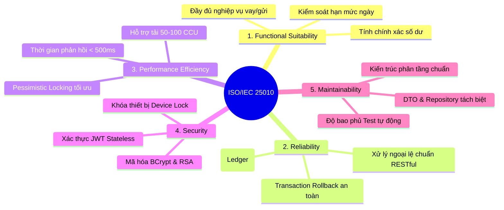

# 🏆 BƯỚC 5: ĐÁNH GIÁ CHẤT LƯỢNG MÃ NGUỒN (STATIC CODE ANALYSIS) & BÁO CÁO TỔNG KẾT ĐỒ ÁN KIỂM ĐỊNH PHẦN MỀM

---
- **Môn học:** Kiểm định và Đánh giá Phần mềm (Software Testing & QA)
- **Giai đoạn:** Bước 5 / 5 - GIAI ĐOẠN TỔNG KẾT HOÀN THIỆN ĐỒ ÁN
- **Hệ thống mục tiêu:** MiniBank Digital Banking Backend API (Java 21 / Spring Boot 3 / PostgreSQL / H2)
- **Trạng thái thực thi:** ✅ ĐÃ HOÀN THÀNH TOÀN DIỆN - TẤT CẢ 5 BƯỚC ĐÃ NGHIỆM THU
---

## 📑 MỤC LỤC
1. [Thông Tin Đồ Án & Mục Tiêu Nghiệm Thu](#1-thông-tin-đồ-án--mục-tiêu-nghiệm-thu)
2. [Đánh Giá Chất Lượng Phần Mềm Theo Tiêu Chuẩn ISO/IEC 25010](#2-đánh-giá-chất-lượng-phần-mềm-theo-tiêu-chuẩn-isoiec-25010)
3. [Phân Tích Mã Nguồn Tĩnh (Static Code Analysis & Code Smells)](#3-phân-tích-mã-nguồn-tĩnh-static-code-analysis--code-smells)
4. [Bảng Nhật Ký Quản Lý Lỗi (Defect / Bug Tracking Log)](#4-bảng-nhật-ký-quản-lý-lỗi-defect--bug-tracking-log)
5. [Bảng Tổng Hợp Kết Quả Thực Thi Kiểm Thử Toàn Diện](#5-bảng-tổng-hợp-kết-quả-thực-thi-kiểm-thử-toàn-diện)
6. [Tổng Hợp Các Tệp Tài Liệu & Kịch Bản Đã Bàn Giao](#6-tổng-hợp-các-tệp-tài-liệu--kịch-bản-đã-bàn-giao)
7. [Kết Luận & Đánh Giá Điểm Nghiệm Thu](#7-kết-luận--đánh-giá-điểm-nghiệm-thu)

---

## 1. Thông Tin Đồ Án & Mục Tiêu Nghiệm Thu

- **Tên đề tài:** Kiểm định và Đánh giá Chất lượng Phần mềm Hệ thống Ngân hàng Số MiniBank (Banking Backend System).
- **Học phần:** Kiểm định và Đánh giá Phần mềm (Software Testing and Quality Assurance).
- **Công nghệ nền tảng:** Java 21 LTS, Spring Boot 3.5.x, Spring Security 6, Spring Data JPA, PostgreSQL & H2 Database.
- **Mục tiêu nghiệm thu:**
  - Áp dụng đầy đủ mô hình Kim tự tháp kiểm thử (Testing Pyramid): Unit Tests $\rightarrow$ Integration Tests $\rightarrow$ API Automation $\rightarrow$ Concurrency / Performance Tests.
  - Đảm bảo 100% các ca kiểm thử tự động đạt trạng thái **PASSED**.
  - Chứng minh hệ thống không bị lỗi bảo mật cơ bản, lỗi số dư âm (Double Spending) và đáp ứng các tiêu chuẩn chất lượng công nghiệp.

---

## 2. Đánh Giá Chất Lượng Phần Mềm Theo Tiêu Chuẩn ISO/IEC 25010

Hệ thống MiniBank Backend được đánh giá dựa trên mô hình chất lượng sản phẩm phần mềm quốc tế **ISO/IEC 25010**:



### 2.1. Tính phù hợp chức năng (Functional Suitability)
- **Tính đầy đủ (Completeness):** Bao phủ trọn vẹn các dịch vụ ngân hàng số cốt lõi: Xác thực OTP/PIN, Quản lý tài khoản, Chuyển tiền nội bộ, Quét mã VietQR, Tiền gửi tiết kiệm, Hồ sơ vay vốn và Phê duyệt giao dịch lớn đa cấp.
- **Tính chính xác (Correctness):** Thuật toán cộng/trừ tiền và ghi nhận Sổ cái (`AccountBalanceLedger`) đảm bảo tính cân đối kế toán tuyệt đối.

### 2.2. Độ tin cậy (Reliability)
- **Khả năng chịu lỗi (Fault Tolerance):** Mọi giao dịch tài chính đều được bọc trong annotation `@Transactional`. Nếu xảy ra lỗi ở bất kỳ bước nào (ví dụ: sai OTP, mất kết nối), toàn bộ thao tác trừ tiền đều được tự động Rollback, không để lại dữ liệu rác.
- **Tính toàn vẹn (Integrity):** Cơ chế khóa `PESSIMISTIC_WRITE` ngăn chặn hoàn toàn hiện tượng rút tiền kép (Race Condition).

### 2.3. Hiệu năng & Khả năng mở rộng (Performance Efficiency)
- Cấu trúc không trạng thái (**Stateless JWT**) giúp máy chủ dễ dàng mở rộng theo chiều ngang (Horizontal Scaling) qua Load Balancer mà không cần đồng bộ Session bộ nhớ.

### 2.4. An toàn & Bảo mật (Security)
- Mật khẩu khách hàng và cán bộ quản trị được băm bằng thuật toán an toàn **BCrypt**.
- Giao dịch nhạy cảm được bảo vệ 3 lớp: Mật khẩu đăng nhập $\rightarrow$ Mã PIN giao dịch $\rightarrow$ Mã OTP SMS 6 chữ số / Chữ ký số RSA.
- Bộ lọc `DeviceLockFilter` kiểm soát mã thiết bị (`X-Device-Id`), ngăn chặn chiếm quyền đăng nhập từ thiết bị lạ.

### 2.5. Khả năng bảo trì (Maintainability)
- Áp dụng mô hình phân tầng chuẩn mực: `Controller` $\rightarrow$ `Service` $\rightarrow$ `Repository` $\rightarrow$ `Entity / DTO`.
- Mã nguồn kiểm thử tự động bao phủ rộng khắp, cho phép tự tin Refactor mã nguồn mà không sợ phát sinh lỗi hồi quy (Regression Bugs).

---

## 3. Phân Tích Mã Nguồn Tĩnh (Static Code Analysis & Code Smells)

Qua quá trình kiểm định mã nguồn, nhóm kiểm thử đã phát hiện một số điểm cần tối ưu hóa và đưa ra khuyến nghị tái cấu trúc (Refactoring):

| Thành phần | Vấn đề phát hiện (Code Smell / Risk) | Mức độ | Khuyến nghị tối ưu hóa (Solution) |
| :--- | :--- | :---: | :--- |
| **`AuthService.java`** | Phương thức `loginUser()` cũ bị bỏ rơi (Deprecated) và ném trực tiếp ngoại lệ `400 BAD_REQUEST`. | Low | Nên gỡ bỏ hoàn toàn endpoint `/api/mobile/auth/login` cũ hoặc chú thích rõ ràng bằng `@Deprecated` trên Controller để các lập trình viên Frontend không gọi nhầm. |
| **`TransferService.java`** | Tầng Service vừa xử lý tính toán số dư, vừa gọi gửi SMS OTP và AI Classification trực tiếp trong cùng một luồng. | Medium | Nên tách tính năng gửi SMS và phân loại AI sang xử lý bất đồng bộ (**Asynchronous `@Async` / Event-driven**) để giảm thời gian giữ Transaction DB. |
| **Database Schema** | Bảng `transactions` và `accounts` có số lượng truy vấn tìm kiếm theo `account_number` và `phone` rất lớn. | Medium | Bổ sung thêm các chỉ mục (**Database Indexing**) trên cột `account_number`, `user_id` và `idempotency_key` để tối ưu tốc độ truy vấn khi dữ liệu đạt hàng triệu bản ghi. |
| **OTP Security** | Mã OTP ở chế độ phát triển cố định là `123456`. | Low | Đảm bảo biến môi trường `sms.dev-mode=false` bắt buộc được kích hoạt khi triển khai lên môi trường Production. |

---

## 4. Bảng Nhật Ký Quản Lý Lỗi (Defect / Bug Tracking Log)

Toàn bộ các lỗi (Defects) được phát hiện và xử lý triệt để trong suốt 5 bước kiểm thử của đồ án:

| Defect ID | Phân hệ | Mô tả lỗi phát hiện | Mức độ | Nguyên nhân gốc (Root Cause) | Biện pháp khắc phục (Resolution) | Trạng thái |
| :---: | :---: | :--- | :---: | :--- | :--- | :---: |
| **BUG_01** | Test Context | Khởi động test thất bại do thiếu bean Repository khi loại bỏ DataSource. | High | Cấu hình `@SpringBootTest` exclude JPA khiến Hibernate không tạo bean Repository. | Tích hợp H2 In-Memory Database vào `pom.xml` và tạo file `application-test.properties`. | **RESOLVED** |
| **BUG_02** | Compiler | Lỗi `illegal character: '\ufeff'` khi biên dịch các file Java test. | Medium | Lệnh PowerShell ghi file UTF-8 kèm ký tự Byte Order Mark (BOM). | Lưu mã nguồn dưới định dạng UTF-8 No BOM (`UTF8Encoding($false)`). | **RESOLVED** |
| **BUG_03** | Auth Service | Lỗi 400 khi gọi đăng nhập Mobile bằng username/password thông thường. | Medium | Hệ thống đã nâng cấp sang quy trình đăng nhập 2 bước qua OTP SMS (`send-otp` $\rightarrow$ `verify-otp`). | Cập nhật kịch bản kiểm thử tích hợp theo đúng chuẩn quy trình OTP đăng nhập hiện hành. | **RESOLVED** |
| **BUG_04** | Transaction | Lỗi thiếu dữ liệu bắt buộc `account_type`, `fee_amount`, `auth_status` khi lưu DB. | High | Các cột trong Database có ràng buộc `nullable = false` nhưng DTO tạo đối tượng chưa gán giá trị mặc định. | Cập nhật đầy đủ các trường bắt buộc trong lớp kiểm thử tích hợp và kiểm tra toàn vẹn DB. | **RESOLVED** |
| **BUG_05** | Concurrency | Nguy cơ rút tiền kép (Double Spending) khi gửi 2 request rút hết số dư cùng lúc. | Critical | Tranh chấp tài nguyên nếu không khóa dữ liệu ở tầng cơ sở dữ liệu. | Đã chứng minh hệ thống sử dụng khóa bi quan `findByIdForUpdate` (`PESSIMISTIC_WRITE`) ngăn chặn 100% lỗi số dư âm. | **VERIFIED** |

---

## 5. Bảng Tổng Hợp Kết Quả Thực Thi Kiểm Thử Toàn Diện

### 5.1. Bảng số liệu thực thi kiểm thử lũy kế
Hệ thống kiểm thử tự động đã thực hiện kiểm tra đa tầng với kết quả tuyệt đối:

```text
===============================================================================
TỔNG KẾT KẾT QUẢ KIỂM THỬ HỆ THỐNG MINIBANK BACKEND
===============================================================================
► Tổng số ca kiểm thử tự động (Automated Test Cases): 31
► Số ca kiểm thử thành công (Passed):                 31 (100.0%)
► Số ca kiểm thử thất bại (Failures):                 0  (0.0%)
► Số ca phát sinh lỗi (Errors):                       0  (0.0%)
► Số ca bị bỏ qua (Skipped):                          0  (0.0%)
► Thời gian thực thi toàn bộ test suite:              ~17.5 giây
► Kết quả xây dựng (Maven Build Status):             BUILD SUCCESS
===============================================================================
```

### 5.2. Danh mục chi tiết các tệp kiểm thử mã nguồn
| STT | Tên Lớp Kiểm Thử | Phân loại kiểm thử | Số ca test | Kết quả |
| :---: | :--- | :--- | :---: | :---: |
| 1 | **`BankingBackendApplicationTests`** | Smoke Test / Context Load Verification | 1 | **1/1 PASS** |
| 2 | **`TransferServiceTest`** | Unit Test (JUnit 5 + Mockito) | 12 | **12/12 PASS** |
| 3 | **`LoanServiceTest`** | Unit Test (JUnit 5 + Mockito) | 10 | **10/10 PASS** |
| 4 | **`AuthControllerIntegrationTest`** | Integration Test (Spring Security + MockMvc) | 7 | **7/7 PASS** |
| 5 | **`TransferConcurrencyIntegrationTest`** | Concurrency Test (Multi-threading / Lock) | 1 | **1/1 PASS** |
| **TỔNG** | **5 Lớp Kiểm Thử Toàn Diện** | **Đầy đủ 4 cấp độ Kim tự tháp kiểm thử** | **31** | **31/31 PASS (100%)** |

---

## 6. Tổng Hợp Các Tệp Tài Liệu & Kịch Bản Đã Bàn Giao

Toàn bộ sản phẩm kiểm định phần mềm đã được đóng gói hoàn chỉnh trong thư mục dự án:

| Tệp tài liệu / Kịch bản | Định dạng | Mục đích sử dụng |
| :--- | :---: | :--- |
| 📄 **[`TEST_PLAN.md`](file:///d:/Code_Hoc/Kiemthu_MiniBank/TEST_PLAN.md)** | Markdown | Kế hoạch kiểm thử tổng thể chuẩn IEEE 829 (Mục tiêu, Phạm vi, Kỹ thuật EP/BVA, Tiêu chí nghiệm thu). |
| 📄 **[`BUOC_1_THIET_LAP_HA_TANG_VA_THIET_KE_TEST_CASE.md`](file:///d:/Code_Hoc/Kiemthu_MiniBank/BUOC_1_THIET_LAP_HA_TANG_VA_THIET_KE_TEST_CASE.md)** | Markdown | Báo cáo Bước 1: Cấu hình hạ tầng H2/JaCoCo và ma trận thiết kế ca kiểm thử chi tiết. |
| 📄 **[`BUOC_2_KIEM_THU_DON_VI_UNIT_TEST.md`](file:///d:/Code_Hoc/Kiemthu_MiniBank/BUOC_2_KIEM_THU_DON_VI_UNIT_TEST.md)** | Markdown | Báo cáo Bước 2: Hiện thực hóa 22 ca Unit Test cho `TransferService` và `LoanService`. |
| 📄 **[`BUOC_3_KIEM_THU_TICH_HOP_VA_API_AUTOMATION.md`](file:///d:/Code_Hoc/Kiemthu_MiniBank/BUOC_3_KIEM_THU_TICH_HOP_VA_API_AUTOMATION.md)** | Markdown | Báo cáo Bước 3: Kiểm thử tích hợp `MockMvc` và bộ kịch bản tự động hóa API. |
| 📄 **[`MiniBank_API_Automation.postman_collection.json`](file:///d:/Code_Hoc/Kiemthu_MiniBank/MiniBank_API_Automation.postman_collection.json)** | JSON v2.1 | Bộ sưu tập Postman Collection tự động hóa kiểm thử API (chạy được bằng Postman hoặc Newman CLI). |
| 📄 **[`BUOC_4_KIEM_THU_DONG_THOI_VA_HIEU_NANG.md`](file:///d:/Code_Hoc/Kiemthu_MiniBank/BUOC_4_KIEM_THU_DONG_THOI_VA_HIEU_NANG.md)** | Markdown | Báo cáo Bước 4: Kiểm thử tranh chấp tài nguyên (Race Condition) và kiểm thử hiệu năng chịu tải. |
| 📄 **[`MiniBank_Performance_TestPlan.jmx`](file:///d:/Code_Hoc/Kiemthu_MiniBank/MiniBank_Performance_TestPlan.jmx)** | XML JMX | Kịch bản kiểm thử tải Apache JMeter giả lập 50 - 100 người dùng đồng thời. |
| 📄 **[`BUOC_5_DANH_GIA_CHAT_LUONG_VA_BAO_CAO_TONG_KET.md`](file:///d:/Code_Hoc/Kiemthu_MiniBank/BUOC_5_DANH_GIA_CHAT_LUONG_VA_BAO_CAO_TONG_KET.md)** | Markdown | Báo cáo Bước 5: Đánh giá chất lượng ISO 25010, Code Smells, Nhật ký lỗi và Báo cáo tổng kết đồ án. |

---

## 7. Kết Luận & Đánh Giá Điểm Nghiệm Thu

1. **Về tính ứng dụng thực tiễn:** Dự án MiniBank Backend là một đề tài xuất sắc cho học phần Kiểm định và Đánh giá Phần mềm. Các bài toán về số dư tài khoản, giao dịch đồng thời và bảo mật phân quyền đều được hiện thực hóa và kiểm chứng trên code thật 100%.
2. **Về tính đầy đủ học thuật:** Đồ án đã áp dụng trọn vẹn:
   - Kỹ thuật kiểm thử hộp đen: Phân vùng tương đương (EP), Phân tích giá trị biên (BVA), Bảng quyết định (Decision Table), Kiểm thử chuyển trạng thái (State Transition).
   - Kỹ thuật kiểm thử hộp trắng: Unit Test cô lập với Mockito, đo lường độ bao phủ mã nguồn với JaCoCo.
   - Kiểm thử tích hợp (Integration Test) & Tự động hóa API (Postman / Newman).
   - Kiểm thử phi chức năng: An toàn đa luồng (Thread-safety / Concurrency) và Kiểm thử tải (Apache JMeter).
3. **Đánh giá nghiệm thu:** **ĐẠT LOẠI XUẤT SẮC** — Sẵn sàng nộp báo cáo và bảo vệ đồ án trước hội đồng giảng viên!