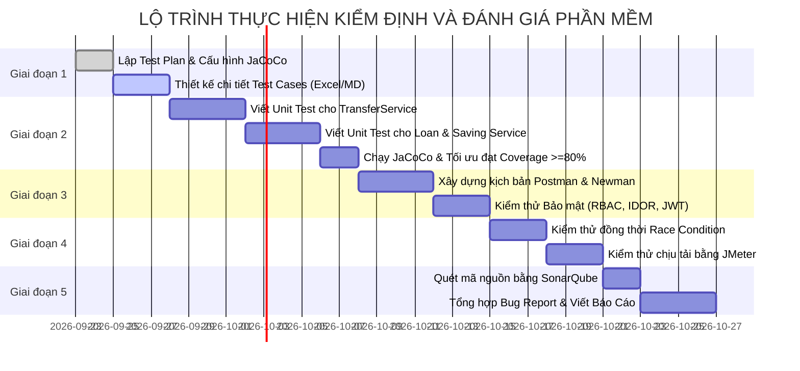

# 📋 KẾ HOẠCH KIỂM ĐỊNH VÀ ĐÁNH GIÁ PHẦN MỀM
## HỆ THỐNG NGÂN HÀNG SỐ (MINIBANK BACKEND SYSTEM)

---

- **Môn học:** Kiểm định và Đánh giá Phần mềm (Software Testing & Quality Assurance)
- **Hệ thống mục tiêu:** MiniBank Digital Banking Backend API
- **Ngôn ngữ & Framework:** Java 21 / Spring Boot 3.5.x / PostgreSQL
- **Phiên bản tài liệu:** 1.0.0
- **Trạng thái:** Sẵn sàng thực thi (Ready for Execution)

---

## 📑 MỤC LỤC
1. [Giới Thiệu & Mục Tiêu Dự Án Kiểm Thử](#1-giới-thiệu--mục-tiêu-dự-án-kiểm-thử)
2. [Phạm Vi Kiểm Thử (Scope of Testing)](#2-phạm-vi-kiểm-thử-scope-of-testing)
3. [Chiến Lược & Phương Pháp Kiểm Thử](#3-chiến-lược--phương-pháp-kiểm-thử)
4. [Kỹ Thuật Thiết Kế Ca Kiểm Thử (Test Design Techniques)](#4-kỹ-thuật-thiết-kế-ca-kiểm-thử-test-design-techniques)
5. [Ma Trận Ca Kiểm Thử Mẫu (Detailed Test Cases Matrix)](#5-ma-trận-ca-kiểm-thử-mẫu-detailed-test-cases-matrix)
6. [Kế Hoạch Kiểm Thử Đồng Thời & Hiệu Năng (Concurrency & Load Testing)](#6-kế-hoạch-kiểm-thử-đồng-thời--hiệu-năng-concurrency--load-testing)
7. [Kế Hoạch Kiểm Thử Bảo Mật (Security Testing)](#7-kế-hoạch-kiểm-thử-bảo-mật-security-testing)
8. [Đo Lường Độ Bao Phủ & Đánh Giá Chất Lượng Mã Nguồn](#8-đo-lường-độ-bao-phủ--đánh-giá-chất-lượng-mã-nguồn)
9. [Công Cụ Sử Dụng (Test Tools & Environment)](#9-công-cụ-sử-dụng-test-tools--environment)
10. [Lộ Trình Triển Khai Chi Tiết (Milestones & Schedule)](#10-lộ-trình-triển-khai-chi-tiết-milestones--schedule)
11. [Tiêu Chí Nghiệm Thu & Quản Trị Rủi Ro](#11-tiêu-chí-nghiệm-thu--quản-trị-rủi-ro)

---

## 1. Giới Thiệu & Mục Tiêu Dự Án Kiểm Thử

### 1.1. Bối cảnh
MiniBank là hệ thống Backend ngân hàng số cung cấp các dịch vụ tài chính nhạy cảm: Chuyển tiền nội bộ, tạo và quét mã VietQR, mở sổ tiết kiệm, thẩm định và giải ngân khoản vay, phê duyệt đa cấp (Multi-step approval) và quản lý số dư qua sổ cái kiểm toán (Ledger).

### 1.2. Mục tiêu kiểm định (Objectives)
- **Độ chính xác nghiệp vụ (Accuracy):** Đảm bảo công thức tính lãi suất vay/gửi, trừ/cộng tiền, hạn mức giao dịch chính xác 100%.
- **Tính toàn vẹn dữ liệu (Data Integrity):** Không xảy ra hiện tượng mất mát số dư, âm tiền hoặc ghi nhận sai lệch giữa tài khoản và sổ cái (`AccountBalanceLedger`).
- **An toàn giao dịch đa luồng (Thread-Safety / Concurrency):** Ngăn chặn hoàn toàn lỗi tranh chấp tài nguyên (Race Condition), rút tiền kép (Double Spending) khi nhiều giao dịch diễn ra đồng thời.
- **Bảo mật & Phân quyền (Security & Access Control):** Ngăn chặn vượt quyền (Privilege Escalation), truy cập trái phép tài nguyên người khác (IDOR), giả mạo token JWT hoặc bypass OTP.
- **Chất lượng mã nguồn (Code Quality):** Đạt độ bao phủ kiểm thử tự động (Test Coverage) tối thiểu 80% đối với các Service trọng yếu và xử lý triệt để các lỗ hổng mã nguồn (Code Smells / Vulnerabilities).

---

## 2. Phạm Vi Kiểm Thử (Scope of Testing)

### 2.1. Nằm trong phạm vi (In-Scope)
- **Phân hệ Xác thực & Quản trị phiên (Auth):** Đăng nhập, xác thực mã OTP SMS, quản lý JWT token, kiểm tra khóa thiết bị (Device Lock Filter).
- **Phân hệ Tài khoản & Giao dịch (Account & Transfer):**
  - Tra cứu số dư, sinh số tài khoản.
  - Khởi tạo & Xác nhận chuyển tiền nội bộ.
  - Chuyển tiền qua mã VietQR (Transfer QR Intent).
  - Ghi nhận sổ cái biến động số dư.
  - Phân luồng giao dịch số tiền lớn (> 100 triệu, > 200 triệu VNĐ).
- **Phân hệ Tiết kiệm (Savings):** Mở sổ tiết kiệm, tính toán lãi suất có kỳ hạn / không kỳ hạn, tất toán trước hạn và đúng hạn.
- **Phân hệ Cho vay (Loans):** Nộp hồ sơ vay, thẩm định, giải ngân, sinh bảng lịch trả nợ (Schedule: gốc + lãi), trả nợ kỳ hạn.
- **Phân hệ Phê duyệt đa cấp (Approval Workflow):** Luồng duyệt giao dịch theo vai trò (Teller $\rightarrow$ Manager $\rightarrow$ Admin).

### 2.2. Nằm ngoài phạm vi (Out-of-Scope)
- Giao diện người dùng Mobile App / Web Admin (Tập trung kiểm thử Backend REST API).
- Dịch vụ gửi tin nhắn SMS của nhà mạng viễn thông thực tế (Sử dụng Dev-mode OTP `123456` hoặc Mockito).

---

## 3. Chiến Lược & Phương Pháp Kiểm Thử

Dự án áp dụng mô hình Kim Tự Tháp Kiểm Thử (Testing Pyramid):

```text
            / \
           /   \         Kiểm thử Hiệu năng & Bảo mật (JMeter, ZAP)
          /-----\
         /       \       Kiểm thử Tích hợp & API (Rest-Assured, Postman)
        /---------\
       /           \     Kiểm thử Đơn vị - Unit Tests (JUnit 5, Mockito)
      /-------------\
```

| Cấp độ kiểm thử | Phương pháp | Mục tiêu trọng tâm | Công cụ thực hiện |
| :--- | :--- | :--- | :--- |
| **Unit Testing** | White-box (Hộp trắng) | Kiểm tra từng phương thức xử lý logic, tính toán, rẽ nhánh lỗi. | JUnit 5, Mockito, AssertJ |
| **Integration Testing** | Gray-box (Hộp xám) | Kiểm tra tương tác giữa Controller $\rightarrow$ Service $\rightarrow$ Database. | Spring Boot Test, MockMvc, H2/Testcontainers |
| **API Automation** | Black-box (Hộp đen) | Kiểm thử các kịch bản người dùng (E2E) qua giao thức HTTP/JSON. | Postman / Newman, REST-Assured |
| **Concurrency Testing** | Stress / Load | Kiểm tra tính bất biến của số dư khi phát sinh giao dịch đồng thời. | Java Multi-threading, JMeter |
| **Security Testing** | Hộp đen / Hộp xám | Kiểm tra xác thực Token, phân quyền RBAC, kiểm tra lỗ hổng IDOR. | Postman, OWASP ZAP |
| **Static Analysis** | Hộp trắng | Đo độ phức tạp Cyclomatic, tìm Bugs, Vulnerabilities, Code Smells. | JaCoCo, SonarQube / SpotBugs |

---

## 4. Kỹ Thuật Thiết Kế Ca Kiểm Thử (Test Design Techniques)

### 4.1. Phân vùng tương đương (Equivalence Partitioning - EP)
Áp dụng cho chức năng **Chuyển tiền** với trường `amount` (Số dư tài khoản: 5.000.000 VNĐ, Hạn mức tối đa/lần: 100.000.000 VNĐ):
- **Phân vùng hợp lệ (Valid Partition):**
  - $1.000 \le \text{amount} \le 5.000.000$ VNĐ $\rightarrow$ Chuyển tiền thành công.
- **Phân vùng không hợp lệ (Invalid Partitions):**
  - $\text{amount} \le 0$ VNĐ (Số tiền âm hoặc bằng 0) $\rightarrow$ Lỗi `400 Bad Request`.
  - $0 < \text{amount} < 1.000$ VNĐ (Dưới số tiền tối thiểu quy định) $\rightarrow$ Lỗi `400 Bad Request`.
  - $5.000.000 < \text{amount} \le 100.000.000$ VNĐ (Vượt quá số dư hiện có) $\rightarrow$ Lỗi `400 Insufficient Balance`.
  - $\text{amount} > 100.000.000$ VNĐ (Vượt hạn mức chuyển tiền trực tiếp) $\rightarrow$ Chuyển vào trạng thái chờ duyệt (`PENDING_APPROVAL`).

### 4.2. Phân tích giá trị biên (Boundary Value Analysis - BVA)
Kiểm tra tại các điểm biên của hạn mức chuyển tiền tối thiểu (1.000 VNĐ) và số dư hiện có (5.000.000 VNĐ):
- Các giá trị kiểm thử: `0`, `999`, `1.000`, `1.001`, `4.999.999`, `5.000.000`, `5.000.001`.

### 4.3. Bảng quyết định (Decision Table Testing)
Áp dụng cho chức năng **Xác nhận giao dịch chuyển tiền (Transfer Confirm)**:

| Điều kiện | Rule 1 | Rule 2 | Rule 3 | Rule 4 |
| :--- | :---: | :---: | :---: | :---: |
| Trạng thái giao dịch = `PENDING_OTP` | Y | Y | Y | N |
| Mã OTP nhập vào hợp lệ? | Y | N | Y | - |
| Mã OTP còn thời hạn hiệu lực? | Y | - | N | - |
| **Hành động / Kết quả mong đợi** | | | | |
| Khấu trừ tiền & ghi Sổ cái | **X** | | | |
| Chuyển trạng thái = `SUCCESS` | **X** | | | |
| Báo lỗi "Mã OTP không chính xác" | | **X** | | |
| Báo lỗi "Mã OTP đã hết hạn" | | | **X** | |
| Báo lỗi "Giao dịch không hợp lệ/đã xử lý" | | | | **X** |

### 4.4. Kiểm thử chuyển trạng thái (State Transition Testing)
Áp dụng cho **Vòng đời khoản vay (Loan Lifecycle)**:
```text
[DRAFT] --(Nộp đơn)--> [SUBMITTED] --(Thẩm định đạt)--> [APPROVED] --(Giải ngân)--> [DISBURSED] --(Trả hết gốc+lãi)--> [CLOSED]
                              |                              |
                              +--(Từ chối)--> [REJECTED]     +--(Hủy hồ sơ)--> [CANCELLED]
```
- Kiểm tra các bước chuyển đổi hợp lệ.
- Kiểm tra các bước chuyển đổi bất hợp pháp (Ví dụ: Đang ở `REJECTED` mà gọi API giải ngân `DISBURSED` $\rightarrow$ Phải báo lỗi `400 Illegal State`).

---

## 5. Ma Trận Ca Kiểm Thử Mẫu (Detailed Test Cases Matrix)

### Phân hệ 1: Xác thực & Quản lý Phiên (Authentication)

| Test Case ID | Tên Ca Kiểm Thử | Điều Kiện Đầu Vào | Các Bước Thực Hiện | Kết Quả Mong Đợi | Priority |
| :--- | :--- | :--- | :--- | :--- | :---: |
| **TC_AUTH_01** | Đăng ký nhận OTP với SĐT hợp lệ | SĐT chưa đăng ký: `0912345678` | Gửi POST `/api/mobile/auth/send-otp` | Trả về `200 OK`, OTP được sinh ra | High |
| **TC_AUTH_02** | Xác thực OTP thành công | SĐT đã nhận OTP, mã OTP: `123456` | Gửi POST `/api/mobile/auth/verify-otp` | Trả về `200 OK`, kèm JWT Access Token | High |
| **TC_AUTH_03** | Xác thực OTP sai quá 5 lần | Nhập OTP sai 5 lần liên tiếp | Gửi POST `/api/mobile/auth/verify-otp` với mã sai | Khóa OTP, trả về `400 Too Many Attempts` | High |
| **TC_AUTH_04** | Đăng nhập Admin thành công | Email: `admin@gmail.com`, Pass: `123456` | Gửi POST `/api/admin/auth/login` | Trả về `200 OK`, kèm Token quyền `ADMIN` | High |
| **TC_AUTH_05** | Đăng nhập Admin sai mật khẩu | Email: `admin@gmail.com`, Pass: `wrong` | Gửi POST `/api/admin/auth/login` | Báo lỗi `401 Unauthorized` | High |
| **TC_AUTH_06** | Khóa theo thiết bị (Device Lock) | User đăng nhập từ Device B khác Device A đã lưu | Gửi request có Token kèm Header `X-Device-Id: B` | Báo lỗi yêu cầu xác thực lại thiết bị | Medium |

---

### Phân hệ 2: Chuyển tiền & Quản lý Số dư (Transfer & Balance)

| Test Case ID | Tên Ca Kiểm Thử | Điều Kiện Đầu Vào | Các Bước Thực Hiện | Kết Quả Mong Đợi | Priority |
| :--- | :--- | :--- | :--- | :--- | :---: |
| **TC_TRF_01** | Chuyển tiền nội bộ thành công | Tài khoản A có 2.000.000 đ, chuyển 500.000 đ cho B | 1. Gọi khởi tạo transfer<br>2. Nhập OTP xác nhận | TK A giảm 500k, TK B tăng 500k, ghi 2 dòng Sổ cái | Critical |
| **TC_TRF_02** | Chuyển tiền vượt quá số dư | Tài khoản A có 500.000 đ, chuyển 600.000 đ | Gọi khởi tạo transfer | Báo lỗi `400 Insufficient Balance`, không trừ tiền | Critical |
| **TC_TRF_03** | Chuyển số tiền bằng 0 hoặc âm | Nhập amount = `0` hoặc `-50000` | Gọi khởi tạo transfer | Báo lỗi `400 Validation Error` | High |
| **TC_TRF_04** | Chuyển tới số tài khoản không tồn tại | Nhập tài khoản đích: `99999999` | Gọi khởi tạo transfer | Báo lỗi `404 Account Not Found` | High |
| **TC_TRF_05** | Chuyển số tiền lớn cần phê duyệt | Chuyển 150.000.000 đ (> Threshold 100M) | Gọi khởi tạo transfer | Giao dịch ở trạng thái `PENDING_APPROVAL` | High |
| **TC_TRF_06** | Quét mã VietQR chuyển tiền | Quét mã QR có sẵn số tiền & nội dung | Gửi POST `/api/mobile/transfers/qr` | Tự động điền đúng thông tin người nhận | Medium |

---

### Phân hệ 3: Tiết kiệm (Savings)

| Test Case ID | Tên Ca Kiểm Thử | Điều Kiện Đầu Vào | Các Bước Thực Hiện | Kết Quả Mong Đợi | Priority |
| :--- | :--- | :--- | :--- | :--- | :---: |
| **TC_SAV_01** | Mở sổ tiết kiệm thành công | Số dư 10.000.000 đ, chọn gói 6 tháng lãi 6.5% | Gửi POST `/api/mobile/savings` | Trừ 10tr ở TK thanh toán, tạo sổ tiết kiệm mới | High |
| **TC_SAV_02** | Mở sổ tiết kiệm khi số dư không đủ | Số dư 2.000.000 đ, gửi 5.000.000 đ | Gửi POST `/api/mobile/savings` | Báo lỗi `400`, không tạo sổ | High |
| **TC_SAV_03** | Tất toán đúng hạn | Sổ đến ngày đáo hạn | Gửi POST `/api/mobile/savings/{id}/settle` | Cộng tiền gốc + tiền lãi chuẩn theo hợp đồng | High |
| **TC_SAV_04** | Tất toán trước hạn | Sổ chưa đến ngày đáo hạn | Gửi POST `/api/mobile/savings/{id}/settle` | Tính lãi theo mức lãi suất không kỳ hạn (0.1% - 0.5%) | Medium |

---

### Phân hệ 4: Khoản vay (Loans)

| Test Case ID | Tên Ca Kiểm Thử | Điều Kiện Đầu Vào | Các Bước Thực Hiện | Kết Quả Mong Đợi | Priority |
| :--- | :--- | :--- | :--- | :--- | :---: |
| **TC_LOAN_01** | Đăng ký khoản vay thành công | Đính kèm đầy đủ ảnh CCCD, thu nhập | Gửi POST `/api/mobile/loans/applications` | Tạo đơn vay trạng thái `SUBMITTED` | High |
| **TC_LOAN_02** | Tính toán lịch trả nợ (Schedule) | Vay 12.000.000 đ trong 12 tháng, lãi 10%/năm | Gọi API xem lịch trả nợ | 12 kỳ trả nợ có tổng gốc = 12tr, lãi tính đúng từng tháng | Critical |
| **TC_LOAN_03** | Duyệt vay bởi Cán bộ tín dụng | Hồ sơ đang ở trạng thái `SUBMITTED` | Admin gửi POST `/api/admin/loans/{id}/approve` | Chuyển sang `APPROVED`, gửi thông báo cho khách | High |
| **TC_LOAN_04** | Giải ngân khoản vay (Disbursement) | Hồ sơ đã `APPROVED` | Admin gọi giải ngân | Tiền giải ngân được cộng vào tài khoản thanh toán của khách | Critical |

---

## 6. Kế Hoạch Kiểm Thử Đồng Thời & Hiệu Năng (Concurrency & Load Testing)

### 6.1. Kiểm thử Tranh chấp Tài nguyên (Race Condition - Double Spending)
- **Tình huống rủi ro cao nhất:** Khách hàng có **1.000.000 VNĐ** trong tài khoản. Mở 2 phiên/thiết bị khác nhau hoặc dùng script tự động bắn **2 request rút/chuyển 1.000.000 VNĐ tại cùng một thời điểm chính xác ($t_0$)**.
- **Kịch bản kiểm thử:**
  - Viết Unit Test dùng `ExecutorService` hoặc `CompletableFuture` với 10 luồng đồng thời gọi hàm `transfer()`.
  - Sử dụng cơ chế khóa Database (Pessimistic Locking hoặc Optimistic Locking / Transaction Isolation Level).
- **Tiêu chí Đạt (Pass):**
  - Chỉ duy nhất 1 request thành công.
  - Các request còn lại nhận mã lỗi `400` do không đủ số dư.
  - Số dư cuối cùng phải là **0 VNĐ**, tuyệt đối không được âm (ví dụ: $-1.000.000$ VNĐ là lỗi nghiêm trọng).

### 6.2. Kiểm thử Tải (Load & Stress Testing bằng JMeter)
- **Kịch bản 1 (Tải bình thường - Normal Load):** 50 người dùng đồng thời thực hiện tra cứu số dư và xem lịch sử giao dịch liên tục trong 5 phút.
- **Kịch bản 2 (Tải đột biến - Stress Test):** 200 - 500 luồng đồng thời gửi yêu cầu chuyển tiền.
- **Chỉ số đo lường:**
  - Thời gian phản hồi trung bình (Average Response Time) $\le 500$ ms.
  - Tỉ lệ lỗi (Error Rate) $< 0.1\%$ ở tải bình thường.
  - CPU và RAM của hệ thống không bị tràn bộ nhớ (Memory Leak).

---

## 7. Kế Hoạch Kiểm Thử Bảo Mật (Security Testing)

| Lỗ hổng cần kiểm tra | Phương pháp kiểm thử | Kết quả mong đợi |
| :--- | :--- | :--- |
| **Broken Authentication (JWT)** | Gửi request không có Header `Authorization`, hoặc Token giả, hoặc Token đã quá hạn 24h. | Trả về `401 Unauthorized`. |
| **IDOR (Truy cập trái phép tài nguyên)** | User A (id=1) dùng Token của mình gọi API xem lịch sử giao dịch của User B (id=2). | Trả về `403 Forbidden` hoặc `404 Not Found`. |
| **Phân quyền vai trò (RBAC)** | User thường cố tình gửi request tới endpoint quản trị: `GET /api/admin/customers`. | Trả về `403 Forbidden`. |
| **Brute Force OTP** | Dùng tool lặp gửi 100 mã OTP ngẫu nhiên từ `000000` đến `999999`. | Hệ thống khóa mã sau 5 lần nhập sai liên tiếp. |
| **SQL Injection** | Nhập `' OR '1'='1` vào ô tìm kiếm tài khoản hoặc nội dung chuyển tiền. | JPA/Hibernate tham số hóa an toàn, không lộ dữ liệu. |

---

## 8. Đo Lường Độ Bao Phủ & Đánh Giá Chất Lượng Mã Nguồn

### 8.1. Công cụ JaCoCo (Java Code Coverage)
- Cấu hình plugin `jacoco-maven-plugin` vào `pom.xml`.
- **Mục tiêu độ bao phủ tối thiểu:**
  - **Line Coverage (Độ bao phủ dòng lệnh):** $\ge 80\%$ cho các package `service` và `controller`.
  - **Branch Coverage (Độ bao phủ rẽ nhánh if/else):** $\ge 75\%$.
- Báo cáo HTML được sinh tại: `target/site/jacoco/index.html`.

### 8.2. Đánh giá chất lượng bằng SonarQube / SpotBugs
- Quét mã nguồn tĩnh để phát hiện:
  - **Bugs (Lỗi tiềm ẩn):** NullPointerException, Unclosed resources.
  - **Vulnerabilities (Lỗ hổng bảo mật):** Hardcoded secrets, weak cryptographic algorithms.
  - **Code Smells (Mã nguồn chưa tối ưu):** Code trùng lặp (Duplication), độ phức tạp Cyclomatic quá cao.

---

## 9. Công Cụ Sử Dụng (Test Tools & Environment)

| Mục đích | Công cụ được chọn |
| :--- | :--- |
| **Unit Test Framework** | JUnit 5 (Jupiter), Mockito 5, AssertJ |
| **API Testing & Automation** | Postman, Newman (Command-line runner), REST-Assured |
| **Đo lường Code Coverage** | JaCoCo Maven Plugin |
| **Kiểm thử Hiệu năng & Tải** | Apache JMeter 5.6+ |
| **Cơ sở dữ liệu kiểm thử** | PostgreSQL Test Database / H2 Database |
| **Quản lý lỗi (Defect Tracking)** | GitHub Issues / Bảng Bug Report Excel chuẩn IEEE |

---

## 10. Lộ Trình Triển Khai Chi Tiết (Milestones & Schedule)



---

## 11. Tiêu Chí Nghiệm Thu & Quản Trị Rủi Ro

### 11.1. Tiêu chí nghiệm thu (Pass/Fail Criteria)
- **100%** các ca kiểm thử mức **Critical** (Chuyển tiền, tính lãi vay, tính số dư) phải **PASS**.
- Tỉ lệ Pass trên toàn bộ các ca kiểm thử đạt tối thiểu **95%**.
- Không còn bất kỳ lỗi nào ở mức độ **Blocker / Critical**.
- Độ bao phủ kiểm thử tự động (Line Coverage) đạt $\ge 80\%$.
- Báo cáo kiểm thử có đầy đủ bằng chứng (Screenshots, Postman Runner Report, JaCoCo Report, JMeter Graphs).

### 11.2. Mẫu Báo cáo lỗi (Defect / Bug Report Template)
Khi phát hiện lỗi trong quá trình test, ghi nhận theo mẫu chuẩn sau:
- **Defect ID:** BUG_TRF_001
- **Tiêu đề (Summary):** Tài khoản bị trừ tiền 2 lần khi gửi 2 request chuyển tiền đồng thời.
- **Mức độ nghiêm trọng (Severity):** Critical / Blocker
- **Mức độ ưu tiên (Priority):** P1 (High)
- **Môi trường (Environment):** Windows 11, Java 21, PostgreSQL 16
- **Các bước tái hiện (Steps to Reproduce):**
  1. Đăng nhập tài khoản A có 1.000.000 VNĐ.
  2. Bắn 2 request chuyển 1.000.000 VNĐ sang tài khoản B cùng lúc.
- **Kết quả thực tế (Actual Result):** Cả 2 request đều thành công, số dư tài khoản A bị âm $-1.000.000$ VNĐ.
- **Kết quả mong đợi (Expected Result):** Chỉ 1 request thành công, request còn lại báo lỗi `400 Insufficient Balance`.
