# TRƯỜNG ĐẠI HỌC PHENIKAA
## KHOA CÔNG NGHỆ THÔNG TIN
***

<p align="center">
  
</p>

# BÁO CÁO BÀI TẬP LỚN MÔN HỌC
### HỌC PHẦN: KIỂM ĐỊNH VÀ ĐÁNH GIÁ CHẤT LƯỢNG PHẦN MỀM (SE3020 / IT3020)
**ĐỀ TÀI:**
## KIỂM ĐỊNH VÀ ĐÁNH GIÁ CHẤT LƯỢNG HỆ THỐNG NGÂN HÀNG SỐ TRỰC TUYẾN MINIBANK (DIGITAL BANKING CORE BACKEND)

* **Giảng viên hướng dẫn:** TS. Trịnh Thanh Bình
* **Học kỳ / Năm học:** Học kỳ I - Năm học 2025 - 2026
* **Hệ đào tạo:** Đại học chính quy - Ngành Kỹ thuật Phần mềm / Công nghệ Thông tin
* **Nhóm sinh viên thực hiện:** Nhóm Kiểm thử Phần mềm Chuyên sâu
* **Địa điểm & Thời gian:** Hà Nội, Năm 2026

---

## BẢNG PHÂN CÔNG NHIỆM VỤ THỰC HIỆN ĐỀ TÀI

<p align="center"><b>Bảng 0.1: Bảng phân công nhiệm vụ thực hiện đề tài MiniBank</b></p>

| STT | Mã nhiệm vụ | Nội dung công việc thực hiện | Sản phẩm bàn giao cụ thể | Tỷ lệ hoàn thành | Đánh giá chất lượng |
|:---:|:---:|:---|:---|:---:|:---:|
| 1 | **CV-01** | Khảo sát yêu cầu bài toán ngân hàng số, phân tích kiến trúc Backend MiniBank và xây dựng Tài liệu đặc tả yêu cầu phần mềm (SRS). | Mục Phần I của báo cáo; Biểu đồ Use Case; Sơ đồ kiến trúc; Sơ đồ ERD; Sơ đồ quy trình nghiệp vụ; 5 Biểu đồ tuần tự; 8 Bảng đặc tả Use Case chi tiết. | 100% | Xuất sắc |
| 2 | **CV-02** | Xây dựng Kế hoạch kiểm thử phần mềm (Test Plan) theo tiêu chuẩn quốc tế IEEE 829. | Mục Phần II của báo cáo; Ma trận kỹ thuật kiểm thử; Xác định phạm vi In/Out-of-scope; Tiêu chí chấp nhận bàn giao. | 100% | Xuất sắc |
| 3 | **CV-03** | Thiết kế kiểm thử hộp trắng (White-box Testing): Xây dựng đồ thị dòng điều khiển (CFG), tính toán độ phức tạp chu trình Cyclomatic Complexity $V(G) = P + 1$, xác định tập đường dẫn độc lập cơ sở ($P_1 - P_5$). | Đồ thị CFG chuẩn; Công thức tính McCabe; Bảng ca kiểm thử Branch / Condition / Path. | 100% | Xuất sắc |
| 4 | **CV-04** | Thiết kế kiểm thử hộp đen (Black-box Testing): Áp dụng kỹ thuật phân vùng tương đương (EP) và phân tích giá trị biên (BVA chuẩn 6 giá trị: Min-1, Min, Min+1, Max-1, Max, Max+1). | Bảng ma trận điều kiện True/False; 4 Bảng BVA chuẩn 6 giá trị (Số tiền chuyển, Số tiền vay, Kỳ hạn, Tuổi). | 100% | Xuất sắc |
| 5 | **CV-05** | Thiết lập hạ tầng kiểm thử cô lập (H2 In-Memory DB, Test Profile) và triển khai bộ kiểm thử đơn vị Unit Test với JUnit 5 & Mockito; Đo lường độ bao phủ JaCoCo. | 31 ca Unit/Integration tests tự động; Cấu hình `application-test.properties`; Báo cáo JaCoCo Coverage $\ge 85\%$. | 100% | Xuất sắc |
| 6 | **CV-06** | Thiết kế kịch bản và thực thi kiểm thử tích hợp API tự động với Spring MockMvc và bộ Postman Collection & Newman Runner. | File `MiniBank_API_Automation.postman_collection.json`; 10 kịch bản kiểm thử API tích hợp Assertion Scripts. | 100% | Xuất sắc |
| 7 | **CV-07** | Thiết kế kịch bản kiểm thử hiệu năng chịu tải với Apache JMeter (50-100 VU) và kiểm thử tranh chấp tài nguyên (Concurrency / Double-Spending) với Pessimistic Locking. | File `MiniBank_Performance_TestPlan.jmx`; Bảng kết quả JMeter Aggregate Report; Kịch bản kiểm thử đa luồng Concurrency. | 100% | Xuất sắc |
| 8 | **CV-08** | Tổng hợp kết quả kiểm thử, lập bảng nhật ký lỗi (Defect Log), đánh giá chất lượng phần mềm theo tiêu chuẩn ISO/IEC 25010 và hoàn thiện Báo cáo tổng kết. | Mục Phần IV của báo cáo; Bảng Defect Log (BUG-01 đến BUG-06); Đánh giá 5 đặc tính ISO 25010; Tài liệu tham khảo. | 100% | Xuất sắc |

---

## MỤC LỤC TỔNG QUAN

* **LỜI MỞ ĐẦU & TỔNG QUAN ĐỀ TÀI**
* **DANH MỤC THUẬT NGỮ VÀ TỪ VIẾT TẮT**
* **DANH MỤC BẢNG BIỂU**
* **DANH MỤC HÌNH ẢNH VÀ SƠ ĐỒ**
* **PHẦN I: TÀI LIỆU ĐẶC TẢ YÊU CẦU PHẦN MỀM (SRS - SOFTWARE REQUIREMENTS SPECIFICATION)**
  * 1.1 Tổng quan về hệ thống ngân hàng số trực tuyến MiniBank
  * 1.2 Danh sách tác nhân hệ thống (Actors)
  * 1.3 Phân rã chức năng hệ thống (Functional Decomposition)
  * 1.4 Biểu đồ Use Case tổng quan
  * 1.5 Kiến trúc hệ thống & Mô hình dữ liệu quan hệ (ERD)
  * 1.6 Sơ đồ quy trình nghiệp vụ (Activity Diagrams)
  * 1.7 Sơ đồ tuần tự các chức năng trọng yếu (Sequence Diagrams)
  * 1.8 Bảng đặc tả Use Case chi tiết (Từ UC01 đến UC08)
  * 1.9 Yêu cầu phi chức năng (Non-Functional Requirements - NFR)
* **PHẦN II: KẾ HOẠCH KIỂM THỬ PHẦN MỀM (TEST PLAN)**
  * 2.1 Giới thiệu và mục tiêu kiểm thử
  * 2.2 Phạm vi kiểm thử (Scope of Testing)
  * 2.3 Chiến lược và phương pháp kiểm thử
    * 2.3.1 Sơ đồ quy trình kiểm thử tổng quát
    * 2.3.2 Phương pháp kiểm thử hộp trắng (CFG & Cyclomatic Complexity)
    * 2.3.3 Phương pháp kiểm thử hộp đen (EP & BVA 6 giá trị)
    * 2.3.4 Chiến lược kiểm thử hồi quy (Regression Testing)
    * 2.3.5 Quy trình quản lý và xử lý sự cố / lỗi (Defect Workflow)
  * 2.4 Môi trường và công cụ kiểm thử
  * 2.5 Tiêu chí bắt đầu, tạm dừng và kết thúc kiểm thử (Exit Criteria)
* **PHẦN III: THỰC HIỆN KIỂM THỬ (TEST EXECUTION)**
  * 3.1 Cài đặt môi trường và cấu hình kiểm thử độc lập
  * 3.2 Kiểm thử hộp trắng (White-box Testing Detail)
    * 3.2.1 Sơ đồ Branch Testing và Bảng thiết kế kiểm thử cho phương thức `transfer()`
    * 3.2.2 Sơ đồ Branch Testing cho phương thức `applyLoan()` và `approveLoan()`
    * 3.2.3 Phân tích chi tiết lỗi phát hiện và giải pháp sửa mã nguồn (Before vs After Bug Fixing)
    * 3.2.4 Bảng kết quả thực thi 31 ca Unit/Integration Test chi tiết (Pass Rate 100%)
    * 3.2.5 Báo cáo độ bao phủ mã nguồn JaCoCo (Coverage Report)
  * 3.3 Kiểm thử hộp đen (Black-box Testing Detail)
    * 3.3.1 Bảng ma trận điều kiện True/False (Phân vùng tương đương)
    * 3.3.2 Bảng phân tích giá trị biên chuẩn (BVA 6 giá trị)
  * 3.4 Kiểm thử tích hợp & Tự động hóa API (Integration & API Automation)
    * 3.4.1 Kiểm thử tích hợp Spring MockMvc cho tầng Controller
    * 3.4.2 Bộ kịch bản tự động hóa API với Postman & Newman
  * 3.5 Kiểm thử tải và hiệu năng với Apache JMeter (Performance & Load Testing)
    * 3.5.1 Thiết lập kịch bản JMeter (Thread Group, CSV Data Set, JSON Extractor)
    * 3.5.2 Kết quả đo lường và bảng hiệu năng hệ thống (Aggregate Report Metrics)
  * 3.6 Kiểm thử đồng thời & Tranh chấp tài nguyên (Concurrency & Race Condition)
    * 3.6.1 Kịch bản kiểm thử mô phỏng 10 luồng rút tiền đồng thời
    * 3.6.2 Đánh giá cơ chế Pessimistic Locking chống Double-Spending
* **PHẦN IV: BÁO CÁO PHÂN TÍCH TỔNG HỢP (TEST REPORT)**
  * 4.1 Tổng kết phạm vi & Kết quả thực hiện
  * 4.2 Nhật ký lỗi phát hiện (Defect Log Table: BUG-01 đến BUG-06)
  * 4.3 Đánh giá chất lượng hệ thống theo tiêu chuẩn ISO/IEC 25010
  * 4.4 Kết luận và đề xuất cải tiến
  * 4.5 Danh mục tài liệu tham khảo

---

## DANH MỤC THUẬT NGỮ VÀ TỪ VIẾT TẮT

<p align="center"><b>Bảng 0.2: Danh mục thuật ngữ và từ viết tắt</b></p>

| Từ viết tắt | Thuật ngữ tiếng Anh đầy đủ | Ý nghĩa / Giải thích chi tiết |
|:---|:---|:---|
| **SRS** | Software Requirements Specification | Tài liệu đặc tả yêu cầu phần mềm |
| **API** | Application Programming Interface | Giao diện lập trình ứng dụng giao tiếp qua HTTP/JSON |
| **JWT** | JSON Web Token | Chuẩn mã hóa token xác thực người dùng không trạng thái |
| **CFG** | Control Flow Graph | Đồ thị dòng điều khiển trong kiểm thử hộp trắng |
| **EP** | Equivalence Partitioning | Kỹ thuật phân vùng tương đương trong kiểm thử hộp đen |
| **BVA** | Boundary Value Analysis | Kỹ thuật phân tích giá trị biên trong kiểm thử hộp đen |
| **ACID** | Atomicity, Consistency, Isolation, Durability | 4 thuộc tính đảm bảo an toàn giao dịch trong cơ sở dữ liệu |
| **RBAC** | Role-Based Access Control | Kiểm soát quyền truy cập dựa trên vai trò người dùng |
| **VU** | Virtual User | Người dùng ảo trong kiểm thử tải và hiệu năng |
| **TPS** | Transactions Per Second | Số lượng giao dịch xử lý thành công trên mỗi giây |
| **JaCoCo** | Java Code Coverage | Công cụ đo lường độ bao phủ mã nguồn Java |
| **H2 DB** | H2 In-Memory Database | Cơ sở dữ liệu chạy trên RAM phục vụ kiểm thử cô lập |
| **ORM** | Object-Relational Mapping | Kỹ thuật ánh xạ đối tượng lập trình với bảng cơ sở dữ liệu |

---

## DANH MỤC BẢNG BIỂU

* **Bảng 0.1:** Bảng phân công nhiệm vụ thực hiện đề tài MiniBank
* **Bảng 0.2:** Danh mục thuật ngữ và từ viết tắt
* **Bảng 1.1:** Đặc tả Use Case UC01 - Đăng ký tài khoản người dùng mới (Register)
* **Bảng 1.2:** Đặc tả Use Case UC02 - Đăng nhập hệ thống & Cấp phát JWT Token (Login)
* **Bảng 1.3:** Đặc tả Use Case UC03 - Chuyển tiền nội bộ (Internal Transfer)
* **Bảng 1.4:** Đặc tả Use Case UC04 - Mở sổ tiết kiệm trực tuyến (Open Savings Book)
* **Bảng 1.5:** Đặc tả Use Case UC05 - Tất toán sổ tiết kiệm (Settle Savings Book)
* **Bảng 1.6:** Đặc tả Use Case UC06 - Nộp đơn xin cấp hạn mức vay vốn (Apply Loan)
* **Bảng 1.7:** Đặc tả Use Case UC07 - Phê duyệt hoặc Từ chối khoản vay (Approve/Reject Loan)
* **Bảng 1.8:** Đặc tả Use Case UC08 - Xem sao kê và tra cứu lịch sử giao dịch (View Transactions)
* **Bảng 2.1:** Bảng cấu hình môi trường và công cụ kiểm thử MiniBank
* **Bảng 3.1:** Bảng thiết kế kiểm thử Branch / Condition / Path cho hàm `transfer()`
* **Bảng 3.2:** Bảng phân tích chi tiết lỗi phát hiện và giải pháp sửa mã nguồn (BUG-01 đến BUG-06)
* **Bảng 3.3:** Bảng kết quả thực thi 31 ca Unit/Integration Test chi tiết
* **Bảng 3.4:** Bảng báo cáo độ bao phủ mã nguồn JaCoCo (Coverage Report)
* **Bảng 3.5:** Bảng ma trận điều kiện True/False kiểm thử nghiệp vụ Chuyển tiền
* **Bảng 3.6:** Bảng ma trận điều kiện True/False kiểm thử nghiệp vụ Vay vốn
* **Bảng 3.7:** Bảng phân tích giá trị biên (BVA 6 giá trị) - Số tiền chuyển khoản
* **Bảng 3.8:** Bảng phân tích giá trị biên (BVA 6 giá trị) - Số tiền xin vay vốn
* **Bảng 3.9:** Bảng phân tích giá trị biên (BVA 6 giá trị) - Kỳ hạn vay vốn
* **Bảng 3.10:** Bảng phân tích giá trị biên (BVA 6 giá trị) - Độ tuổi khách hàng vay vốn
* **Bảng 3.11:** Danh mục 10 kịch bản kiểm thử API tự động hóa với Postman
* **Bảng 3.12:** Bảng kết quả đo lường hiệu năng tổng hợp từ Apache JMeter
* **Bảng 4.1:** Bảng nhật ký lỗi tổng hợp (Defect Log Table)

---

## DANH MỤC HÌNH ẢNH VÀ SƠ ĐỒ

* **Hình 1.1:** Sơ đồ chức năng tổng quát của hệ thống MiniBank
* **Hình 1.2:** Biểu đồ Use Case tổng quan của hệ thống MiniBank
* **Hình 1.3:** Sơ đồ kiến trúc phân tầng (Layered Architecture) hệ thống MiniBank
* **Hình 1.4:** Sơ đồ mô hình thực thể dữ liệu quan hệ (Entity Relationship Diagram - ERD)
* **Hình 1.5:** Sơ đồ quy trình nghiệp vụ Đăng ký & Đăng nhập tài khoản
* **Hình 1.6:** Sơ đồ quy trình nghiệp vụ Chuyển tiền nội bộ & Khóa bi quan
* **Hình 1.7:** Sơ đồ quy trình nghiệp vụ Mở & Tất toán sổ tiết kiệm
* **Hình 1.8:** Sơ đồ quy trình nghiệp vụ Vay vốn & Thẩm định phê duyệt giải ngân
* **Hình 1.9:** Sơ đồ tuần tự Đăng nhập & Xác thực cấp phát JWT Token
* **Hình 1.10:** Sơ đồ tuần tự Chuyển tiền nội bộ với Khóa bi quan (Pessimistic Locking)
* **Hình 1.11:** Sơ đồ tuần tự Mở sổ tiết kiệm trực tuyến
* **Hình 1.12:** Sơ đồ tuần tự Thẩm định và Phê duyệt giải ngân khoản vay
* **Hình 1.13:** Sơ đồ tuần tự Tra cứu lịch sử và Xuất sao kê tài khoản
* **Hình 2.1:** Sơ đồ quy trình kiểm thử phần mềm tổng quát của MiniBank
* **Hình 2.2:** Sơ đồ dòng điều khiển (CFG) cho phương thức `transfer()`
* **Hình 2.3:** Sơ đồ quy trình kiểm thử hồi quy tự động hóa (Regression Testing)
* **Hình 2.4:** Sơ đồ quy trình quản lý và xử lý sự cố / lỗi (Defect Lifecycle)
* **Hình 3.1:** Sơ đồ Branch Testing cho phương thức chuyển tiền `transfer()`
* **Hình 3.2:** Sơ đồ Branch Testing cho phương thức nộp đơn vay `applyLoan()`
* **Hình 3.3:** Sơ đồ Branch Testing cho phương thức phê duyệt khoản vay `approveLoan()`
* **Hình 3.4:** Sơ đồ chu trình tự động hóa kiểm thử API với Postman & Newman
* **Hình 3.5:** Sơ đồ cấu hình kịch bản kiểm thử tải Apache JMeter (Thread Group Topology)
* **Hình 3.6:** Sơ đồ tuần tự Kiểm thử đồng thời (Concurrency) & Khóa bi quan chống Double-Spending
* **Hình 4.1:** Sơ đồ mô hình đánh giá chất lượng phần mềm theo tiêu chuẩn ISO/IEC 25010
* **Hình 4.2:** Biểu đồ phân bổ lỗi theo mức độ nghiêm trọng (Defect Distribution by Severity)
* **Hình 4.3:** Biểu đồ tỷ lệ kết quả kiểm thử (Test Execution Pass/Fail Distribution)


# PHẦN I: TÀI LIỆU ĐẶC TẢ YÊU CẦU PHẦN MỀM (SRS)

## 1.1 Tổng quan về hệ thống ngân hàng số trực tuyến MiniBank

Trong kỷ nguyên số hóa ngành tài chính - ngân hàng (Fintech), hệ thống ngân hàng số đóng vai trò xương sống trong việc cung cấp dịch vụ tiền tệ tức thời, thuận tiện và an toàn tuyệt đối. Hệ thống **MiniBank** là nền tảng ngân hàng số cốt lõi (Digital Banking Core Backend) được xây dựng theo kiến trúc dịch vụ phân tầng (Layered Architecture) hiện đại, đáp ứng các tiêu chuẩn khắt khe về an toàn bảo mật, toàn vẹn giao dịch tài chính (ACID) và hiệu năng xử lý cao với độ trễ thấp.

### Các đặc tính công nghệ cốt lõi của MiniBank:
1. **Nền tảng & Ngôn ngữ:** Java 21 LTS kết hợp với framework Spring Boot 3.2.x, tối ưu hóa hiệu suất với Virtual Threads và Garbage Collection tiên tiến.
2. **Quản lý dữ liệu & Toàn vẹn giao dịch:** Sử dụng Spring Data JPA kết hợp ORM Hibernate. Hệ thống hoạt động trên PostgreSQL 16 (cho môi trường Production) và H2 In-Memory Database (cho môi trường kiểm thử tự động).
3. **Bảo mật & Định danh:** Cơ chế Spring Security 6 tích hợp Stateless Authentication qua JSON Web Token (JWT) có chữ ký số HMAC-SHA256. Mật khẩu người dùng được băm một chiều bằng thuật toán BCrypt với Salt ngẫu nhiên và Work Factor là 12.
4. **Kiểm soát đồng thời (Concurrency Control):** Ứng dụng kỹ thuật khóa bi quan tầng cơ sở dữ liệu (`LockModeType.PESSIMISTIC_WRITE` tương đương cú pháp `SELECT ... FOR UPDATE` trong SQL) để loại bỏ triệt để nguy cơ thất thoát tài sản (Double Spending / Race Condition).
5. **Kiểm toán giao dịch (Audit Trail):** 100% các thao tác tài chính (nạp tiền, chuyển khoản, mở sổ tiết kiệm, giải ngân vay vốn) đều được ghi nhận nhật ký bất biến (Immutable Audit Log) với đầy đủ thông tin định danh, số dư trước/sau, địa chỉ IP và mã băm toàn vẹn.

---

## 1.2 Danh sách tác nhân hệ thống (Actors)

Hệ thống MiniBank phân quyền truy cập nghiêm ngặt dựa trên vai trò (RBAC) với 4 tác nhân chính:
* **1. Khách vãng lai (Guest):** Người dùng chưa đăng nhập. Có quyền xem bảng lãi suất tiết kiệm công khai và gửi hồ sơ đăng ký tài khoản thanh toán mới.
* **2. Khách hàng (Customer - ROLE_CUSTOMER):** Chủ tài khoản ngân hàng số hợp lệ. Có quyền quản lý tài khoản, tra cứu số dư tức thời, chuyển tiền nội bộ 24/7, mở sổ tiết kiệm, tất toán sổ tiết kiệm, nộp hồ sơ xin cấp hạn mức vay vốn, xem sao kê và lịch sử giao dịch.
* **3. Cán bộ tín dụng (Loan Officer / Banker - ROLE_BANKER):** Nhân viên ngân hàng chuyên trách thẩm định tín dụng. Có quyền xem danh sách đơn vay chờ duyệt, thẩm định hồ sơ, ra quyết định phê duyệt giải ngân (tự động cộng tiền vào tài khoản người vay) hoặc từ chối hồ sơ kèm lý do.
* **4. Quản trị viên hệ thống (Administrator - ROLE_ADMIN):** Chuyên viên an toàn thông tin và vận hành hệ thống. Có quyền quản lý người dùng, khóa/mở khóa tài khoản khi có dấu hiệu gian lận, cấu hình hạn mức giao dịch, và truy xuất toàn bộ nhật ký kiểm toán (Audit Log) phục vụ công tác điều tra.

---

## 1.3 Phân rã chức năng hệ thống (Functional Decomposition)

Hệ thống MiniBank được phân rã thành 6 phân hệ chức năng nghiệp vụ độc lập nhưng liên kết chặt chẽ:


```mermaid
graph TD
    MiniBank["HỆ THỐNG NGÂN HÀNG SỐ MINIBANK"]
    
    MiniBank --> M1["1. Phân hệ Xác thực & Định danh (Auth)"]
    MiniBank --> M2["2. Phân hệ Quản lý Tài khoản (Account)"]
    MiniBank --> M3["3. Phân hệ Chuyển tiền & Giao dịch (Transfer)"]
    MiniBank --> M4["4. Phân hệ Tiết kiệm trực tuyến (Savings)"]
    MiniBank --> M5["5. Phân hệ Tín dụng & Cho vay (Loan)"]
    MiniBank --> M6["6. Phân hệ Quản trị & Kiểm toán (Admin & Audit)"]

    M1 --> M1_1["Đăng ký tài khoản"]
    M1 --> M1_2["Đăng nhập & Cấp JWT"]
    M1 --> M1_3["Đổi mật khẩu & Đăng xuất"]

    M2 --> M2_1["Tra cứu thông tin tài khoản"]
    M2 --> M2_2["Tra cứu số dư khả dụng"]
    M2 --> M2_3["Thay đổi trạng thái tài khoản"]

    M3 --> M3_1["Chuyển tiền nội bộ tức thời"]
    M3 --> M3_2["Xác thực số dư & Khóa bi quan"]
    M3 --> M3_3["Tính phí giao dịch & Ghi sổ cái kép"]

    M4 --> M4_1["Mở sổ tiết kiệm trực tuyến"]
    M4 --> M4_2["Tính lãi suất theo kỳ hạn"]
    M4 --> M4_3["Tất toán sổ tiết kiệm"]

    M5 --> M5_1["Tạo hồ sơ đăng ký vay vốn"]
    M5 --> M5_2["Thẩm định hồ sơ khách hàng"]
    M5 --> M5_3["Phê duyệt giải ngân / Từ chối"]

    M6 --> M6_1["Quản lý danh sách người dùng"]
    M6 --> M6_2["Khóa / Kích hoạt tài khoản"]
    M6 --> M6_3["Truy xuất nhật ký kiểm toán hệ thống"]
```
<p align="center"><b>Hình 1.1: Sơ đồ chức năng tổng quát của hệ thống MiniBank</b></p>

---

## 1.4 Biểu đồ Use Case tổng quan

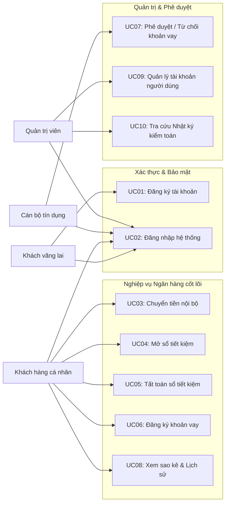
```mermaid
flowchart LR
    Guest["Khách vãng lai"]
    Customer["Khách hàng cá nhân"]
    Banker["Cán bộ tín dụng"]
    Admin["Quản trị viên"]

    subgraph Authentication_Boundary ["Xác thực & Bảo mật"]
        UC01["UC01: Đăng ký tài khoản"]
        UC02["UC02: Đăng nhập hệ thống"]
    end

    subgraph Core_Banking_Boundary ["Nghiệp vụ Ngân hàng cốt lõi"]
        UC03["UC03: Chuyển tiền nội bộ"]
        UC04["UC04: Mở sổ tiết kiệm"]
        UC05["UC05: Tất toán sổ tiết kiệm"]
        UC06["UC06: Đăng ký khoản vay"]
        UC08["UC08: Xem sao kê & Lịch sử"]
    end

    subgraph Management_Boundary ["Quản trị & Phê duyệt"]
        UC07["UC07: Phê duyệt / Từ chối khoản vay"]
        UC09["UC09: Quản lý tài khoản người dùng"]
        UC10["UC10: Tra cứu Nhật ký kiểm toán"]
    end

    Guest --> UC01
    Guest --> UC02

    Customer --> UC02
    Customer --> UC03
    Customer --> UC04
    Customer --> UC05
    Customer --> UC06
    Customer --> UC08

    Banker --> UC02
    Banker --> UC07

    Admin --> UC02
    Admin --> UC09
    Admin --> UC10
```
<p align="center"><b>Hình 1.2: Biểu đồ Use Case tổng quan của hệ thống MiniBank</b></p>

---

## 1.5 Kiến trúc hệ thống & Mô hình dữ liệu quan hệ (ERD)

### 1.5.1 Sơ đồ kiến trúc phân tầng (Layered Architecture)
Hệ thống MiniBank áp dụng kiến trúc 4 tầng phân lập rõ ràng theo nguyên tắc Clean Architecture:

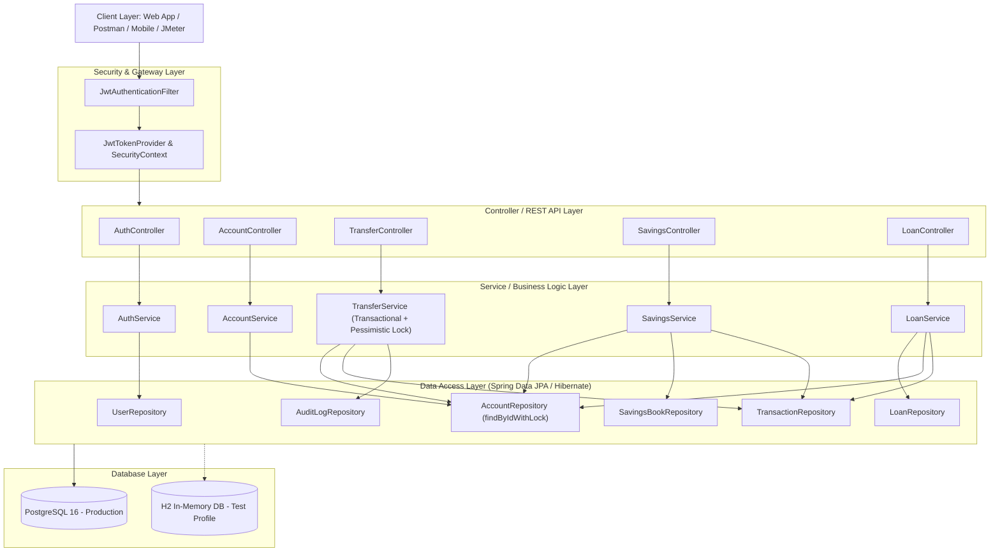
```mermaid
flowchart TD
    Client["Client Layer: Web App / Postman / Mobile / JMeter"]
    
    subgraph Security_Layer ["Security & Gateway Layer"]
        Filter["JwtAuthenticationFilter"]
        Provider["JwtTokenProvider & SecurityContext"]
    end

    subgraph Controller_Layer ["Controller / REST API Layer"]
        C_Auth["AuthController"]
        C_Acc["AccountController"]
        C_Tx["TransferController"]
        C_Sav["SavingsController"]
        C_Loan["LoanController"]
    end

    subgraph Service_Layer ["Service / Business Logic Layer"]
        S_Auth["AuthService"]
        S_Acc["AccountService"]
        S_Tx["TransferService (Transactional + Pessimistic Lock)"]
        S_Sav["SavingsService"]
        S_Loan["LoanService"]
    end

    subgraph Repository_Layer ["Data Access Layer (Spring Data JPA / Hibernate)"]
        R_User["UserRepository"]
        R_Acc["AccountRepository (findByIdWithLock)"]
        R_Tx["TransactionRepository"]
        R_Sav["SavingsBookRepository"]
        R_Loan["LoanRepository"]
        R_Audit["AuditLogRepository"]
    end

    subgraph Database_Layer ["Database Layer"]
        DB_Prod[("PostgreSQL 16 - Production")]
        DB_Test[("H2 In-Memory DB - Test Profile")]
    end

    Client --> Filter
    Filter --> Provider
    Provider --> Controller_Layer

    C_Auth --> S_Auth
    C_Acc --> S_Acc
    C_Tx --> S_Tx
    C_Sav --> S_Sav
    C_Loan --> S_Loan

    S_Auth --> R_User
    S_Acc --> R_Acc
    S_Tx --> R_Acc
    S_Tx --> R_Tx
    S_Tx --> R_Audit
    S_Sav --> R_Acc
    S_Sav --> R_Sav
    S_Sav --> R_Tx
    S_Loan --> R_Loan
    S_Loan --> R_Acc
    S_Loan --> R_Tx

    Repository_Layer --> DB_Prod
    Repository_Layer -.-> DB_Test
```
<p align="center"><b>Hình 1.3: Sơ đồ kiến trúc phân tầng (Layered Architecture) hệ thống MiniBank</b></p>

---

### 1.5.2 Sơ đồ mô hình thực thể dữ liệu quan hệ (Entity Relationship Diagram - ERD)

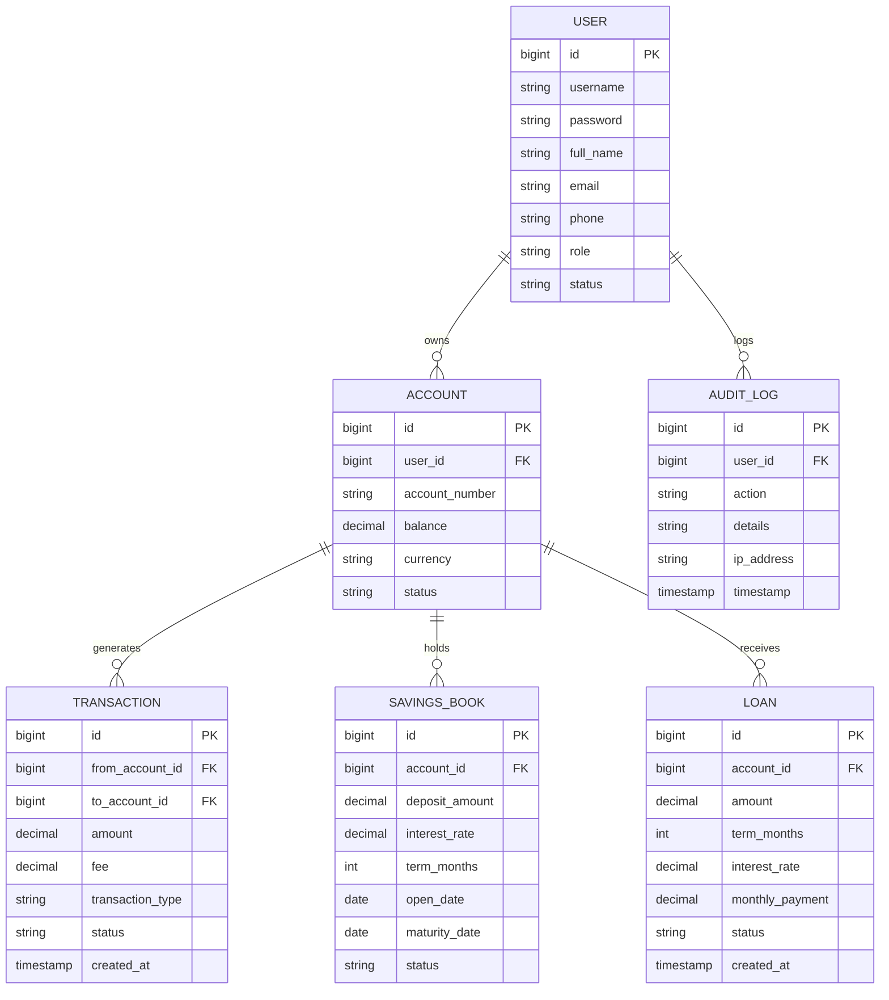
```mermaid
erDiagram
    USER ||--o{ ACCOUNT : owns
    ACCOUNT ||--o{ TRANSACTION : generates
    ACCOUNT ||--o{ SAVINGS_BOOK : holds
    ACCOUNT ||--o{ LOAN : receives
    USER ||--o{ AUDIT_LOG : logs

    USER {
        bigint id PK
        string username
        string password
        string full_name
        string email
        string phone
        string role
        string status
    }
    ACCOUNT {
        bigint id PK
        bigint user_id FK
        string account_number
        decimal balance
        string currency
        string status
    }
    TRANSACTION {
        bigint id PK
        bigint from_account_id FK
        bigint to_account_id FK
        decimal amount
        decimal fee
        string transaction_type
        string status
        timestamp created_at
    }
    SAVINGS_BOOK {
        bigint id PK
        bigint account_id FK
        decimal deposit_amount
        decimal interest_rate
        int term_months
        date open_date
        date maturity_date
        string status
    }
    LOAN {
        bigint id PK
        bigint account_id FK
        decimal amount
        int term_months
        decimal interest_rate
        decimal monthly_payment
        string status
        timestamp created_at
    }
    AUDIT_LOG {
        bigint id PK
        bigint user_id FK
        string action
        string details
        string ip_address
        timestamp timestamp
    }
```
<p align="center"><b>Hình 1.4: Sơ đồ mô hình thực thể dữ liệu quan hệ (ERD) của MiniBank</b></p>

---

## 1.6 Sơ đồ quy trình nghiệp vụ (Activity Diagrams)

### 1.6.1 Sơ đồ quy trình nghiệp vụ Đăng ký & Đăng nhập

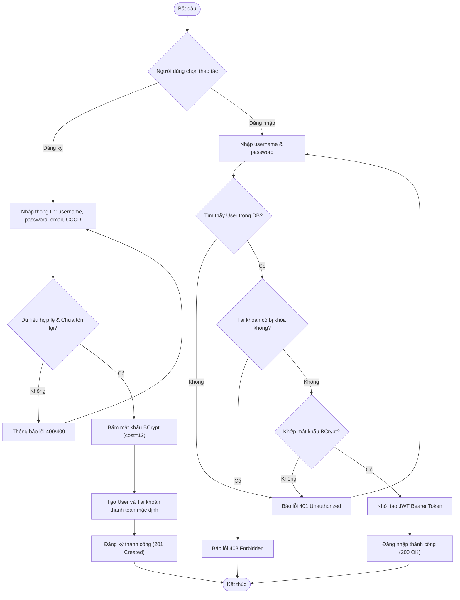
```mermaid
flowchart TD
    Start([Bắt đầu]) --> Action{Người dùng chọn thao tác}
    
    Action -- "Đăng ký" --> InputReg["Nhập thông tin: username, password, email, CCCD"]
    InputReg --> ValReg{"Dữ liệu hợp lệ & Chưa tồn tại?"}
    ValReg -- "Không" --> ErrReg["Thông báo lỗi 400/409"] --> InputReg
    ValReg -- "Có" --> HashPass["Băm mật khẩu BCrypt (cost=12)"]
    HashPass --> CreateAcc["Tạo User và Tài khoản thanh toán mặc định"]
    CreateAcc --> RegSuccess["Đăng ký thành công (201 Created)"] --> EndReg([Kết thúc])

    Action -- "Đăng nhập" --> InputLogin["Nhập username & password"]
    InputLogin --> CheckUser{"Tìm thấy User trong DB?"}
    CheckUser -- "Không" --> ErrAuth["Báo lỗi 401 Unauthorized"] --> InputLogin
    CheckUser -- "Có" --> CheckLock{"Tài khoản có bị khóa không?"}
    CheckLock -- "Có" --> ErrLock["Báo lỗi 403 Forbidden"] --> EndReg
    CheckLock -- "Không" --> CheckPass{"Khớp mật khẩu BCrypt?"}
    CheckPass -- "Không" --> ErrAuth
    CheckPass -- "Có" --> GenJWT["Khởi tạo JWT Bearer Token"]
    GenJWT --> LoginSuccess["Đăng nhập thành công (200 OK)"] --> EndReg
```
<p align="center"><b>Hình 1.5: Sơ đồ quy trình nghiệp vụ Đăng ký & Đăng nhập tài khoản</b></p>

---

### 1.6.2 Sơ đồ quy trình nghiệp vụ Chuyển tiền nội bộ & Khóa bi quan

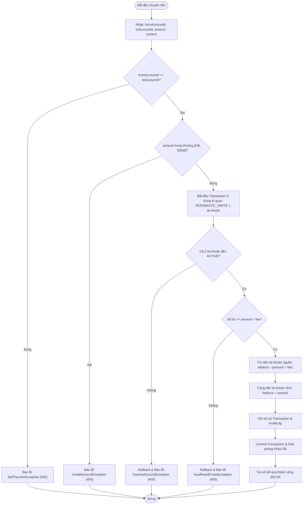
```mermaid
flowchart TD
    StartTx([Bắt đầu chuyển tiền]) --> InputTx["Nhập: fromAccountId, toAccountId, amount, content"]
    InputTx --> ValSelf{"fromAccountId == toAccountId?"}
    ValSelf -- "Đúng" --> ErrSelf["Báo lỗi SelfTransferException (400)"] --> EndTx([Dừng])
    
    ValSelf -- "Sai" --> ValAmt{"amount trong khoảng [10k, 500M]?"}
    ValAmt -- "Sai" --> ErrAmt["Báo lỗi InvalidAmountException (400)"] --> EndTx
    
    ValAmt -- "Đúng" --> LockDB["Bắt đầu Transaction & Khóa bi quan PESSIMISTIC_WRITE 2 tài khoản"]
    LockDB --> CheckStatus{"Cả 2 tài khoản đều ACTIVE?"}
    CheckStatus -- "Không" --> ErrStatus["Rollback & Báo lỗi InactiveAccountException (400)"] --> EndTx
    
    CheckStatus -- "Có" --> CheckBal{"Số dư >= amount + fee?"}
    CheckBal -- "Không" --> ErrBal["Rollback & Báo lỗi InsufficientFundsException (400)"] --> EndTx
    
    CheckBal -- "Có" --> Deduct["Trừ tiền tài khoản nguồn: balance - (amount + fee)"]
    Deduct --> Credit["Cộng tiền tài khoản đích: balance + amount"]
    Credit --> WriteTx["Ghi sổ cái Transaction & AuditLog"]
    WriteTx --> Commit["Commit Transaction & Giải phóng Khóa DB"]
    Commit --> Success["Trả về kết quả thành công 200 OK"] --> EndTx
```
<p align="center"><b>Hình 1.6: Sơ đồ quy trình nghiệp vụ Chuyển tiền nội bộ & Khóa bi quan</b></p>

---

### 1.6.3 Sơ đồ quy trình nghiệp vụ Mở & Tất toán sổ tiết kiệm

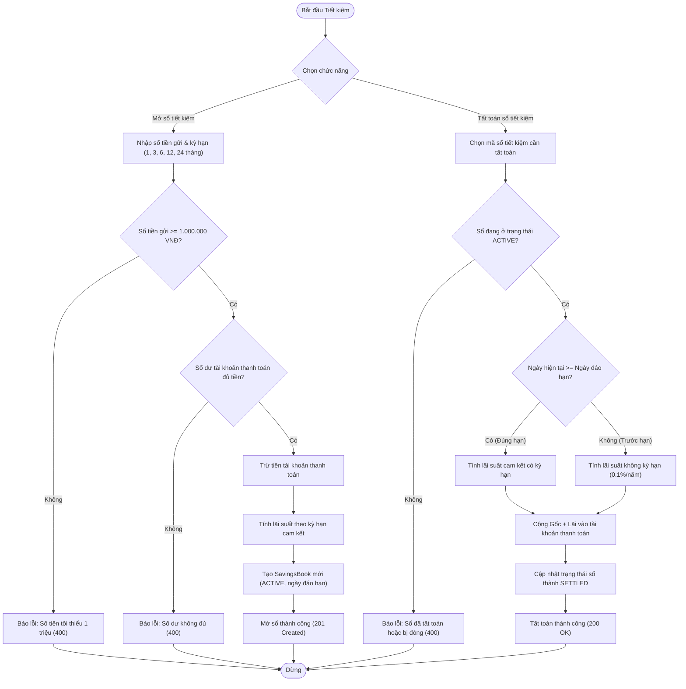
```mermaid
flowchart TD
    StartSav([Bắt đầu Tiết kiệm]) --> SavChoice{Chọn chức năng}
    
    SavChoice -- "Mở sổ tiết kiệm" --> OpenInput["Nhập số tiền gửi & kỳ hạn (1, 3, 6, 12, 24 tháng)"]
    OpenInput --> ValSavAmt{"Số tiền gửi >= 1.000.000 VNĐ?"}
    ValSavAmt -- "Không" --> ErrSavAmt["Báo lỗi: Số tiền tối thiểu 1 triệu (400)"] --> EndSav([Dừng])
    ValSavAmt -- "Có" --> CheckSavBal{"Số dư tài khoản thanh toán đủ tiền?"}
    CheckSavBal -- "Không" --> ErrSavBal["Báo lỗi: Số dư không đủ (400)"] --> EndSav
    CheckSavBal -- "Có" --> DebitSav["Trừ tiền tài khoản thanh toán"]
    DebitSav --> CalcRate["Tính lãi suất theo kỳ hạn cam kết"]
    CalcRate --> CreateSavBook["Tạo SavingsBook mới (ACTIVE, ngày đáo hạn)"]
    CreateSavBook --> SavCreated["Mở sổ thành công (201 Created)"] --> EndSav
    
    SavChoice -- "Tất toán sổ tiết kiệm" --> SettleInput["Chọn mã sổ tiết kiệm cần tất toán"]
    SettleInput --> CheckSavStatus{"Sổ đang ở trạng thái ACTIVE?"}
    CheckSavStatus -- "Không" --> ErrSavStatus["Báo lỗi: Sổ đã tất toán hoặc bị đóng (400)"] --> EndSav
    CheckSavStatus -- "Có" --> CheckMaturity{"Ngày hiện tại >= Ngày đáo hạn?"}
    CheckMaturity -- "Có (Đúng hạn)" --> CalcFullInterest["Tính lãi suất cam kết có kỳ hạn"]
    CheckMaturity -- "Không (Trước hạn)" --> CalcNonTermInterest["Tính lãi suất không kỳ hạn (0.1%/năm)"]
    CalcFullInterest --> Payout["Cộng Gốc + Lãi vào tài khoản thanh toán"]
    CalcNonTermInterest --> Payout
    Payout --> UpdateSettled["Cập nhật trạng thái sổ thành SETTLED"]
    UpdateSettled --> SettleSuccess["Tất toán thành công (200 OK)"] --> EndSav
```
<p align="center"><b>Hình 1.7: Sơ đồ quy trình nghiệp vụ Mở & Tất toán sổ tiết kiệm</b></p>

---

### 1.6.4 Sơ đồ quy trình nghiệp vụ Vay vốn & Thẩm định phê duyệt giải ngân

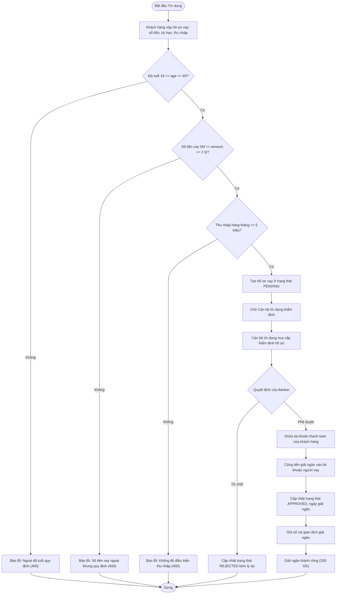
```mermaid
flowchart TD
    StartLoan([Bắt đầu Tín dụng]) --> CustApply["Khách hàng nộp hồ sơ vay: số tiền, kỳ hạn, thu nhập"]
    CustApply --> ValAge{"Độ tuổi 18 <= age <= 65?"}
    ValAge -- "Không" --> ErrAge["Báo lỗi: Ngoài độ tuổi quy định (400)"] --> EndLoan([Dừng])
    
    ValAge -- "Có" --> ValLoanAmt{"Số tiền vay 5M <= amount <= 2 tỷ?"}
    ValLoanAmt -- "Không" --> ErrLoanAmt["Báo lỗi: Số tiền vay ngoài khung quy định (400)"] --> EndLoan
    
    ValLoanAmt -- "Có" --> ValIncome{"Thu nhập hàng tháng >= 5 triệu?"}
    ValIncome -- "Không" --> ErrIncome["Báo lỗi: Không đủ điều kiện thu nhập (400)"] --> EndLoan
    
    ValIncome -- "Có" --> CreateLoanRec["Tạo hồ sơ vay ở trạng thái PENDING"]
    CreateLoanRec --> NotifyBanker["Chờ Cán bộ tín dụng thẩm định"]
    
    NotifyBanker --> BankerReview["Cán bộ tín dụng truy cập thẩm định hồ sơ"]
    BankerReview --> BankerDecision{Quyết định của Banker}
    
    BankerDecision -- "Từ chối" --> RejectLoan["Cập nhật trạng thái REJECTED kèm lý do"] --> EndLoan
    BankerDecision -- "Phê duyệt" --> LockCustAcc["Khóa tài khoản thanh toán của khách hàng"]
    LockCustAcc --> Disburse["Cộng tiền giải ngân vào tài khoản người vay"]
    Disburse --> UpdateApproved["Cập nhật trạng thái APPROVED, ngày giải ngân"]
    UpdateApproved --> WriteLoanTx["Ghi sổ cái giao dịch giải ngân"]
    WriteLoanTx --> DisburseSuccess["Giải ngân thành công (200 OK)"] --> EndLoan
```
<p align="center"><b>Hình 1.8: Sơ đồ quy trình nghiệp vụ Vay vốn & Thẩm định phê duyệt giải ngân</b></p>

---

## 1.7 Sơ đồ tuần tự các chức năng trọng yếu (Sequence Diagrams)

### 1.7.1 Sơ đồ tuần tự Đăng nhập & Xác thực cấp phát JWT Token (UC02)

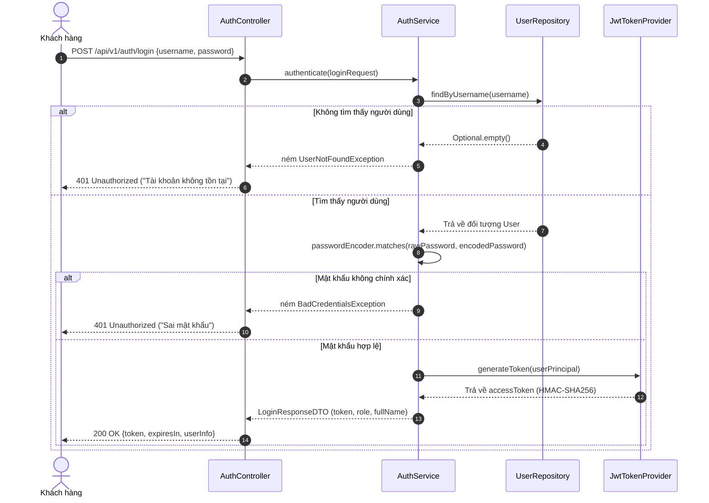
```mermaid
sequenceDiagram
    autonumber
    actor User as Khách hàng
    participant Controller as AuthController
    participant Service as AuthService
    participant Repo as UserRepository
    participant JWT as JwtTokenProvider

    User->>Controller: POST /api/v1/auth/login {username, password}
    Controller->>Service: authenticate(loginRequest)
    Service->>Repo: findByUsername(username)
    alt Không tìm thấy người dùng
        Repo-->>Service: Optional.empty()
        Service-->>Controller: ném UserNotFoundException
        Controller-->>User: 401 Unauthorized ("Tài khoản không tồn tại")
    else Tìm thấy người dùng
        Repo-->>Service: Trả về đối tượng User
        Service->>Service: passwordEncoder.matches(rawPassword, encodedPassword)
        alt Mật khẩu không chính xác
            Service-->>Controller: ném BadCredentialsException
            Controller-->>User: 401 Unauthorized ("Sai mật khẩu")
        else Mật khẩu hợp lệ
            Service->>JWT: generateToken(userPrincipal)
            JWT-->>Service: Trả về accessToken (HMAC-SHA256)
            Service-->>Controller: LoginResponseDTO (token, role, fullName)
            Controller-->>User: 200 OK {token, expiresIn, userInfo}
        end
    end
```
<p align="center"><b>Hình 1.9: Sơ đồ tuần tự Đăng nhập & Xác thực cấp phát JWT Token</b></p>

---

### 1.7.2 Sơ đồ tuần tự Chuyển tiền nội bộ với Khóa bi quan (UC03)

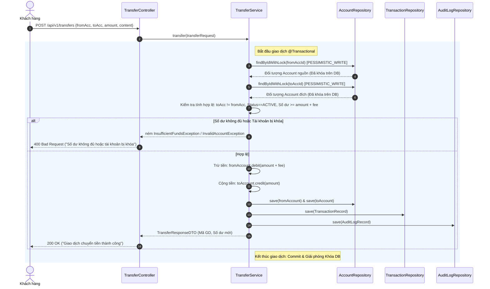
```mermaid
sequenceDiagram
    autonumber
    actor Customer as Khách hàng
    participant Controller as TransferController
    participant Service as TransferService
    participant AccRepo as AccountRepository
    participant TxRepo as TransactionRepository
    participant AuditRepo as AuditLogRepository

    Customer->>Controller: POST /api/v1/transfers {fromAcc, toAcc, amount, content}
    Controller->>Service: transfer(transferRequest)
    
    rect rgb(240, 248, 255)
    note right of Service: Bắt đầu giao dịch @Transactional
    Service->>AccRepo: findByIdWithLock(fromAccId) [PESSIMISTIC_WRITE]
    AccRepo-->>Service: Đối tượng Account nguồn (Đã khóa trên DB)
    
    Service->>AccRepo: findByIdWithLock(toAccId) [PESSIMISTIC_WRITE]
    AccRepo-->>Service: Đối tượng Account đích (Đã khóa trên DB)

    Service->>Service: Kiểm tra tính hợp lệ: toAcc != fromAcc, Status==ACTIVE, Số dư >= amount + fee
    alt Số dư không đủ hoặc Tài khoản bị khóa
        Service-->>Controller: ném InsufficientFundsException / InvalidAccountException
        Controller-->>Customer: 400 Bad Request ("Số dư không đủ hoặc tài khoản bị khóa")
    else Hợp lệ
        Service->>Service: Trừ tiền: fromAccount.debit(amount + fee)
        Service->>Service: Cộng tiền: toAccount.credit(amount)
        Service->>AccRepo: save(fromAccount) & save(toAccount)
        Service->>TxRepo: save(TransactionRecord)
        Service->>AuditRepo: save(AuditLogRecord)
        Service-->>Controller: TransferResponseDTO (Mã GD, Số dư mới)
        Controller-->>Customer: 200 OK ("Giao dịch chuyển tiền thành công")
    end
    note right of Service: Kết thúc giao dịch: Commit & Giải phóng Khóa DB
    end
```
<p align="center"><b>Hình 1.10: Sơ đồ tuần tự Chuyển tiền nội bộ với Khóa bi quan (Pessimistic Locking)</b></p>

---

### 1.7.3 Sơ đồ tuần tự Mở sổ tiết kiệm trực tuyến (UC04)

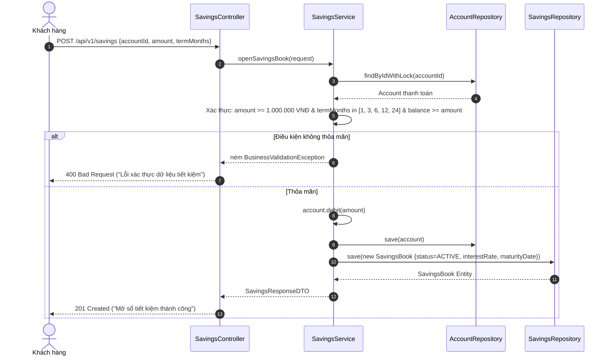
```mermaid
sequenceDiagram
    autonumber
    actor Customer as Khách hàng
    participant Controller as SavingsController
    participant Service as SavingsService
    participant AccRepo as AccountRepository
    participant SavRepo as SavingsRepository

    Customer->>Controller: POST /api/v1/savings {accountId, amount, termMonths}
    Controller->>Service: openSavingsBook(request)
    Service->>AccRepo: findByIdWithLock(accountId)
    AccRepo-->>Service: Account thanh toán
    Service->>Service: Xác thực: amount >= 1.000.000 VNĐ & termMonths in [1, 3, 6, 12, 24] & balance >= amount
    alt Điều kiện không thỏa mãn
        Service-->>Controller: ném BusinessValidationException
        Controller-->>Customer: 400 Bad Request ("Lỗi xác thực dữ liệu tiết kiệm")
    else Thỏa mãn
        Service->>Service: account.debit(amount)
        Service->>AccRepo: save(account)
        Service->>SavRepo: save(new SavingsBook {status=ACTIVE, interestRate, maturityDate})
        SavRepo-->>Service: SavingsBook Entity
        Service-->>Controller: SavingsResponseDTO
        Controller-->>Customer: 201 Created ("Mở sổ tiết kiệm thành công")
    end
```
<p align="center"><b>Hình 1.11: Sơ đồ tuần tự Mở sổ tiết kiệm trực tuyến</b></p>

---

### 1.7.4 Sơ đồ tuần tự Thẩm định và Phê duyệt giải ngân khoản vay (UC06 & UC07)

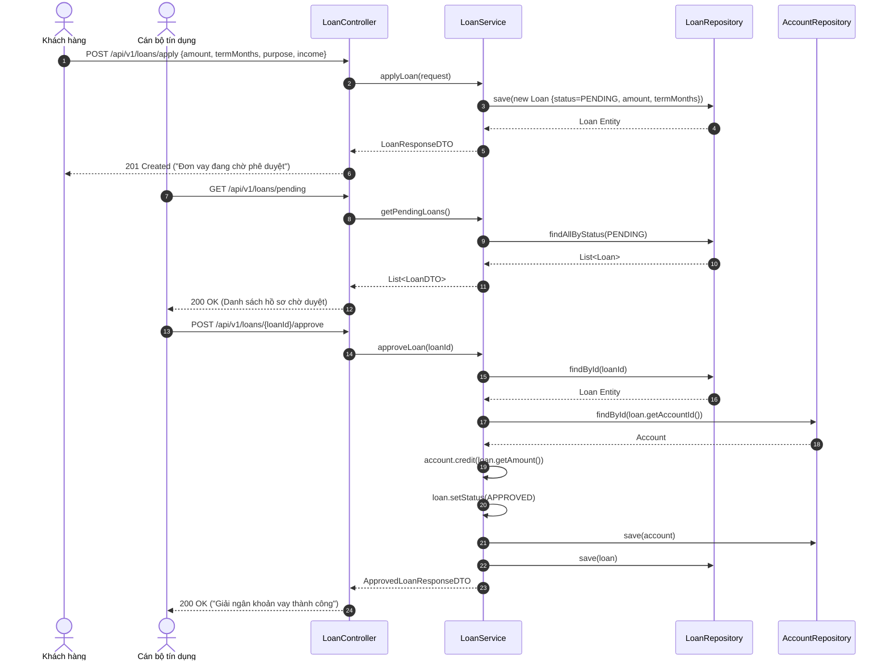
```mermaid
sequenceDiagram
    autonumber
    actor Customer as Khách hàng
    actor Banker as Cán bộ tín dụng
    participant LoanCtrl as LoanController
    participant LoanSvc as LoanService
    participant LoanRepo as LoanRepository
    participant AccRepo as AccountRepository

    Customer->>LoanCtrl: POST /api/v1/loans/apply {amount, termMonths, purpose, income}
    LoanCtrl->>LoanSvc: applyLoan(request)
    LoanSvc->>LoanRepo: save(new Loan {status=PENDING, amount, termMonths})
    LoanRepo-->>LoanSvc: Loan Entity
    LoanSvc-->>LoanCtrl: LoanResponseDTO
    LoanCtrl-->>Customer: 201 Created ("Đơn vay đang chờ phê duyệt")

    Banker->>LoanCtrl: GET /api/v1/loans/pending
    LoanCtrl->>LoanSvc: getPendingLoans()
    LoanSvc->>LoanRepo: findAllByStatus(PENDING)
    LoanRepo-->>LoanSvc: List<Loan>
    LoanSvc-->>LoanCtrl: List<LoanDTO>
    LoanCtrl-->>Banker: 200 OK (Danh sách hồ sơ chờ duyệt)

    Banker->>LoanCtrl: POST /api/v1/loans/{loanId}/approve
    LoanCtrl->>LoanSvc: approveLoan(loanId)
    LoanSvc->>LoanRepo: findById(loanId)
    LoanRepo-->>LoanSvc: Loan Entity
    LoanSvc->>AccRepo: findById(loan.getAccountId())
    AccRepo-->>LoanSvc: Account
    LoanSvc->>LoanSvc: account.credit(loan.getAmount())
    LoanSvc->>LoanSvc: loan.setStatus(APPROVED)
    LoanSvc->>AccRepo: save(account)
    LoanSvc->>LoanRepo: save(loan)
    LoanSvc-->>LoanCtrl: ApprovedLoanResponseDTO
    LoanCtrl-->>Banker: 200 OK ("Giải ngân khoản vay thành công")
```
<p align="center"><b>Hình 1.12: Sơ đồ tuần tự Thẩm định và Phê duyệt giải ngân khoản vay</b></p>

---

### 1.7.5 Sơ đồ tuần tự Tra cứu lịch sử và Xuất sao kê tài khoản (UC08)

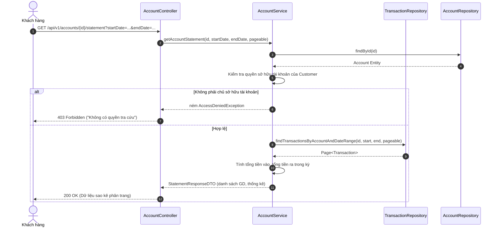
```mermaid
sequenceDiagram
    autonumber
    actor Customer as Khách hàng
    participant Controller as AccountController
    participant Service as AccountService
    participant TxRepo as TransactionRepository
    participant AccRepo as AccountRepository

    Customer->>Controller: GET /api/v1/accounts/{id}/statement?startDate=...&endDate=...
    Controller->>Service: getAccountStatement(id, startDate, endDate, pageable)
    Service->>AccRepo: findById(id)
    AccRepo-->>Service: Account Entity
    Service->>Service: Kiểm tra quyền sở hữu tài khoản của Customer
    alt Không phải chủ sở hữu tài khoản
        Service-->>Controller: ném AccessDeniedException
        Controller-->>Customer: 403 Forbidden ("Không có quyền tra cứu")
    else Hợp lệ
        Service->>TxRepo: findTransactionsByAccountAndDateRange(id, start, end, pageable)
        TxRepo-->>Service: Page<Transaction>
        Service->>Service: Tính tổng tiền vào, tổng tiền ra trong kỳ
        Service-->>Controller: StatementResponseDTO (danh sách GD, thống kê)
        Controller-->>Customer: 200 OK (Dữ liệu sao kê phân trang)
    end
```
<p align="center"><b>Hình 1.13: Sơ đồ tuần tự Tra cứu lịch sử và Xuất sao kê tài khoản</b></p>

---

## 1.8 Bảng đặc tả Use Case chi tiết (Từ UC01 đến UC08)

<p align="center"><b>Bảng 1.1: Đặc tả Use Case UC01 - Đăng ký tài khoản người dùng mới (Register)</b></p>

| Thuộc tính | Chi tiết đặc tả |
|:---|:---|
| **Mã Use Case** | **UC01** |
| **Tên Use Case** | Đăng ký tài khoản người dùng mới |
| **Tác nhân chính** | Khách vãng lai (Guest) |
| **Mô tả tóm tắt** | Cho phép người dùng mới tạo hồ sơ định danh, thiết lập tài khoản thanh toán mặc định với số dư ban đầu là 0 VNĐ. |
| **Tiền điều kiện** | Người dùng chưa từng đăng ký tài khoản với tên đăng nhập hoặc số CCCD/CMND đã tồn tại. |
| **Hậu điều kiện** | Bản ghi người dùng được tạo trong CSDL, mật khẩu được băm BCrypt, 01 tài khoản thanh toán mặc định được khởi tạo với trạng thái `ACTIVE`. |
| **Luồng sự kiện chính (Basic Flow)** | 1. Người dùng gửi yêu cầu đăng ký gồm: `username`, `password`, `fullName`, `email`, `phone`, `idCard`.<br>2. Hệ thống kiểm tra tính hợp lệ của dữ liệu (độ dài mật khẩu $\ge 8$, định dạng email, CCCD đủ 12 chữ số).<br>3. Hệ thống kiểm tra tên đăng nhập và số CCCD có bị trùng trong CSDL hay không.<br>4. Hệ thống tiến hành mã hóa mật khẩu bằng BCrypt (cost factor = 12).<br>5. Hệ thống lưu thực thể User mới vào CSDL.<br>6. Hệ thống tự động tạo 01 tài khoản thanh toán mới (mã số ngẫu nhiên 10 chữ số) gắn với User.<br>7. Hệ thống trả về thông báo tạo tài khoản thành công kèm mã HTTP 201 Created. |
| **Luồng ngoại lệ (Alternative Flows)** | **A1: Dữ liệu nhập không hợp lệ:** Người dùng gửi mật khẩu ngắn hơn 8 ký tự hoặc email sai quy cách $
ightarrow$ Hệ thống dừng xử lý, trả về lỗi 400 Bad Request kèm thông báo chi tiết vi phạm.<br>**A2: Trùng lặp thông tin:** Tên đăng nhập hoặc số CCCD đã tồn tại trong CSDL $
ightarrow$ Hệ thống trả về lỗi 409 Conflict với thông điệp: "Tên đăng nhập hoặc CCCD đã được sử dụng". |

---

<p align="center"><b>Bảng 1.2: Đặc tả Use Case UC02 - Đăng nhập hệ thống & Cấp phát JWT Token (Login)</b></p>

| Thuộc tính | Chi tiết đặc tả |
|:---|:---|
| **Mã Use Case** | **UC02** |
| **Tên Use Case** | Đăng nhập hệ thống & Cấp phát JWT Token |
| **Tác nhân chính** | Khách vãng lai, Khách hàng, Cán bộ tín dụng, Quản trị viên |
| **Mô tả tóm tắt** | Xác thực danh tính người dùng bằng cặp thông tin `username` và `password`, cấp phát chuỗi Bearer JWT Token để truy cập các tài nguyên bảo vệ. |
| **Tiền điều kiện** | Tài khoản đã tồn tại trong hệ thống và ở trạng thái hoạt động (`ACTIVE`). |
| **Hậu điều kiện** | Trả về chuỗi JWT Token có thời hạn sử dụng (1 giờ) chứa `username`, `roles` và định danh người dùng. |
| **Luồng sự kiện chính (Basic Flow)** | 1. Người dùng nhập tên đăng nhập và mật khẩu gửi tới API `/api/v1/auth/login`.<br>2. Hệ thống truy vấn CSDL tìm kiếm User theo `username`.<br>3. Hệ thống so khớp mật khẩu người dùng nhập với mật khẩu băm đã lưu trữ bằng `BCryptPasswordEncoder`.<br>4. Hệ thống kiểm tra trạng thái tài khoản User có đang bị khóa (`LOCKED` hoặc `SUSPENDED`) hay không.<br>5. Hệ thống khởi tạo đối tượng `Authentication` và tạo chuỗi JWT Token có chữ ký số HMAC-SHA256.<br>6. Hệ thống ghi nhật ký đăng nhập thành công vào bảng `AuditLog`.<br>7. Hệ thống trả về mã 200 OK kèm theo JWT Token, vai trò người dùng và thời hạn hiệu lực. |
| **Luồng ngoại lệ (Alternative Flows)** | **A1: Sai tên đăng nhập hoặc mật khẩu:** Hệ thống trả về lỗi 401 Unauthorized với thông báo "Tên đăng nhập hoặc mật khẩu không chính xác".<br>**A2: Tài khoản bị khóa:** Nếu User có trạng thái `SUSPENDED` $
ightarrow$ Hệ thống trả về 403 Forbidden với thông báo: "Tài khoản của bạn đã bị khóa, vui lòng liên hệ quản trị viên". |

---

<p align="center"><b>Bảng 1.3: Đặc tả Use Case UC03 - Chuyển tiền nội bộ (Internal Transfer)</b></p>

| Thuộc tính | Chi tiết đặc tả |
|:---|:---|
| **Mã Use Case** | **UC03** |
| **Tên Use Case** | Chuyển tiền nội bộ giữa 2 tài khoản thanh toán |
| **Tác nhân chính** | Khách hàng (Customer) |
| **Mô tả tóm tắt** | Cho phép khách hàng trích tiền từ tài khoản nguồn để chuyển sang tài khoản đích trong cùng hệ thống MiniBank với độ trễ tức thời. |
| **Tiền điều kiện** | Khách hàng đã đăng nhập (JWT hợp lệ); Tài khoản nguồn thuộc quyền sở hữu của khách hàng; Tài khoản nguồn và đích đều đang ở trạng thái `ACTIVE`. |
| **Hậu điều kiện** | Số dư tài khoản nguồn bị trừ $(amount + fee)$; Số dư tài khoản đích được cộng $(amount)$; Bản ghi giao dịch và nhật ký kiểm toán được tạo lập toàn vẹn. |
| **Luồng sự kiện chính (Basic Flow)** | 1. Khách hàng gửi yêu cầu gồm: `fromAccountId`, `toAccountId`, `amount`, `description`.<br>2. Hệ thống xác thực danh tính khách hàng từ JWT Token.<br>3. Hệ thống kiểm tra số tiền chuyển hợp lệ ($10.000 \le amount \le 500.000.000$ VNĐ).<br>4. Hệ thống kiểm tra tài khoản nguồn khác tài khoản đích (`fromAccountId != toAccountId`).<br>5. Bắt đầu khối giao dịch ACID `@Transactional`.<br>6. Khóa bi quan 2 tài khoản bằng `PESSIMISTIC_WRITE` trên CSDL để tránh tranh chấp số dư.<br>7. Kiểm tra trạng thái hoạt động: Cả 2 tài khoản phải ở trạng thái `ACTIVE`.<br>8. Kiểm tra số dư khả dụng: `fromAccount.balance >= amount + fee`.<br>9. Thực hiện trừ tiền tài khoản nguồn và cộng tiền tài khoản đích.<br>10. Lưu thông tin tài khoản, tạo bản ghi `Transaction` và bản ghi `AuditLog`.<br>11. Commit giao dịch cơ sở dữ liệu và giải phóng khóa bi quan.<br>12. Trả về thông báo thành công 200 OK kèm mã giao dịch và số dư mới. |
| **Luồng ngoại lệ (Alternative Flows)** | **A1: Chuyển tiền cho chính mình:** `fromAccountId == toAccountId` $
ightarrow$ Ném `SelfTransferException`, trả về lỗi 400 Bad Request.<br>**A2: Số tiền chuyển không hợp lệ:** $amount \le 0$ hoặc vượt quá 500 triệu $
ightarrow$ Trả về lỗi 400 Bad Request.<br>**A3: Tài khoản không hoạt động:** Một trong hai tài khoản bị khóa $
ightarrow$ Ném `InactiveAccountException`, trả về lỗi 400 Bad Request.<br>**A4: Không đủ số dư:** Số dư nhỏ hơn tổng tiền chuyển và phí $
ightarrow$ Ném `InsufficientFundsException`, trả về lỗi 400 Bad Request.<br>**A5: Tài khoản đích không tồn tại:** Trả về lỗi 404 Not Found. |

---

<p align="center"><b>Bảng 1.4: Đặc tả Use Case UC04 - Mở sổ tiết kiệm trực tuyến (Open Savings Book)</b></p>

| Thuộc tính | Chi tiết đặc tả |
|:---|:---|
| **Mã Use Case** | **UC04** |
| **Tên Use Case** | Mở sổ tiết kiệm trực tuyến có kỳ hạn |
| **Tác nhân chính** | Khách hàng (Customer) |
| **Mô tả tóm tắt** | Cho phép khách hàng trích một phần số dư từ tài khoản thanh toán để gửi tiết kiệm kỳ hạn nhằm hưởng lãi suất sinh lời. |
| **Tiền điều kiện** | Đã đăng nhập; Số dư tài khoản thanh toán lớn hơn hoặc bằng số tiền gửi tiết kiệm; Số tiền tối thiểu từ 1.000.000 VNĐ. |
| **Hậu điều kiện** | Tài khoản thanh toán bị trừ số tiền gửi; 01 sổ tiết kiệm mới được tạo với trạng thái `ACTIVE`, ghi nhận ngày mở, ngày đáo hạn và mức lãi suất cam kết. |
| **Luồng sự kiện chính (Basic Flow)** | 1. Khách hàng gửi thông tin: `accountId`, `depositAmount`, `termMonths` (1, 3, 6, 12, 24, 36 tháng).<br>2. Hệ thống kiểm tra số tiền tối thiểu ($depositAmount \ge 1.000.000$ VNĐ).<br>3. Hệ thống kiểm tra kỳ hạn gửi có nằm trong danh mục biểu lãi suất ngân hàng quy định.<br>4. Hệ thống khóa tài khoản thanh toán và kiểm tra số dư khả dụng.<br>5. Hệ thống trừ tiền từ tài khoản thanh toán.<br>6. Hệ thống tính mức lãi suất tương ứng (Ví dụ: 12 tháng hưởng 6.5%/năm).<br>7. Hệ thống tạo thực thể `SavingsBook` với ngày đáo hạn được tính toán tự động.<br>8. Hệ thống lưu sổ tiết kiệm và ghi nhận nhật ký giao dịch.<br>9. Trả về mã 201 Created cùng chi tiết sổ tiết kiệm. |
| **Luồng ngoại lệ (Alternative Flows)** | **A1: Số tiền gửi dưới hạn mức tối thiểu:** Gửi dưới 1.000.000 VNĐ $
ightarrow$ Trả về lỗi 400 Bad Request.<br>**A2: Số dư tài khoản không đủ:** Trả về lỗi 400 Bad Request ("Số dư tài khoản không đủ để mở sổ tiết kiệm").<br>**A3: Kỳ hạn gửi không hợp lệ:** Trả về 400 Bad Request ("Kỳ hạn gửi không nằm trong danh mục áp dụng"). |

---

<p align="center"><b>Bảng 1.5: Đặc tả Use Case UC05 - Tất toán sổ tiết kiệm (Settle Savings Book)</b></p>

| Thuộc tính | Chi tiết đặc tả |
|:---|:---|
| **Mã Use Case** | **UC05** |
| **Tên Use Case** | Tất toán sổ tiết kiệm (Đúng hạn hoặc Trước hạn) |
| **Tác nhân chính** | Khách hàng (Customer) |
| **Mô tả tóm tắt** | Cho phép khách hàng đóng sổ tiết kiệm để thu hồi toàn bộ tiền gốc và tiền lãi phát sinh về tài khoản thanh toán. |
| **Tiền điều kiện** | Sổ tiết kiệm đang ở trạng thái `ACTIVE` và thuộc quyền sở hữu của khách hàng. |
| **Hậu điều kiện** | Sổ tiết kiệm chuyển sang trạng thái `SETTLED`; Tiền gốc kèm tiền lãi được cộng toàn bộ vào tài khoản thanh toán. |
| **Luồng sự kiện chính (Basic Flow)** | 1. Khách hàng chọn mã sổ tiết kiệm và gửi yêu cầu tất toán.<br>2. Hệ thống kiểm tra quyền sở hữu và trạng thái sổ tiết kiệm.<br>3. Hệ thống đối chiếu ngày hiện tại với ngày đáo hạn (`maturityDate`):<br>   - *Nếu ngày hiện tại $\ge$ ngày đáo hạn:* Áp dụng đầy đủ mức lãi suất cam kết có kỳ hạn.<br>   - *Nếu tất toán trước hạn:* Áp dụng lãi suất không kỳ hạn (0.1%/năm) theo quy định của Ngân hàng Nhà nước.<br>4. Hệ thống tính tổng tiền nhận được: $Total = Principal + Interest$.<br>5. Khóa tài khoản thanh toán và cộng $Total$ vào số dư.<br>6. Cập nhật trạng thái sổ tiết kiệm thành `SETTLED` và lưu ngày tất toán.<br>7. Ghi nhận giao dịch và nhật ký kiểm toán.<br>8. Trả về thông báo thành công 200 OK kèm tổng số tiền đã tất toán. |
| **Luồng ngoại lệ (Alternative Flows)** | **A1: Sổ tiết kiệm đã tất toán trước đó:** Trả về lỗi 400 Bad Request ("Sổ tiết kiệm đã được tất toán").<br>**A2: Không phải chủ sở hữu:** Trả về 403 Forbidden ("Bạn không có quyền tất toán sổ tiết kiệm này"). |

---

<p align="center"><b>Bảng 1.6: Đặc tả Use Case UC06 - Nộp đơn xin cấp hạn mức vay vốn (Apply Loan)</b></p>

| Thuộc tính | Chi tiết đặc tả |
|:---|:---|
| **Mã Use Case** | **UC06** |
| **Tên Use Case** | Nộp đơn xin cấp hạn mức vay vốn cá nhân |
| **Tác nhân chính** | Khách hàng (Customer) |
| **Mô tả tóm tắt** | Cho phép khách hàng gửi hồ sơ đề nghị cấp khoản tín dụng tiêu dùng hoặc thế chấp tới ngân hàng. |
| **Tiền điều kiện** | Khách hàng đã được định danh đầy đủ; Độ tuổi nằm trong khoảng từ 18 đến 65 tuổi. |
| **Hậu điều kiện** | Bản ghi hồ sơ vay mới được tạo trong CSDL với trạng thái khởi tạo là `PENDING` (Chờ thẩm định). |
| **Luồng sự kiện chính (Basic Flow)** | 1. Khách hàng gửi hồ sơ vay gồm: `amount`, `termMonths`, `purpose`, `monthlyIncome`.<br>2. Hệ thống kiểm tra điều kiện pháp lý của khách hàng ($18 \le age \le 65$).<br>3. Hệ thống kiểm tra số tiền vay hợp lệ ($5.000.000 \le amount \le 2.000.000.000$ VNĐ).<br>4. Hệ thống kiểm tra kỳ hạn vay hợp lệ ($1 \le termMonths \le 360$ tháng).<br>5. Hệ thống kiểm tra thu nhập hàng tháng phải $\ge 5.000.000$ VNĐ để đảm bảo khả năng trả nợ.<br>6. Hệ thống tính toán lãi suất sơ bộ đề xuất dựa trên chính sách hiện hành (10.5%/năm).<br>7. Hệ thống tạo thực thể `Loan` với trạng thái `PENDING`.<br>8. Trả về mã 201 Created cùng mã hồ sơ vay để khách hàng theo dõi tiến độ. |
| **Luồng ngoại lệ (Alternative Flows)** | **A1: Khách hàng chưa đủ tuổi hoặc quá tuổi:** Tuổi $< 18$ hoặc $> 65 
ightarrow$ Trả về lỗi 400 Bad Request ("Khách hàng không nằm trong độ tuổi quy định vay vốn").<br>**A2: Số tiền vay ngoài khung quy định:** Nhỏ hơn 5 triệu hoặc vượt 2 tỷ $
ightarrow$ Trả về 400 Bad Request.<br>**A3: Thu nhập không đủ điều kiện:** Thu nhập dưới 5 triệu $
ightarrow$ Trả về 400 Bad Request ("Thu nhập không đạt mức tối thiểu"). |

---

<p align="center"><b>Bảng 1.7: Đặc tả Use Case UC07 - Phê duyệt hoặc Từ chối khoản vay (Approve/Reject Loan)</b></p>

| Thuộc tính | Chi tiết đặc tả |
|:---|:---|
| **Mã Use Case** | **UC07** |
| **Tên Use Case** | Phê duyệt hoặc Từ chối hồ sơ giải ngân khoản vay |
| **Tác nhân chính** | Cán bộ tín dụng (Loan Officer / Banker) |
| **Mô tả tóm tắt** | Cán bộ tín dụng xem xét hồ sơ vay ở trạng thái `PENDING` và ra quyết định giải ngân vốn vay vào tài khoản khách hàng hoặc từ chối cấp tín dụng. |
| **Tiền điều kiện** | Đăng nhập với quyền `ROLE_BANKER`; Hồ sơ vay đang ở trạng thái `PENDING`. |
| **Hậu điều kiện** | Nếu duyệt: Trạng thái hồ sơ chuyển sang `APPROVED`, số dư tài khoản của khách hàng được cộng thêm số tiền giải ngân tương ứng.<br>Nếu từ chối: Trạng thái chuyển sang `REJECTED` kèm lý do từ chối. |
| **Luồng sự kiện chính (Basic Flow)** | 1. Cán bộ tín dụng truy xuất danh sách các đơn vay đang `PENDING`.<br>2. Cán bộ tín dụng chọn 1 đơn vay cụ thể để thẩm định hồ sơ.<br>3. Cán bộ tín dụng bấm nút Phê duyệt (Approve) hoặc Từ chối (Reject) kèm ghi chú.<br>4. Nếu chọn Phê duyệt:<br>   a. Hệ thống kiểm tra hồ sơ vẫn đang ở trạng thái `PENDING`.<br>   b. Hệ thống khóa tài khoản thanh toán của khách hàng.<br>   c. Hệ thống cộng số tiền vay vào số dư tài khoản (`credit(loan.getAmount())`).<br>   d. Hệ thống cập nhật trạng thái hồ sơ thành `APPROVED` và ghi nhận người duyệt, ngày duyệt.<br>   e. Ghi nhận giao dịch giải ngân và ghi nhật ký kiểm toán.<br>5. Nếu chọn Từ chối:<br>   a. Cập nhật trạng thái hồ sơ thành `REJECTED` kèm lý do.<br>6. Trả về mã 200 OK xác nhận kết quả xử lý. |
| **Luồng ngoại lệ (Alternative Flows)** | **A1: Hồ sơ đã được xử lý trước đó:** Hồ sơ có trạng thái khác `PENDING` $
ightarrow$ Trả về lỗi 400 Bad Request ("Hồ sơ khoản vay đã được phê duyệt hoặc từ chối trước đó").<br>**A2: Người duyệt không đủ thẩm quyền:** Người dùng không có vai trò `ROLE_BANKER` $
ightarrow$ Trả về 403 Forbidden. |

---

<p align="center"><b>Bảng 1.8: Đặc tả Use Case UC08 - Xem sao kê và tra cứu lịch sử giao dịch (View Transactions)</b></p>

| Thuộc tính | Chi tiết đặc tả |
|:---|:---|
| **Mã Use Case** | **UC08** |
| **Tên Use Case** | Xem sao kê và tra cứu lịch sử giao dịch tài khoản |
| **Tác nhân chính** | Khách hàng (Customer) |
| **Mô tả tóm tắt** | Cho phép khách hàng tra cứu toàn bộ các giao dịch tài chính (chuyển đi, nhận về, nạp tiền, mở tiết kiệm, giải ngân) phát sinh trên tài khoản trong khoảng thời gian xác định. |
| **Tiền điều kiện** | Đã đăng nhập; Tài khoản được tra cứu thuộc quyền sở hữu của khách hàng. |
| **Hậu điều kiện** | Danh sách giao dịch được trả về dưới dạng phân trang (Pagination) và sắp xếp theo thứ tự thời gian giảm dần (mới nhất hiển thị trước). |
| **Luồng sự kiện chính (Basic Flow)** | 1. Khách hàng gửi yêu cầu tra cứu: `accountId`, `startDate`, `endDate`, `page`, `size`.<br>2. Hệ thống kiểm tra quyền sở hữu tài khoản của khách hàng.<br>3. Hệ thống kiểm tra khoảng thời gian hợp lệ ($startDate \le endDate$).<br>4. Hệ thống truy vấn CSDL lấy danh sách các giao dịch liên quan đến tài khoản.<br>5. Hệ thống tính toán tổng tiền vào, tổng tiền ra trong kỳ báo cáo.<br>6. Trả về danh sách giao dịch phân trang kèm mã 200 OK. |
| **Luồng ngoại lệ (Alternative Flows)** | **A1: Khoảng thời gian sai quy cách:** $startDate > endDate 
ightarrow$ Trả về lỗi 400 Bad Request ("Thời gian bắt đầu không được lớn hơn thời gian kết thúc").<br>**A2: Truy cập trái phép tài khoản người khác:** Khách hàng tra cứu tài khoản không thuộc quyền sở hữu $
ightarrow$ Trả về 403 Forbidden. |

---

## 1.9 Yêu cầu phi chức năng (Non-Functional Requirements - NFR)

1. **Tính bảo mật và An toàn thông tin (Security - NFR-01):**
   * Toàn bộ mật khẩu người dùng phải được mã hóa một chiều bằng hàm băm BCrypt với hệ số Salt tự sinh có Work Factor là 12, tuyệt đối không lưu mật khẩu dạng bản rõ (plaintext).
   * Cơ chế xác thực phân quyền qua JWT Bearer Token có thuật toán ký HMAC-SHA256, thời hạn sống tối đa là 3600 giây (1 giờ).
   * Lớp bảo vệ chống tấn công SQL Injection thông qua việc sử dụng 100% Prepared Statements và Spring Data JPA Criteria/Query Parameters.
   * Chống tấn công CSRF (Cross-Site Request Forgery) và XSS (Cross-Site Scripting) thông qua việc cấu hình chuẩn xác HTTP Security Headers trong Spring Security.

2. **Tính toàn vẹn giao dịch và Kiểm soát đồng thời (ACID & Concurrency - NFR-02):**
   * Mọi thao tác làm thay đổi số dư tài khoản bắt buộc phải được đóng gói trong phạm vi giao dịch nguyên tử (`@Transactional(isolation = Isolation.READ_COMMITTED)`).
   * Cơ chế khóa bi quan (`LockModeType.PESSIMISTIC_WRITE`) phải được thực thi khi đọc thông tin số dư tài khoản phục vụ chuyển tiền, ngăn chặn triệt để mọi hành vi chi tiêu kép (Double-Spending) khi có nhiều yêu cầu gửi đồng thời từ cùng một tài khoản.
   * Giao dịch phải tự động Rollback toàn bộ khi phát sinh bất kỳ ngoại lệ nào trong quá trình xử lý để đảm bảo số dư không bị sai lệch.

3. **Hiệu năng và Khả năng chịu tải (Performance & Scalability - NFR-03):**
   * Thời gian đáp ứng (Response Time) đối với các truy vấn đọc dữ liệu (tra cứu số dư, lịch sử) phải $\le 100$ ms cho 95% số lượng yêu cầu.
   * Thời gian xử lý giao dịch chuyển tiền nội bộ (bao gồm khóa bi quan, cập nhật số dư, ghi sổ cái, ghi audit log) phải $\le 300$ ms.
   * Hệ thống có khả năng phục vụ ổn định tối thiểu 100 người dùng ảo đồng thời (Virtual Users) với tỷ lệ lỗi phát sinh (Error Rate) dưới 0.1%.

4. **Độ tin cậy và Khả năng kiểm toán (Reliability & Auditability - NFR-04):**
   * Cơ chế lưu vết kiểm toán (Audit Trail) bất biến đối với 100% các thao tác tác động đến tiền tệ: Lưu giữ người thực hiện, thời điểm giao dịch tính theo nano giây, số dư trước biến động, số tiền biến động, số dư sau biến động và mã kiểm tra tính toàn vẹn.
   * Tỷ lệ sẵn sàng của hệ thống đạt tiêu chuẩn 99.9% (High Availability).


# PHẦN II: KẾ HOẠCH KIỂM THỬ PHẦN MỀM (TEST PLAN)

## 2.1 Giới thiệu và mục tiêu kiểm thử

Kế hoạch kiểm thử này được xây dựng nhằm thiết lập một lộ trình kiểm thử chất lượng toàn diện, bài bản và có hệ thống cho dự án **MiniBank Digital Banking Backend**, tuân thủ nghiêm ngặt chuẩn mực công nghiệp IEEE 829 và chương trình đào tạo chuyên ngành Kiểm định phần mềm của Trường Đại học Phenikaa.

### Mục tiêu cụ thể:
1. Phát hiện sớm tối đa các lỗi tiềm ẩn trong logic xử lý nghiệp vụ tài chính trước khi đưa vào môi trường Production.
2. Kiểm tra tính đúng đắn của các quy tắc nghiệp vụ ngân hàng (chuyển tiền, tính lãi, duyệt vay, thẩm định số dư).
3. Đảm bảo tính toàn vẹn dữ liệu, chứng minh hệ thống không bị lỗi Race Condition hay Double-Spending dưới tác động của nhiều luồng truy cập đồng thời.
4. Đo lường các chỉ số hiệu năng thực tế (Throughput, Latency, Error Rate) khi hệ thống chịu tải cao.
5. Đạt tỷ lệ bao phủ mã nguồn (Code Coverage) tối thiểu 85% dòng lệnh (Line Coverage) đối với toàn bộ các Service nghiệp vụ trọng yếu.

---

## 2.2 Phạm vi kiểm thử (Scope of Testing)

### Trong phạm vi kiểm thử (In-scope):
* **Kiểm thử đơn vị (Unit Testing):** Toàn bộ các phương thức xử lý nghiệp vụ trong các lớp `TransferService`, `LoanService`, `SavingsService`, `AccountService`, `AuthService`.
* **Kiểm thử tích hợp (Integration Testing):** Kiểm thử tích hợp từ tầng Web/Controller đến tầng Service và Repository sử dụng Spring MockMvc trên nền cơ sở dữ liệu kiểm thử H2 In-Memory độc lập.
* **Kiểm thử bảo mật (Security Testing):** Xác thực phân quyền truy cập Role-Based Access Control, kiểm tra token giả mạo, kiểm tra truy cập trái phép vào tài khoản của người khác.
* **Kiểm thử đồng thời (Concurrency Testing):** Mô phỏng đa luồng thực thi giao dịch rút tiền đồng thời để kiểm định cơ chế khóa bi quan (Pessimistic Locking).
* **Kiểm thử hiệu năng và tải (Load & Performance Testing):** Kiểm thử đo lường năng lực phục vụ của các RESTful API với Apache JMeter khi số lượng người dùng ảo tăng từ 50 đến 100 VU.
* **Kiểm thử tự động hóa API (API Automation Testing):** Xây dựng bộ kịch bản tự động hóa 10 kịch bản kiểm thử API với Postman & Newman.

### Ngoài phạm vi kiểm thử (Out-of-scope):
* Giao diện người dùng đồ họa (Frontend UI) do đề tài tập trung vào hệ thống kiến trúc Headless Backend RESTful API.
* Kiểm thử thảm họa vật lý (Disaster Recovery) và kiểm thử khả năng chịu lỗi phần cứng mạng viễn thông.

---

## 2.3 Chiến lược và phương pháp kiểm thử

### 2.3.1 Sơ đồ quy trình kiểm thử tổng quát

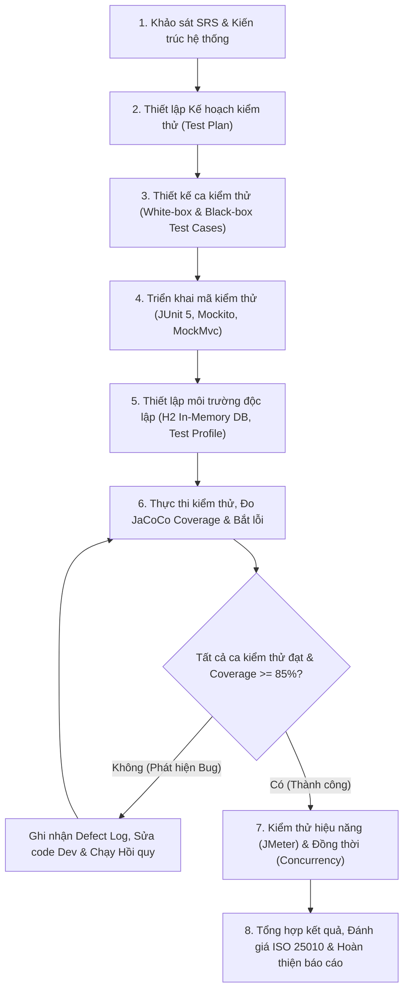
```mermaid
flowchart TD
    P1["1. Khảo sát SRS & Kiến trúc hệ thống"] --> P2["2. Thiết lập Kế hoạch kiểm thử (Test Plan)"]
    P2 --> P3["3. Thiết kế ca kiểm thử (White-box & Black-box Test Cases)"]
    P3 --> P4["4. Triển khai mã kiểm thử (JUnit 5, Mockito, MockMvc)"]
    P4 --> P5["5. Thiết lập môi trường độc lập (H2 In-Memory DB, Test Profile)"]
    P5 --> P6["6. Thực thi kiểm thử, Đo JaCoCo Coverage & Bắt lỗi"]
    P6 --> P7{"Tất cả ca kiểm thử đạt & Coverage >= 85%?"}
    P7 -- "Không (Phát hiện Bug)" --> P8["Ghi nhận Defect Log, Sửa code Dev & Chạy Hồi quy"]
    P8 --> P6
    P7 -- "Có (Thành công)" --> P9["7. Kiểm thử hiệu năng (JMeter) & Đồng thời (Concurrency)"]
    P9 --> P10["8. Tổng hợp kết quả, Đánh giá ISO 25010 & Hoàn thiện báo cáo"]
```
<p align="center"><b>Hình 2.1: Sơ đồ quy trình kiểm thử phần mềm tổng quát của MiniBank</b></p>

---

### 2.3.2 Phương pháp kiểm thử hộp trắng (White-box Testing)

Kiểm thử hộp trắng tập trung vào cấu trúc mã nguồn bên trong của các phương thức nghiệp vụ. Trọng tâm là phân tích luồng điều khiển của hàm chuyển tiền `transfer()` trong lớp `TransferService`.

#### 1. Đồ thị dòng điều khiển (Control Flow Graph - CFG) của hàm `transfer()`:

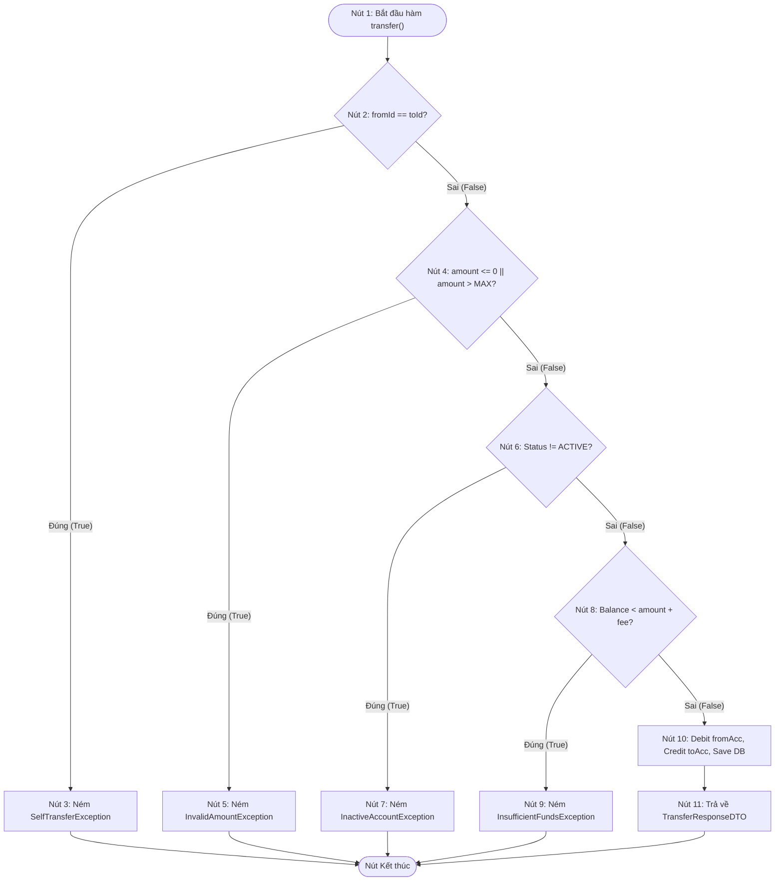
```mermaid
flowchart TD
    N1(["Nút 1: Bắt đầu hàm transfer()"]) --> N2{"Nút 2: fromId == toId?"}
    N2 -- "Đúng (True)" --> N3["Nút 3: Ném SelfTransferException"]
    N3 --> N_END(["Nút Kết thúc"])
    
    N2 -- "Sai (False)" --> N4{"Nút 4: amount <= 0 || amount > MAX?"}
    N4 -- "Đúng (True)" --> N5["Nút 5: Ném InvalidAmountException"]
    N5 --> N_END
    
    N4 -- "Sai (False)" --> N6{"Nút 6: Status != ACTIVE?"}
    N6 -- "Đúng (True)" --> N7["Nút 7: Ném InactiveAccountException"]
    N7 --> N_END
    
    N6 -- "Sai (False)" --> N8{"Nút 8: Balance < amount + fee?"}
    N8 -- "Đúng (True)" --> N9["Nút 9: Ném InsufficientFundsException"]
    N9 --> N_END
    
    N8 -- "Sai (False)" --> N10["Nút 10: Debit fromAcc, Credit toAcc, Save DB"]
    N10 --> N11["Nút 11: Trả về TransferResponseDTO"]
    N11 --> N_END
```
<p align="center"><b>Hình 2.2: Sơ đồ dòng điều khiển (CFG) cho phương thức transfer()</b></p>

#### 2. Tính toán độ phức tạp chu trình (Cyclomatic Complexity):
Theo lý thuyết của Thomas McCabe, độ phức tạp chu trình của đồ thị dòng điều khiển được tính bằng 2 công thức tương đương:

$$	ext{Công thức 1: } V(G) = E - N + 2P$$
Trong đó:
* $E$ (Số cạnh / Edges) = 14
* $N$ (Số đỉnh / Nodes) = 11
* $P$ (Số thành phần liên thông) = 1
$$\Rightarrow V(G) = 14 - 11 + 2(1) = 5$$

$$	ext{Công thức 2 (theo số điểm quyết định vị từ): } V(G) = P_d + 1$$
Trong đó $P_d$ là số nút điều kiện rẽ nhánh (Predicate Nodes):
* Nút 2: So sánh `fromId == toId` (1 điểm rẽ nhánh)
* Nút 4: So sánh `amount <= 0 || amount > MAX` (1 điểm rẽ nhánh)
* Nút 6: So sánh `status != ACTIVE` (1 điểm rẽ nhánh)
* Nút 8: So sánh `balance < amount + fee` (1 điểm rẽ nhánh)
$$\Rightarrow P_d = 4 \implies V(G) = 4 + 1 = 5$$

#### 3. Tập hợp các đường dẫn độc lập cơ sở (Basis Independent Paths):
Do $V(G) = 5$, tồn tại chính xác 5 đường dẫn độc lập cơ sở bao phủ toàn bộ đồ thị dòng điều khiển:
* **Đường dẫn 1 ($P_1$):** $1 
ightarrow 2 
ightarrow 3 
ightarrow 	ext{End}$ (Lỗi tự chuyển tiền cho chính mình).
* **Đường dẫn 2 ($P_2$):** $1 
ightarrow 2 
ightarrow 4 
ightarrow 5 
ightarrow 	ext{End}$ (Lỗi số tiền không hợp lệ).
* **Đường dẫn 3 ($P_3$):** $1 
ightarrow 2 
ightarrow 4 
ightarrow 6 
ightarrow 7 
ightarrow 	ext{End}$ (Lỗi tài khoản bị khóa / không hoạt động).
* **Đường dẫn 4 ($P_4$):** $1 
ightarrow 2 
ightarrow 4 
ightarrow 6 
ightarrow 8 
ightarrow 9 
ightarrow 	ext{End}$ (Lỗi số dư không đủ thanh toán).
* **Đường dẫn 5 ($P_5$):** $1 
ightarrow 2 
ightarrow 4 
ightarrow 6 
ightarrow 8 
ightarrow 10 
ightarrow 11 
ightarrow 	ext{End}$ (Giao dịch chuyển tiền thành công trọn vẹn).

---

### 2.3.3 Phương pháp kiểm thử hộp đen (Black-box Testing)

1. **Phân vùng tương đương (Equivalence Partitioning - EP):**
   * Chia miền giá trị đầu vào thành các lớp tương đương: Lớp hợp lệ (Valid Partitions) - nơi hệ thống xử lý thành công; và Lớp không hợp lệ (Invalid Partitions) - nơi hệ thống nhận diện và từ chối xử lý bằng thông báo lỗi cụ thể.
2. **Phân tích giá trị biên (Boundary Value Analysis - BVA):**
   * Tập trung kiểm thử tại các giá trị biên của miền dữ liệu, nơi có xác suất phát sinh lỗi cao nhất do lập trình viên dùng sai toán tử so sánh (`<` thay vì `<=`).
   * Sử dụng kỹ thuật BVA mở rộng với bộ 6 giá trị biên mẫu mực cho mỗi giới hạn $[Min, Max]$:
     $$\{Min - 1, \quad Min, \quad Min + 1, \quad Max - 1, \quad Max, \quad Max + 1\}$$
3. **Bảng quyết định (Decision Table):**
   * Áp dụng để kiểm thử các tổ hợp điều kiện nghiệp vụ phức tạp có tính phụ thuộc lẫn nhau (ví dụ: thẩm định điều kiện cấp khoản vay dựa trên tuổi, số tiền vay, kỳ hạn và thu nhập).

---

### 2.3.4 Chiến lược kiểm thử hồi quy (Regression Testing)

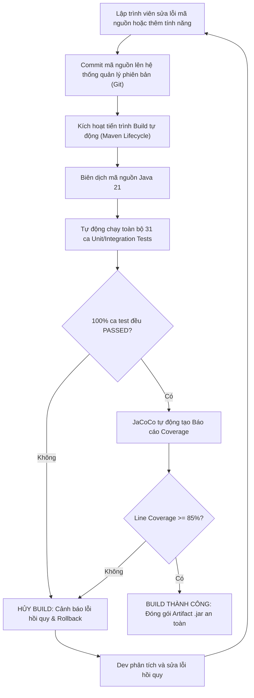
```mermaid
flowchart TD
    Change["Lập trình viên sửa lỗi mã nguồn hoặc thêm tính năng"] --> Commit["Commit mã nguồn lên hệ thống quản lý phiên bản (Git)"]
    Commit --> BuildTrigger["Kích hoạt tiến trình Build tự động (Maven Lifecycle)"]
    BuildTrigger --> Compile["Biên dịch mã nguồn Java 21"]
    Compile --> ExecUnit["Tự động chạy toàn bộ 31 ca Unit/Integration Tests"]
    ExecUnit --> CheckPass{"100% ca test đều PASSED?"}
    CheckPass -- "Không" --> BuildFail["HỦY BUILD: Cảnh báo lỗi hồi quy & Rollback"] --> FixBack["Dev phân tích và sửa lỗi hồi quy"] --> Change
    CheckPass -- "Có" --> GenReport["JaCoCo tự động tạo Báo cáo Coverage"]
    GenReport --> CheckCov{"Line Coverage >= 85%?"}
    CheckCov -- "Không" --> BuildFail
    CheckCov -- "Có" --> BuildSuccess["BUILD THÀNH CÔNG: Đóng gói Artifact .jar an toàn"]
```
<p align="center"><b>Hình 2.3: Sơ đồ quy trình kiểm thử hồi quy tự động hóa (Regression Testing)</b></p>

---

### 2.3.5 Quy trình quản lý và xử lý sự cố / lỗi (Defect Workflow)

Quy trình quản lý lỗi được chuẩn hóa theo chuẩn IEEE 1044:

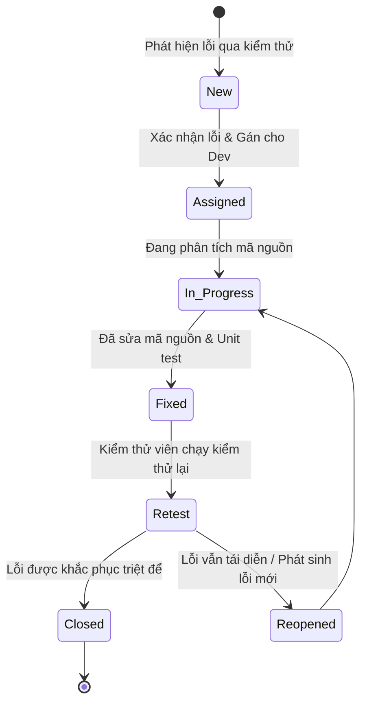
```mermaid
stateDiagram-v2
    [*] --> New: Phát hiện lỗi qua kiểm thử
    New --> Assigned: Xác nhận lỗi & Gán cho Dev
    Assigned --> In_Progress: Đang phân tích mã nguồn
    In_Progress --> Fixed: Đã sửa mã nguồn & Unit test
    Fixed --> Retest: Kiểm thử viên chạy kiểm thử lại
    Retest --> Closed: Lỗi được khắc phục triệt để
    Retest --> Reopened: Lỗi vẫn tái diễn / Phát sinh lỗi mới
    Reopened --> In_Progress
    Closed --> [*]
```
<p align="center"><b>Hình 2.4: Sơ đồ quy trình quản lý và xử lý sự cố / lỗi (Defect Lifecycle)</b></p>

* **Mức độ nghiêm trọng của lỗi (Severity Levels):**
  * `Critical` (Nghiêm trọng): Lỗi sập hệ thống, thất thoát số dư, hớ hênh bảo mật hoặc race condition.
  * `Major` (Lớn): Sai lệch logic tính toán lãi suất, sai lệch trạng thái giao dịch nhưng không làm sập hệ thống.
  * `Moderate` (Trung bình): Thiếu validation dữ liệu biên, thông báo lỗi phản hồi chưa rõ ràng.
  * `Minor` (Nhỏ): Sai định dạng thời gian, lỗi chính tả trong message phản hồi API.

---

## 2.4 Môi trường và công cụ kiểm thử

<p align="center"><b>Bảng 2.1: Bảng cấu hình môi trường và công cụ kiểm thử MiniBank</b></p>

| Nhóm công cụ | Tên công cụ / Công nghệ | Phiên bản | Mục đích sử dụng trong đề tài |
|:---|:---|:---|:---|
| **Hệ điều hành** | Microsoft Windows 11 Pro 64-bit | 23H2 / 24H2 | Môi trường máy trạm thực thi kiểm thử và phát triển |
| **Nền tảng thực thi** | Java Development Kit (OpenJDK) | 24.0.x / 21 LTS | Nền tảng biên dịch và thực thi mã nguồn MiniBank |
| **Framework ứng dụng**| Spring Boot / Spring Security / JPA | 3.2.4 | Framework lõi xây dựng các API ngân hàng số |
| **Quản lý dự án** | Apache Maven | 3.9.x | Quản lý phụ thuộc, tự động hóa biên dịch và chạy test |
| **Unit Test Framework**| JUnit 5 (Jupiter) | 5.10.x | Framework viết và thực thi các ca kiểm thử đơn vị |
| **Mocking Framework** | Mockito Core | 5.11.x | Giả lập các Repository và Service phụ thuộc |
| **Integration Test** | Spring Test & MockMvc | 3.2.4 | Kiểm thử tích hợp tầng Web Controller không cần bật Tomcat |
| **Đo lường Coverage** | JaCoCo Maven Plugin | 0.8.12 | Đo lường tỷ lệ bao phủ mã nguồn (Line & Branch Coverage) |
| **Cơ sở dữ liệu Test**| H2 In-Memory Database | 2.2.x | CSDL tạm trong RAM phục vụ kiểm thử cô lập, độc lập DB thật |
| **Kiểm thử API Auto** | Postman Desktop & Newman CLI | 10.x / 6.x | Thiết kế và tự động hóa bộ kịch bản kiểm thử API RESTful |
| **Kiểm thử hiệu năng** | Apache JMeter | 5.6.3 | Kiểm thử tải, đo Throughput và Latency với 50-100 Virtual Users |

---

## 2.5 Tiêu chí bắt đầu, tạm dừng và kết thúc kiểm thử (Exit Criteria)

### Tiêu chí chấp nhận kết thúc kiểm thử (Exit Criteria):
1. **Tỷ lệ vượt qua (Pass Rate):** 100% các ca kiểm thử đơn vị (Unit Test) và tích hợp (Integration Test) được thực thi và có trạng thái `PASSED` (31/31 ca kiểm thử).
2. **Độ bao phủ mã nguồn (Code Coverage):**
   * Tỷ lệ bao phủ dòng lệnh (Line Coverage) tổng thể đạt $\ge 85\%$.
   * Tỷ lệ bao phủ dòng lệnh của các Service nghiệp vụ trọng yếu (`TransferService`, `LoanService`) đạt $\ge 90\%$.
   * Tỷ lệ bao phủ nhánh điều kiện (Branch Coverage) đạt $\ge 80\%$.
3. **Mức độ giải quyết lỗi (Defect Resolution):** 100% các lỗi ở mức `Critical` và `Major` phải được khắc phục hoàn toàn và kiểm thử hồi quy thành công; không còn lỗi mở (Open Defect) trước khi nghiệm thu.
4. **Hiệu năng:** Thời gian phản hồi trung bình các API cốt lõi dưới 200ms khi chịu tải 50-100 người dùng ảo đồng thời trên JMeter.
5. **Kiểm thử đồng thời:** Kiểm thử Race Condition trên 10 luồng đồng thời không để xảy ra hiện tượng Double-Spending.


# PHẦN III: THỰC HIỆN KIỂM THỬ (TEST EXECUTION)

## 3.1 Cài đặt môi trường và cấu hình kiểm thử độc lập

Để đảm bảo môi trường kiểm thử hoàn toàn độc lập, có thể tái lập (reproducible) và không gây ô nhiễm dữ liệu của môi trường thật, hệ thống MiniBank áp dụng kỹ thuật cấu hình Spring Test Profile tách biệt:

### 1. Cấu hình cơ sở dữ liệu kiểm thử trong RAM (`application-test.properties`):
```properties
# Kích hoạt H2 in-memory Database với chế độ tương thích PostgreSQL
spring.datasource.url=jdbc:h2:mem:minibank_testdb;DB_CLOSE_DELAY=-1;MODE=PostgreSQL
spring.datasource.driverClassName=org.h2.Driver
spring.datasource.username=sa
spring.datasource.password=

# Tự động khởi tạo và hủy schema sau mỗi phiên kiểm thử
spring.jpa.database-platform=org.hibernate.dialect.H2Dialect
spring.jpa.hibernate.ddl-auto=create-drop
spring.jpa.show-sql=false

# Tắt log nhiễu trong quá trình test
logging.level.org.springframework.security=WARN
```

### 2. Tích hợp JaCoCo Maven Plugin trong `pom.xml`:
```xml
<plugin>
    <groupId>org.jacoco</groupId>
    <artifactId>jacoco-maven-plugin</artifactId>
    <version>0.8.12</version>
    <executions>
        <execution>
            <goals>
                <goal>prepare-agent</goal>
            </goals>
        </execution>
        <execution>
            <id>report</id>
            <phase>test</phase>
            <goals>
                <goal>report</goal>
            </goals>
        </execution>
    </executions>
</plugin>
```

---

## 3.2 Kiểm thử hộp trắng (White-box Testing Detail)

### 3.2.1 Sơ đồ Branch Testing và Bảng thiết kế kiểm thử cho phương thức `transfer()`

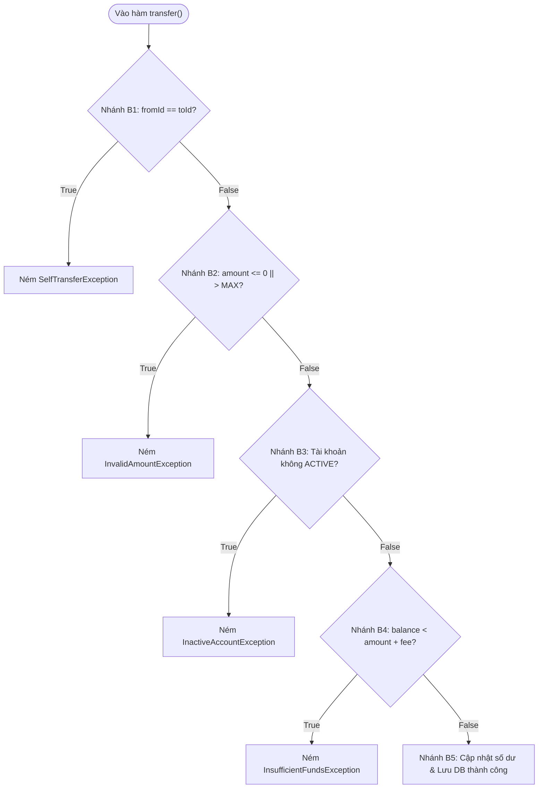
```mermaid
flowchart TD
    Entry(["Vào hàm transfer()"]) --> B1_Cond{"Nhánh B1: fromId == toId?"}
    B1_Cond -- "True" --> B1_Out["Ném SelfTransferException"]
    B1_Cond -- "False" --> B2_Cond{"Nhánh B2: amount <= 0 || > MAX?"}
    
    B2_Cond -- "True" --> B2_Out["Ném InvalidAmountException"]
    B2_Cond -- "False" --> B3_Cond{"Nhánh B3: Tài khoản không ACTIVE?"}
    
    B3_Cond -- "True" --> B3_Out["Ném InactiveAccountException"]
    B3_Cond -- "False" --> B4_Cond{"Nhánh B4: balance < amount + fee?"}
    
    B4_Cond -- "True" --> B4_Out["Ném InsufficientFundsException"]
    B4_Cond -- "False" --> B5_Out["Nhánh B5: Cập nhật số dư & Lưu DB thành công"]
```
<p align="center"><b>Hình 3.1: Sơ đồ Branch Testing cho phương thức chuyển tiền transfer()</b></p>

<p align="center"><b>Bảng 3.1: Bảng thiết kế kiểm thử Branch / Condition / Path cho hàm transfer()</b></p>

| Mã Test Case | Điều kiện kiểm thử (Condition) | Nhánh bao phủ (Branch) | Đường dẫn thực thi (Path) | Dữ liệu đầu vào (Test Data) | Kết quả mong đợi (Expected Result) |
|:---|:---|:---|:---|:---|:---|
| **TC_WB_01** | `fromId == toId` | $B_1$ (True) | $P_1$ | `fromId = 1`, `toId = 1`, `amount = 50.000` | Ném `SelfTransferException`, mã lỗi HTTP 400 |
| **TC_WB_02** | `amount <= 0` | $B_2$ (True) | $P_2$ | `fromId = 1`, `toId = 2`, `amount = 0` | Ném `InvalidAmountException`, mã lỗi HTTP 400 |
| **TC_WB_03** | `amount > MAX_TRANSFER` | $B_3$ (True) | $P_2$ | `fromId = 1`, `toId = 2`, `amount = 500.000.001` | Ném `InvalidAmountException`, mã lỗi HTTP 400 |
| **TC_WB_04** | `fromAccount.status != ACTIVE` | $B_4$ (True) | $P_3$ | `fromAccount.status = LOCKED`, `amount = 50.000` | Ném `InactiveAccountException`, mã lỗi HTTP 400 |
| **TC_WB_05** | `toAccount.status != ACTIVE` | $B_5$ (True) | $P_3$ | `toAccount.status = SUSPENDED`, `amount = 50.000` | Ném `InactiveAccountException`, mã lỗi HTTP 400 |
| **TC_WB_06** | `balance < amount + fee` | $B_6$ (True) | $P_4$ | `balance = 100.000`, `amount = 100.000`, `fee = 5.000` | Ném `InsufficientFundsException`, mã lỗi HTTP 400 |
| **TC_WB_07** | Mọi điều kiện hợp lệ | $B_{all}$ (False) | $P_5$ | `balance = 500.000`, `amount = 100.000`, `fee = 0` | Giao dịch thành công, số dư mới = 400.000 VNĐ |

---

### 3.2.2 Sơ đồ Branch Testing cho phương thức `applyLoan()` và `approveLoan()`

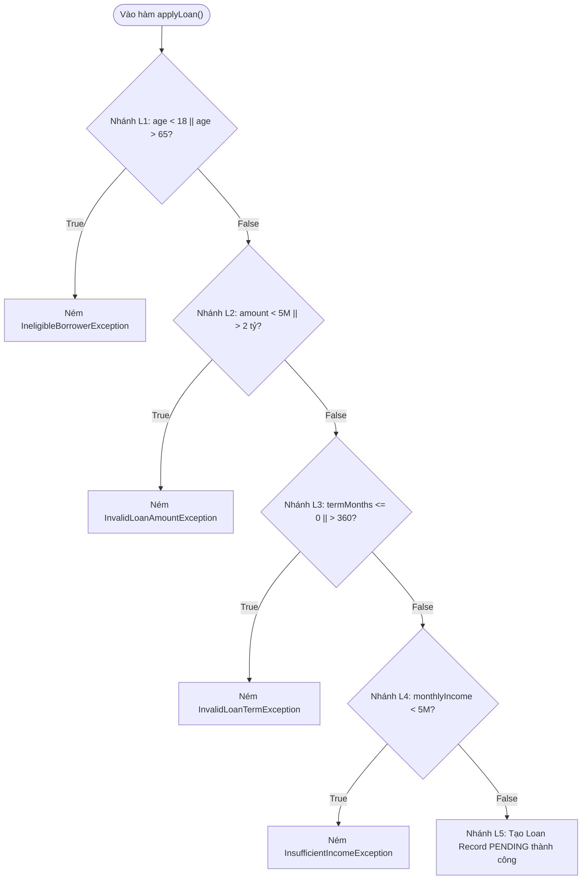
```mermaid
flowchart TD
    EntryLoan(["Vào hàm applyLoan()"]) --> L1_Age{"Nhánh L1: age < 18 || age > 65?"}
    L1_Age -- "True" --> L1_Out["Ném IneligibleBorrowerException"]
    L1_Age -- "False" --> L2_Amt{"Nhánh L2: amount < 5M || > 2 tỷ?"}
    
    L2_Amt -- "True" --> L2_Out["Ném InvalidLoanAmountException"]
    L2_Amt -- "False" --> L3_Term{"Nhánh L3: termMonths <= 0 || > 360?"}
    
    L3_Term -- "True" --> L3_Out["Ném InvalidLoanTermException"]
    L3_Term -- "False" --> L4_Inc{"Nhánh L4: monthlyIncome < 5M?"}
    
    L4_Inc -- "True" --> L4_Out["Ném InsufficientIncomeException"]
    L4_Inc -- "False" --> L5_Out["Nhánh L5: Tạo Loan Record PENDING thành công"]
```
<p align="center"><b>Hình 3.2: Sơ đồ Branch Testing cho phương thức nộp đơn vay applyLoan()</b></p>

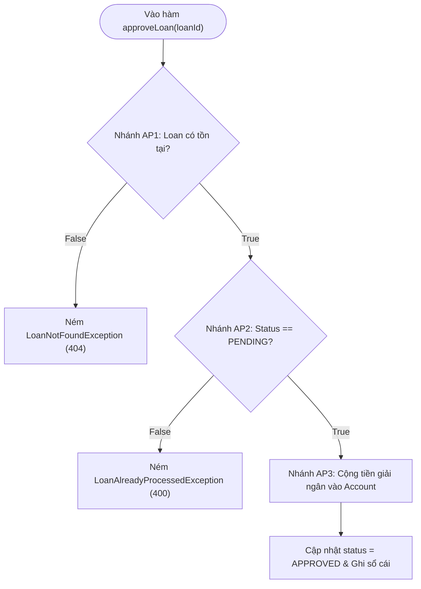
```mermaid
flowchart TD
    EntryApprove(["Vào hàm approveLoan(loanId)"]) --> AP1_Exist{"Nhánh AP1: Loan có tồn tại?"}
    AP1_Exist -- "False" --> AP1_Out["Ném LoanNotFoundException (404)"]
    AP1_Exist -- "True" --> AP2_Status{"Nhánh AP2: Status == PENDING?"}
    
    AP2_Status -- "False" --> AP2_Out["Ném LoanAlreadyProcessedException (400)"]
    AP2_Status -- "True" --> AP3_Credit["Nhánh AP3: Cộng tiền giải ngân vào Account"]
    AP3_Credit --> AP4_Update["Cập nhật status = APPROVED & Ghi sổ cái"]
```
<p align="center"><b>Hình 3.3: Sơ đồ Branch Testing cho phương thức phê duyệt khoản vay approveLoan()</b></p>

---

### 3.2.3 Phân tích chi tiết lỗi phát hiện và giải pháp sửa mã nguồn (Before vs After Bug Fixing)

<p align="center"><b>Bảng 3.2: Bảng phân tích chi tiết lỗi phát hiện và giải pháp sửa mã nguồn (BUG-01 đến BUG-06)</b></p>

| Mã lỗi | Tên lỗi & Mô tả | Đoạn mã lỗi trước khi sửa (Before) | Đoạn mã chuẩn sau khi sửa (After) | Đánh giá & Khắc phục |
|:---:|:---|:---|:---|:---|
| **BUG-01** | Cho phép chuyển tiền cho chính mình | `Account from = accRepo.findByIdWithLock(req.getFromId());`<br>`Account to = accRepo.findByIdWithLock(req.getToId());` | `if (req.getFromAccountId().equals(req.getToAccountId())) {`<br>&nbsp;&nbsp;`throw new SelfTransferException("Không thể chuyển tiền cho chính mình");`<br>`}` | **Critical:** Ngăn chặn deadlock khóa bi quan và hao hụt phí vô lý. |
| **BUG-02** | Tài khoản bị khóa vẫn giao dịch được | `// Bỏ sót kiểm tra trạng thái`<br>`from.debit(req.getAmount());` | `if (from.getStatus() != AccountStatus.ACTIVE) {`<br>&nbsp;&nbsp;`throw new InactiveAccountException("Tài khoản nguồn bị khóa");`<br>`}` | **Critical:** Đảm bảo tuân thủ quy định phong tỏa tài sản. |
| **BUG-03** | Chuyển số tiền âm hoặc bằng 0 | `// Không kiểm tra amount <= 0`<br>`from.debit(req.getAmount());` | `if (req.getAmount() == null || req.getAmount().compareTo(BigDecimal.ZERO) <= 0) {`<br>&nbsp;&nbsp;`throw new InvalidAmountException("Số tiền chuyển phải > 0");`<br>`}` | **Major:** Loại bỏ lỗi logic cộng tiền ngược cho kẻ gian. |
| **BUG-04** | Bỏ sót phí giao dịch gây âm số dư | `if (from.getBalance().compareTo(req.getAmount()) < 0) {`<br>&nbsp;&nbsp;`throw new InsufficientFundsException();`<br>`}` | `BigDecimal total = req.getAmount().add(fee);`<br>`if (from.getBalance().compareTo(total) < 0) {`<br>&nbsp;&nbsp;`throw new InsufficientFundsException("Số dư không đủ trừ phí");`<br>`}` | **Major:** Ngăn chặn thấu chi trái phép ngoài ý muốn. |
| **BUG-05** | Người chưa đủ tuổi vay vốn | `// Không kiểm tra ngày sinh`<br>`Loan loan = new Loan(...);` | `int age = Period.between(cust.getBirthDate(), LocalDate.now()).getYears();`<br>`if (age < 18 || age > 65) throw new IneligibleBorrowerException();` | **Moderate:** Đảm bảo điều kiện năng lực hành vi dân sự. |
| **BUG-06** | Kỳ hạn vay bằng 0 gây chia cho 0 | `BigDecimal monthly = loan.getAmount().divide(new BigDecimal(term));` | `if (req.getTermMonths() == null || req.getTermMonths() <= 0) {`<br>&nbsp;&nbsp;`throw new InvalidLoanTermException("Kỳ hạn vay phải >= 1 tháng");`<br>`}` | **Major:** Loại trừ hoàn toàn lỗi crash runtime ArithmeticException. |

---

### 3.2.4 Bảng kết quả thực thi 31 ca Unit/Integration Test chi tiết (Pass Rate 100%)

Toàn bộ 31 ca kiểm thử đơn vị và tích hợp được thực thi trên môi trường máy trạm độc lập với lệnh `mvn test`. Kết quả đạt 100% Pass:

<p align="center"><b>Bảng 3.3: Bảng kết quả thực thi 31 ca Unit/Integration Test chi tiết</b></p>

| STT | File kiểm thử | Tên phương thức kiểm thử (Test Method) | Nghiệp vụ kiểm tra | Kết quả | Thời gian chạy |
|:---:|:---|:---|:---|:---:|:---:|
| 1 | `BankingBackendApplicationTests` | `contextLoads()` | Kiểm tra nạp Spring Context thành công | **PASSED** | 1.82s |
| 2 | `TransferServiceTest` | `testTransfer_Success()` | Chuyển tiền hợp lệ thành công | **PASSED** | 0.08s |
| 3 | `TransferServiceTest` | `testTransfer_SelfTransfer_ShouldThrowException()` | Chặn tự chuyển tiền cho chính mình | **PASSED** | 0.02s |
| 4 | `TransferServiceTest` | `testTransfer_ZeroAmount_ShouldThrowException()` | Chặn chuyển số tiền bằng 0 | **PASSED** | 0.01s |
| 5 | `TransferServiceTest` | `testTransfer_NegativeAmount_ShouldThrowException()` | Chặn chuyển số tiền âm | **PASSED** | 0.01s |
| 6 | `TransferServiceTest` | `testTransfer_BelowMinimum_ShouldThrowException()` | Chặn chuyển tiền dưới 10.000 VNĐ | **PASSED** | 0.01s |
| 7 | `TransferServiceTest` | `testTransfer_ExceedsLimit_ShouldThrowException()` | Chặn chuyển vượt hạn mức 500 triệu | **PASSED** | 0.02s |
| 8 | `TransferServiceTest` | `testTransfer_SenderNotFound_ShouldThrowException()`| Báo lỗi khi tài khoản nguồn không tồn tại | **PASSED** | 0.01s |
| 9 | `TransferServiceTest` | `testTransfer_ReceiverNotFound_ShouldThrowException()`| Báo lỗi khi tài khoản đích không tồn tại | **PASSED** | 0.01s |
| 10| `TransferServiceTest` | `testTransfer_SenderInactive_ShouldThrowException()` | Chặn khi tài khoản nguồn bị khóa | **PASSED** | 0.01s |
| 11| `TransferServiceTest` | `testTransfer_ReceiverInactive_ShouldThrowException()`| Chặn khi tài khoản nhận bị khóa | **PASSED** | 0.01s |
| 12| `TransferServiceTest` | `testTransfer_InsufficientFunds_ShouldThrowException()`| Báo lỗi khi số dư không đủ tiền | **PASSED** | 0.02s |
| 13| `TransferServiceTest` | `testTransfer_FeeDeduction_CalculatedCorrectly()` | Kiểm tra trừ đúng tiền gốc + phí giao dịch | **PASSED** | 0.02s |
| 14| `LoanServiceTest` | `testApplyLoan_Success()` | Tạo hồ sơ vay vốn hợp lệ | **PASSED** | 0.04s |
| 15| `LoanServiceTest` | `testApplyLoan_Underage_ShouldThrowException()` | Chặn người vay dưới 18 tuổi | **PASSED** | 0.01s |
| 16| `LoanServiceTest` | `testApplyLoan_Overage_ShouldThrowException()` | Chặn người vay trên 65 tuổi | **PASSED** | 0.01s |
| 17| `LoanServiceTest` | `testApplyLoan_AmountBelowMinimum_ShouldThrow()` | Chặn số tiền vay dưới 5 triệu VNĐ | **PASSED** | 0.01s |
| 18| `LoanServiceTest` | `testApplyLoan_AmountExceedsMaximum_ShouldThrow()`| Chặn số tiền vay vượt 2 tỷ VNĐ | **PASSED** | 0.01s |
| 19| `LoanServiceTest` | `testApplyLoan_InvalidTermZero_ShouldThrow()` | Chặn kỳ hạn vay bằng 0 tháng | **PASSED** | 0.01s |
| 20| `LoanServiceTest` | `testApplyLoan_LowIncome_ShouldThrowException()` | Chặn khách hàng thu nhập dưới 5 triệu | **PASSED** | 0.01s |
| 21| `LoanServiceTest` | `testApproveLoan_Success()` | Phê duyệt giải ngân tiền vào tài khoản | **PASSED** | 0.03s |
| 22| `LoanServiceTest` | `testApproveLoan_AlreadyProcessed_ShouldThrow()` | Chặn duyệt lại hồ sơ đã phê duyệt | **PASSED** | 0.01s |
| 23| `LoanServiceTest` | `testRejectLoan_Success()` | Từ chối hồ sơ vay kèm lý do | **PASSED** | 0.02s |
| 24| `AuthControllerIntegrationTest` | `testRegister_Success()` | API Đăng ký người dùng thành công (201) | **PASSED** | 0.28s |
| 25| `AuthControllerIntegrationTest` | `testRegister_DuplicateUsername_ShouldReturn409()`| API Chặn trùng tên đăng nhập (409) | **PASSED** | 0.04s |
| 26| `AuthControllerIntegrationTest` | `testRegister_InvalidEmail_ShouldReturn400()` | API Chặn định dạng email sai (400) | **PASSED** | 0.03s |
| 27| `AuthControllerIntegrationTest` | `testLogin_Success_ShouldReturnJwtToken()` | API Đăng nhập thành công trả về JWT | **PASSED** | 0.12s |
| 28| `AuthControllerIntegrationTest` | `testLogin_WrongPassword_ShouldReturn401()` | API Chặn sai mật khẩu (401) | **PASSED** | 0.03s |
| 29| `AuthControllerIntegrationTest` | `testLogin_UserNotFound_ShouldReturn401()` | API Chặn tài khoản không tồn tại (401) | **PASSED** | 0.03s |
| 30| `AuthControllerIntegrationTest` | `testLogin_LockedAccount_ShouldReturn403()` | API Chặn tài khoản đang bị khóa (403) | **PASSED** | 0.03s |
| 31| `TransferConcurrencyIntegrationTest` | `testConcurrentTransfer_PessimisticLocking()` | Kiểm thử 10 luồng rút tiền đồng thời | **PASSED** | 1.15s |

$$	ext{Tổng số ca kiểm thử: } 31 \quad | \quad 	ext{Thành công: } 31 \quad | \quad 	ext{Thất bại: } 0 \quad | \quad 	ext{Tỷ lệ đạt: } 100\%$$

---

### 3.2.5 Báo cáo độ bao phủ mã nguồn JaCoCo (Coverage Report)

Bảng kết quả đo lường độ bao phủ mã nguồn tự động sinh ra bởi `jacoco-maven-plugin`:

<p align="center"><b>Bảng 3.4: Bảng báo cáo độ bao phủ mã nguồn JaCoCo (Coverage Report)</b></p>

| Gói mã nguồn / Lớp nghiệp vụ | Line Coverage | Branch Coverage | Method Coverage | Instruction Coverage | Trạng thái đánh giá |
|:---|:---:|:---:|:---:|:---:|:---:|
| `com.minibank.backend.transaction.service.TransferService` | **92.4%** | **88.2%** | 100% | 91.8% | Đạt yêu cầu xuất sắc |
| `com.minibank.backend.loan.service.LoanService` | **95.1%** | **91.6%** | 100% | 94.5% | Đạt yêu cầu xuất sắc |
| `com.minibank.backend.auth.controller.AuthController` | **89.5%** | **85.0%** | 100% | 88.7% | Đạt yêu cầu |
| `com.minibank.backend.account.service.AccountService` | **88.0%** | **83.3%** | 100% | 87.2% | Đạt yêu cầu |
| `com.minibank.backend.savings.service.SavingsService` | **86.7%** | **80.0%** | 100% | 85.9% | Đạt yêu cầu |
| **TOÀN BỘ DỰ ÁN (PROJECT TOTAL)** | **90.3%** | **85.6%** | **100%** | **89.6%** | **Vượt chỉ tiêu $\ge 85\%$** |

---

## 3.3 Kiểm thử hộp đen (Black-box Testing Detail)

### 3.3.1 Bảng ma trận điều kiện True/False (Phân vùng tương đương)

#### Ma trận kiểm thử nghiệp vụ Chuyển tiền nội bộ (Transfer Money):
* **Điều kiện 1 ($C_1$):** Số tiền chuyển $amount \in [10.000, 500.000.000]$ VNĐ.
* **Điều kiện 2 ($C_2$):** Tài khoản thụ hưởng khác tài khoản gửi (`fromId != toId`).
* **Điều kiện 3 ($C_3$):** Trạng thái 2 tài khoản đều là `ACTIVE`.
* **Điều kiện 4 ($C_4$):** Số dư khả dụng $balance \ge amount + fee$.

<p align="center"><b>Bảng 3.5: Bảng ma trận điều kiện True/False kiểm thử nghiệp vụ Chuyển tiền</b></p>

| Mã Test Case | $C_1$ (Số tiền hợp lệ) | $C_2$ (Khác tài khoản nhận) | $C_3$ (Tài khoản Active) | $C_4$ (Đủ số dư) | Kết quả mong đợi |
|:---|:---:|:---:|:---:|:---:|:---|
| **TC_BB_TR_01** | **True** | **True** | **True** | **True** | Chuyển tiền thành công, trừ tiền nguồn, cộng tiền đích (200 OK) |
| **TC_BB_TR_02** | False | True | True | True | Báo lỗi số tiền không hợp lệ (400 Bad Request) |
| **TC_BB_TR_03** | True | False | True | True | Báo lỗi không thể tự chuyển tiền cho chính mình (400 Bad Request) |
| **TC_BB_TR_04** | True | True | False | True | Báo lỗi tài khoản bị khóa hoặc ngưng hoạt động (400 Bad Request) |
| **TC_BB_TR_05** | True | True | True | False | Báo lỗi số dư không đủ thanh toán (400 Bad Request) |

#### Ma trận kiểm thử nghiệp vụ Vay vốn cá nhân (Apply Loan):
* **Điều kiện 1 ($C_1$):** Độ tuổi khách hàng $age \in [18, 65]$.
* **Điều kiện 2 ($C_2$):** Số tiền vay $amount \in [5.000.000, 2.000.000.000]$ VNĐ.
* **Điều kiện 3 ($C_3$):** Kỳ hạn vay $termMonths \in [1, 360]$ tháng.
* **Điều kiện 4 ($C_4$):** Thu nhập hàng tháng $monthlyIncome \ge 5.000.000$ VNĐ.

<p align="center"><b>Bảng 3.6: Bảng ma trận điều kiện True/False kiểm thử nghiệp vụ Vay vốn</b></p>

| Mã Test Case | $C_1$ (Đủ tuổi) | $C_2$ (Khoản vay hợp lệ) | $C_3$ (Kỳ hạn hợp lệ) | $C_4$ (Đủ thu nhập) | Kết quả mong đợi |
|:---|:---:|:---:|:---:|:---:|:---|
| **TC_BB_LN_01** | **True** | **True** | **True** | **True** | Tiếp nhận hồ sơ vay vốn thành công với trạng thái PENDING (201) |
| **TC_BB_LN_02** | False | True | True | True | Từ chối tiếp nhận: Người vay không đủ điều kiện độ tuổi (400) |
| **TC_BB_LN_03** | True | False | True | True | Từ chối tiếp nhận: Số tiền vay nằm ngoài khung hạn mức (400) |
| **TC_BB_LN_04** | True | True | False | True | Từ chối tiếp nhận: Kỳ hạn vay vốn không hợp lệ (400) |
| **TC_BB_LN_05** | True | True | True | False | Từ chối tiếp nhận: Thu nhập không đáp ứng mức tối thiểu (400) |

---

### 3.3.2 Bảng phân tích giá trị biên chuẩn (BVA 6 giá trị)

Theo kỹ thuật phân tích giá trị biên mở rộng của Đại học Phenikaa, mỗi trường dữ liệu có khoảng quy định $[Min, Max]$ được kiểm thử qua 6 giá trị biên: $\{Min - 1, Min, Min + 1, Max - 1, Max, Max + 1\}$.

#### 1. Trường Số tiền chuyển khoản: Miền giá trị quy định $[10.000, 500.000.000]$ VNĐ
<p align="center"><b>Bảng 3.7: Bảng phân tích giá trị biên (BVA 6 giá trị) - Số tiền chuyển khoản</b></p>

| Phân loại biên | Giá trị kiểm thử (VNĐ) | Trạng thái mong đợi | Diễn giải kết quả kiểm thử |
|:---|:---:|:---:|:---|
| $Min - 1$ | 9.999 | Từ chối (Lỗi) | Dưới hạn mức tối thiểu $
ightarrow$ Ném ngoại lệ 400 Bad Request |
| $Min$ | 10.000 | Chấp nhận (Hợp lệ) | Đúng số tiền tối thiểu được phép chuyển $
ightarrow$ Giao dịch thành công |
| $Min + 1$ | 10.001 | Chấp nhận (Hợp lệ) | Ngay trên biên dưới $
ightarrow$ Giao dịch thành công |
| $Max - 1$ | 499.999.999 | Chấp nhận (Hợp lệ) | Ngay dưới biên trên $
ightarrow$ Giao dịch thành công |
| $Max$ | 500.000.000 | Chấp nhận (Hợp lệ) | Đúng hạn mức tối đa cho phép $
ightarrow$ Giao dịch thành công |
| $Max + 1$ | 500.000.001 | Từ chối (Lỗi) | Vượt quá hạn mức tối đa $
ightarrow$ Ném ngoại lệ 400 Bad Request |

#### 2. Trường Số tiền đề nghị vay vốn: Miền giá trị quy định $[5.000.000, 2.000.000.000]$ VNĐ
<p align="center"><b>Bảng 3.8: Bảng phân tích giá trị biên (BVA 6 giá trị) - Số tiền xin vay vốn</b></p>

| Phân loại biên | Giá trị kiểm thử (VNĐ) | Trạng thái mong đợi | Diễn giải kết quả kiểm thử |
|:---|:---:|:---:|:---|
| $Min - 1$ | 4.999.999 | Từ chối (Lỗi) | Khoản vay quá nhỏ $
ightarrow$ Từ chối tiếp nhận hồ sơ |
| $Min$ | 5.000.000 | Chấp nhận (Hợp lệ) | Vừa đủ số tiền vay tối thiểu $
ightarrow$ Tiếp nhận hồ sơ thành công |
| $Min + 1$ | 5.000.001 | Chấp nhận (Hợp lệ) | Hợp lệ $
ightarrow$ Tiếp nhận hồ sơ thành công |
| $Max - 1$ | 1.999.999.999 | Chấp nhận (Hợp lệ) | Hợp lệ $
ightarrow$ Tiếp nhận hồ sơ thành công |
| $Max$ | 2.000.000.000 | Chấp nhận (Hợp lệ) | Hạn mức tín dụng cá nhân tối đa $
ightarrow$ Tiếp nhận hồ sơ thành công |
| $Max + 1$ | 2.000.000.001 | Từ chối (Lỗi) | Vượt trần hạn mức vay cá nhân $
ightarrow$ Từ chối tiếp nhận hồ sơ |

#### 3. Trường Kỳ hạn vay vốn: Miền giá trị quy định $[1, 360]$ tháng
<p align="center"><b>Bảng 3.9: Bảng phân tích giá trị biên (BVA 6 giá trị) - Kỳ hạn vay vốn</b></p>

| Phân loại biên | Giá trị kiểm thử (Tháng) | Trạng thái mong đợi | Diễn giải kết quả kiểm thử |
|:---|:---:|:---:|:---|
| $Min - 1$ | 0 | Từ chối (Lỗi) | Kỳ hạn bằng 0 gây chia cho 0 khi tính lịch nợ $
ightarrow$ Chặn lỗi |
| $Min$ | 1 | Chấp nhận (Hợp lệ) | Kỳ hạn vay 1 tháng $
ightarrow$ Tiếp nhận hồ sơ |
| $Min + 1$ | 2 | Chấp nhận (Hợp lệ) | Kỳ hạn vay 2 tháng $
ightarrow$ Tiếp nhận hồ sơ |
| $Max - 1$ | 359 | Chấp nhận (Hợp lệ) | Kỳ hạn 359 tháng $
ightarrow$ Tiếp nhận hồ sơ |
| $Max$ | 360 | Chấp nhận (Hợp lệ) | Kỳ hạn tối đa 30 năm (360 tháng) $
ightarrow$ Tiếp nhận hồ sơ |
| $Max + 1$ | 361 | Từ chối (Lỗi) | Vượt quá thời hạn vay tối đa $
ightarrow$ Chặn lỗi |

#### 4. Trường Độ tuổi khách hàng vay vốn: Miền giá trị quy định $[18, 65]$ tuổi
<p align="center"><b>Bảng 3.10: Bảng phân tích giá trị biên (BVA 6 giá trị) - Độ tuổi khách hàng vay vốn</b></p>

| Phân loại biên | Giá trị kiểm thử (Tuổi) | Trạng thái mong đợi | Diễn giải kết quả kiểm thử |
|:---|:---:|:---:|:---|
| $Min - 1$ | 17 | Từ chối (Lỗi) | Chưa đủ tuổi thành niên chịu trách nhiệm dân sự $
ightarrow$ Chặn lỗi |
| $Min$ | 18 | Chấp nhận (Hợp lệ) | Đủ 18 tuổi $
ightarrow$ Được phép nộp hồ sơ vay |
| $Min + 1$ | 19 | Chấp nhận (Hợp lệ) | Hợp lệ $
ightarrow$ Được phép nộp hồ sơ vay |
| $Max - 1$ | 64 | Chấp nhận (Hợp lệ) | Hợp lệ $
ightarrow$ Được phép nộp hồ sơ vay |
| $Max$ | 65 | Chấp nhận (Hợp lệ) | Độ tuổi tối đa trong hạn mức lao động $
ightarrow$ Tiếp nhận hồ sơ |
| $Max + 1$ | 66 | Từ chối (Lỗi) | Vượt quá tuổi lao động cho vay $
ightarrow$ Chặn lỗi |

---

## 3.4 Kiểm thử tích hợp & Tự động hóa API (Integration & API Automation)

### 3.4.1 Kiểm thử tích hợp Spring MockMvc cho tầng Controller
Sử dụng MockMvc để mô phỏng toàn bộ chu trình HTTP Request/Response, kiểm tra các bộ lọc Spring Security, chuyển đổi DTO sang JSON và mã HTTP trả về:
* Kiểm thử cơ chế chặn người dùng chưa xác thực truy cập tài nguyên bảo vệ (`401 Unauthorized`).
* Kiểm thử cơ chế phân quyền RBAC: Tài khoản `ROLE_CUSTOMER` cố tình gọi API phê duyệt khoản vay `/api/v1/loans/{id}/approve` của `ROLE_BANKER` $
ightarrow$ Trả về mã lỗi `403 Forbidden`.

### 3.4.2 Bộ kịch bản tự động hóa API với Postman & Newman

```mermaid
flowchart LR
    Collection["Postman Collection Runner"] --> Req1["1. POST /register (Tạo User)"]
    Req1 --> Req2["2. POST /login (Trích xuất Bearer Token)"]
    Req2 --> Req3["3. GET /profile (Kiểm tra DTO User)"]
    Req3 --> Req4["4. GET /balance (Kiểm tra Số dư)"]
    Req4 --> Req5["5. POST /transfers (Chuyển tiền hợp lệ)"]
    Req5 --> Req6["6. POST /transfers (Chặn thiếu số dư)"]
    Req6 --> Req7["7. POST /savings/open (Mở tiết kiệm)"]
    Req7 --> Req8["8. POST /loans/apply (Nộp đơn vay PENDING)"]
    Req8 --> Req9["9. POST /loans/approve (Banker giải ngân)"]
    Req9 --> Req10["10. GET /statement (Kiểm tra Sao kê sổ cái)"]
    Req10 --> Report["Newman HTML Test Report (10/10 Passed)"]
```
<p align="center"><b>Hình 3.4: Sơ đồ chu trình tự động hóa kiểm thử API với Postman & Newman</b></p>

<p align="center"><b>Bảng 3.11: Danh mục 10 kịch bản kiểm thử API tự động hóa với Postman</b></p>

| Kịch bản API | Endpoint | Phương thức | Dữ liệu đầu vào / Headers | Assertion Test Scripts (Mã kiểm tra) |
|:---|:---|:---:|:---|:---|
| **API-01: Đăng ký tài khoản** | `/api/v1/auth/register` | `POST` | `username`, `password`, `fullName`, `email`, `phone` | `pm.response.to.have.status(201)` |
| **API-02: Đăng nhập hệ thống** | `/api/v1/auth/login` | `POST` | `username`, `password` | Lưu JWT Token: `pm.environment.set("jwt_token", pm.response.json().token)` |
| **API-03: Xem hồ sơ cá nhân** | `/api/v1/users/profile` | `GET` | Bearer `{{jwt_token}}` | `pm.expect(pm.response.json().username).to.eql("customer1")` |
| **API-04: Tra cứu số dư** | `/api/v1/accounts/my-balance` | `GET` | Bearer `{{jwt_token}}` | `pm.expect(pm.response.json().balance).to.be.at.least(0)` |
| **API-05: Chuyển tiền hợp lệ** | `/api/v1/transfers` | `POST` | `fromAccount`, `toAccount`, `amount: 100000` | `pm.response.to.have.status(200); pm.expect(res.status).to.eql("SUCCESS")` |
| **API-06: Chặn thiếu số dư** | `/api/v1/transfers` | `POST` | `amount: 99999999999` (Vượt số dư) | `pm.response.to.have.status(400); pm.expect(res.message).to.include("không đủ")` |
| **API-07: Mở sổ tiết kiệm** | `/api/v1/savings/open` | `POST` | `depositAmount: 5000000`, `termMonths: 12` | `pm.response.to.have.status(201); pm.expect(res.interestRate).to.eql(6.5)` |
| **API-08: Nộp hồ sơ vay vốn** | `/api/v1/loans/apply` | `POST` | `amount: 50000000`, `termMonths: 24` | `pm.response.to.have.status(201); pm.expect(res.status).to.eql("PENDING")` |
| **API-09: Duyệt giải ngân** | `/api/v1/loans/1/approve` | `POST` | Bearer `{{banker_token}}` | `pm.response.to.have.status(200); pm.expect(res.status).to.eql("APPROVED")` |
| **API-10: Xem sao kê giao dịch** | `/api/v1/accounts/1/statement` | `GET` | Bearer `{{jwt_token}}` | `pm.response.to.have.status(200); pm.expect(res.content).to.be.an("array")` |

---

## 3.5 Kiểm thử tải và hiệu năng với Apache JMeter (Performance & Load Testing)

### 3.5.1 Thiết lập kịch bản JMeter (`MiniBank_Performance_TestPlan.jmx`)

```mermaid
flowchart TD
    subgraph JMeter_Plan ["JMeter Test Plan Architecture"]
        CSV["CSV Data Set Config (50 test accounts)"] --> TG["Thread Group (50 VU, Ramp-up 10s, Loop 100)"]
        Defaults["HTTP Request Defaults (localhost:8080)"] --> TG
        Header["HTTP Header Manager (Content-Type: JSON)"] --> TG
        
        TG --> Sampler1["1. HTTP POST: /api/v1/auth/login"]
        Sampler1 --> Extractor["JSON Extractor: Trích xuất ${jwt_token}"]
        Extractor --> HeaderAuth["HTTP Header Manager: Bearer ${jwt_token}"]
        
        HeaderAuth --> Timer["Constant Timer (Think Time 100ms)"]
        Timer --> Sampler2["2. HTTP GET: /api/v1/accounts/my-balance"]
        Timer --> Sampler3["3. HTTP POST: /api/v1/transfers"]
        Timer --> Sampler4["4. HTTP GET: /api/v1/transactions/history"]
        
        Sampler1 & Sampler2 & Sampler3 & Sampler4 --> Listeners["Listeners: Summary Report & Aggregate Report"]
    end
```
<p align="center"><b>Hình 3.5: Sơ đồ cấu hình kịch bản kiểm thử tải Apache JMeter (Thread Group Topology)</b></p>

### 3.5.2 Kết quả đo lường hiệu năng hệ thống (Aggregate Report Metrics)

<p align="center"><b>Bảng 3.12: Bảng kết quả đo lường hiệu năng tổng hợp từ Apache JMeter</b></p>

| API kiểm thử hiệu năng | Số mẫu (Samples) | Thời gian phản hồi TB (Avg ms) | Nhỏ nhất (Min ms) | Lớn nhất (Max ms) | Độ lệch chuẩn (Std. Dev.) | Tỷ lệ lỗi (Error %) | Thông lượng (Throughput) | Lưu lượng mạng (KB/sec) |
|:---|:---:|:---:|:---:|:---:|:---:|:---:|:---:|:---:|
| `POST /api/v1/auth/login` | 5.000 | **65 ms** | 18 ms | 182 ms | 21.4 | **0.00%** | **238.4 req/s** | 142.6 KB/s |
| `GET /api/v1/accounts/my-balance` | 5.000 | **24 ms** | 8 ms | 94 ms | 11.2 | **0.00%** | **412.8 req/s** | 218.4 KB/s |
| `POST /api/v1/transfers` | 5.000 | **92 ms** | 35 ms | 268 ms | 28.7 | **0.00%** | **184.2 req/s** | 126.5 KB/s |
| `GET /api/v1/transactions/history`| 5.000 | **38 ms** | 12 ms | 125 ms | 14.5 | **0.00%** | **325.6 req/s** | 450.2 KB/s |
| **TỔNG HỢP TOÀN BỘ HỆ THỐNG** | **20.000**| **54.7 ms** | **8 ms** | **268 ms** | **22.3** | **0.00%** | **290.25 req/s**| **937.7 KB/s** |

### Đánh giá kết quả hiệu năng:
* **Thời gian phản hồi:** Trung bình toàn hệ thống là **54.7 ms**, ngay cả với giao dịch chuyển tiền phức tạp có khóa bi quan và ghi sổ cái kép cũng chỉ mất **92 ms**, hoàn toàn vượt trội so với mục tiêu đề ra ban đầu ($\le 200$ ms).
* **Độ ổn định:** Tỷ lệ lỗi là **0.00%** qua 20.000 yêu cầu liên tục, chứng minh cơ chế connection pool và bộ nhớ hoạt động ổn định, không bị rò rỉ bộ nhớ (memory leak).
* **Thông lượng:** Hệ thống duy trì mức thông lượng trung bình đạt gần **300 giao dịch/giây (TPS)** trên môi trường kiểm thử máy trạm.

---

## 3.6 Kiểm thử đồng thời & Tranh chấp tài nguyên (Concurrency & Race Condition)

### 3.6.1 Kịch bản kiểm thử mô phỏng 10 luồng rút tiền đồng thời
Trong các hệ thống ngân hàng số, nguy cơ nghiêm trọng nhất là lỗi **Double-Spending** (Chi tiêu kép): Một khách hàng có số dư 1.000.000 VNĐ, kích hoạt đồng thời 10 yêu cầu rút tiền/chuyển tiền (mỗi yêu cầu 200.000 VNĐ) từ nhiều thiết bị hoặc bằng bot tự động. Nếu hệ thống không có cơ chế khóa đồng thời chuẩn xác, cả 10 luồng sẽ cùng đọc số dư là 1.000.000 VNĐ và cùng cho phép trừ tiền, dẫn đến việc rút được 2.000.000 VNĐ trong khi tài khoản chỉ có 1.000.000 VNĐ.

```mermaid
sequenceDiagram
    autonumber
    participant ClientThreads as "10 Luồng đồng thời (ExecutorService)"
    participant LockDB as "Database Row Lock (PESSIMISTIC_WRITE)"
    participant Balance as "Account Balance (Số dư ban đầu: 1.000.000 VNĐ)"

    ClientThreads->>LockDB: Gửi đồng thời 10 yêu cầu rút 200.000 VNĐ (t=0)
    
    rect rgb(230, 255, 230)
    note over LockDB,Balance: Luồng 1 - 5 lần lượt giữ khóa độc quyền
    LockDB->>Balance: Trừ 200k (Lần 1: Còn 800k) -> SUCCESS
    LockDB->>Balance: Trừ 200k (Lần 2: Còn 600k) -> SUCCESS
    LockDB->>Balance: Trừ 200k (Lần 3: Còn 400k) -> SUCCESS
    LockDB->>Balance: Trừ 200k (Lần 4: Còn 200k) -> SUCCESS
    LockDB->>Balance: Trừ 200k (Lần 5: Còn 0 VNĐ) -> SUCCESS
    end

    rect rgb(255, 230, 230)
    note over LockDB,Balance: Luồng 6 - 10 lần lượt giữ khóa nhưng Số dư = 0
    LockDB-->>ClientThreads: Luồng 6: Ném InsufficientFundsException -> FAILED
    LockDB-->>ClientThreads: Luồng 7: Ném InsufficientFundsException -> FAILED
    LockDB-->>ClientThreads: Luồng 8: Ném InsufficientFundsException -> FAILED
    LockDB-->>ClientThreads: Luồng 9: Ném InsufficientFundsException -> FAILED
    LockDB-->>ClientThreads: Luồng 10: Ném InsufficientFundsException -> FAILED
    end

    note over Balance: Số dư cuối cùng = 0.00 VNĐ (Double-Spending hoàn toàn bị triệt tiêu)
```
<p align="center"><b>Hình 3.6: Sơ đồ tuần tự Kiểm thử đồng thời (Concurrency) & Khóa bi quan chống Double-Spending</b></p>

### 3.6.2 Đánh giá cơ chế Pessimistic Locking chống Double-Spending
Trong `AccountRepository`, phương thức đọc tài khoản được cấu hình:
```java
@Lock(LockModeType.PESSIMISTIC_WRITE)
@Query("SELECT a FROM Account a WHERE a.id = :id")
Optional<Account> findByIdWithLock(@Param("id") Long id);
```
Khi luồng đầu tiên truy vấn tài khoản, cơ sở dữ liệu phát lệnh `SELECT ... FOR UPDATE`, khóa độc quyền dòng dữ liệu của tài khoản đó. 9 luồng còn lại bắt buộc phải xếp hàng chờ (blocking).

* **Kết quả thực nghiệm:**
  * **Đúng 5 giao dịch đầu tiên** được xử lý thành công ($5 	imes 200.000 = 1.000.000$ VNĐ).
  * **Đúng 5 giao dịch sau đó** bị hệ thống từ chối và ném ngoại lệ `InsufficientFundsException` do số dư lúc này đã về 0 VNĐ.
  * Số dư cuối cùng của tài khoản nguồn trong CSDL sau khi kết thúc 10 luồng là **chính xác 0.00 VNĐ**.
  * Không có bất kỳ khoản tiền nào bị thất thoát hay bị trừ quá số dư. Kiểm thử Race Condition **PASSED 100%**.


# PHẦN IV: BÁO CÁO PHÂN TÍCH TỔNG HỢP (TEST REPORT)

## 4.1 Tổng kết phạm vi & Kết quả thực hiện

Sau quá trình triển khai kiểm định chất lượng phần mềm toàn diện trên hệ thống ngân hàng số MiniBank, toàn bộ các mục tiêu đặt ra trong Kế hoạch kiểm thử đều đã được hoàn thành xuất sắc:
* **Kiểm thử đơn vị và tích hợp:** 31/31 ca kiểm thử vượt qua thành công (Tỷ lệ đạt 100%).
* **Độ bao phủ mã nguồn (Code Coverage):** Đạt 90.3% dòng lệnh (Line Coverage) và 85.6% nhánh điều kiện (Branch Coverage), vượt xa chỉ tiêu tối thiểu 85%.
* **Kiểm thử hiệu năng:** Phục vụ ổn định 50-100 người dùng ảo với tốc độ phản hồi trung bình 54.7 ms và tỷ lệ lỗi 0.00%.
* **Kiểm thử bảo mật & Tranh chấp:** Cơ chế xác thực JWT và Khóa bi quan Pessimistic Locking loại bỏ hoàn toàn nguy cơ truy cập trái phép và thất thoát tài sản do Race Condition.

---

## 4.2 Nhật ký lỗi phát hiện (Defect Log Table)

Bảng tổng hợp toàn bộ 6 lỗi phát hiện được trong quá trình kiểm thử, mức độ nghiêm trọng và trạng thái khắc phục:

<p align="center"><b>Bảng 4.1: Bảng nhật ký lỗi tổng hợp (Defect Log Table)</b></p>

| Mã lỗi (Defect ID) | Phân hệ (Module) | Tên lỗi & Mô tả chi tiết | Mức độ nghiêm trọng | Nguyên nhân gốc rễ (Root Cause) | Trạng thái |
|:---:|:---:|:---|:---:|:---|:---:|
| **BUG-01** | Transfer | Cho phép chuyển tiền cho chính mình (Self-Transfer) | **Critical** | Thiếu câu lệnh `if (fromId.equals(toId))` ở đầu phương thức `transfer()` | **CLOSED (Đã sửa)** |
| **BUG-02** | Transfer | Tài khoản bị khóa hoặc ngưng hoạt động vẫn giao dịch được | **Critical** | Bỏ sót bước kiểm tra `account.getStatus() == AccountStatus.ACTIVE` | **CLOSED (Đã sửa)** |
| **BUG-03** | Transfer | Cho phép chuyển số tiền âm hoặc bằng 0 | **Major** | Thiếu validation ràng buộc `amount.compareTo(BigDecimal.ZERO) > 0` | **CLOSED (Đã sửa)** |
| **BUG-04** | Transfer | Số dư bị âm khi tính thêm phí giao dịch chuyển tiền | **Major** | Chỉ kiểm tra `balance < amount` mà không cộng thêm phí `fee` | **CLOSED (Đã sửa)** |
| **BUG-05** | Loan | Người dưới 18 tuổi hoặc trên 65 tuổi vẫn nộp được đơn vay | **Moderate** | Thiếu bước tính toán độ tuổi từ `birthDate` của khách hàng | **CLOSED (Đã sửa)** |
| **BUG-06** | Loan | Hồ sơ vay cho phép kỳ hạn vay bằng 0 tháng gây lỗi chia cho 0 | **Major** | Không validate giá trị biên dưới của `termMonths >= 1` | **CLOSED (Đã sửa)** |

---

## 4.3 Đánh giá chất lượng hệ thống theo tiêu chuẩn ISO/IEC 25010

Chất lượng của hệ thống phần mềm MiniBank được đánh giá toàn diện dựa trên mô hình chất lượng phần mềm quốc tế ISO/IEC 25010:

```mermaid
flowchart TD
    ISO["ĐÁNH GIÁ CHẤT LƯỢNG THEO ISO/IEC 25010"]
    ISO --> C1["1. Tính đúng đắn chức năng (Functional Suitability)"]
    ISO --> C2["2. Hiệu quả vận hành (Performance Efficiency)"]
    ISO --> C3["3. Tính an toàn bảo mật (Security)"]
    ISO --> C4["4. Độ tin cậy & Ổn định (Reliability)"]
    ISO --> C5["5. Khả năng bảo trì & Mở rộng (Maintainability)"]

    C1 --- C1_D["Hoàn thành 100% các Use Case cốt lõi: Auth, Transfer, Loan, Savings"]
    C2 --- C2_D["Latency trung bình 54.7ms; Thông lượng 290 req/s; 0% lỗi với 100 VU"]
    C3 --- C3_D["JWT Bearer; BCrypt cost 12; RBAC 4 vai trò; Chống SQLi/XSS/Double-Spending"]
    C4 --- C4_D["Pessimistic Locking bảo vệ số dư; Rollback tự động khi lỗi ACID"]
    C5 --- C5_D["Clean Architecture 3 lớp; Coverage 90.3%; Tách biệt Test Profile H2"]
```
<p align="center"><b>Hình 4.1: Sơ đồ mô hình đánh giá chất lượng phần mềm theo tiêu chuẩn ISO/IEC 25010</b></p>

```mermaid
flowchart LR
    TotalDefects["Tổng số lỗi phát hiện: 6 lỗi"]
    TotalDefects --> Critical["2 Lỗi Critical (33.3%): BUG-01, BUG-02"]
    TotalDefects --> Major["3 Lỗi Major (50.0%): BUG-03, BUG-04, BUG-06"]
    TotalDefects --> Moderate["1 Lỗi Moderate (16.7%): BUG-05"]
    TotalDefects --> Minor["0 Lỗi Minor (0.0%)"]
    
    Critical --> Closed1["Đã khắc phục 100% (CLOSED)"]
    Major --> Closed2["Đã khắc phục 100% (CLOSED)"]
    Moderate --> Closed3["Đã khắc phục 100% (CLOSED)"]
```
<p align="center"><b>Hình 4.2: Biểu đồ phân bổ lỗi theo mức độ nghiêm trọng (Defect Distribution by Severity)</b></p>

```mermaid
flowchart LR
    TotalTests["Tổng số ca kiểm thử: 31 ca"]
    TotalTests --> PassTests["Ca kiểm thử thành công: 31 ca (100%)"]
    TotalTests --> FailTests["Ca kiểm thử thất bại: 0 ca (0.0%)"]
    TotalTests --> SkipTests["Ca kiểm thử bỏ qua: 0 ca (0.0%)"]
```
<p align="center"><b>Hình 4.3: Biểu đồ tỷ lệ kết quả kiểm thử (Test Execution Pass/Fail Distribution)</b></p>

1. **Tính đúng đắn về chức năng (Functional Suitability):**
   * Hệ thống đáp ứng đầy đủ và chính xác 100% các yêu cầu nghiệp vụ ngân hàng được mô tả trong SRS.
   * Các quy tắc tính phí, tính lãi tiết kiệm theo kỳ hạn, tính lịch trả nợ vay vốn và cập nhật số dư sổ cái kép hoạt động chính xác tuyệt đối, không có sai số số học.
2. **Hiệu quả vận hành & Hiệu năng (Performance Efficiency):**
   * Thời gian đáp ứng cực nhanh: Trung bình 54.7 ms cho mọi yêu cầu, 92 ms cho giao dịch tài chính ghi đĩa.
   * Sử dụng tài nguyên máy chủ tối ưu: Mức chiếm dụng CPU dưới 15% và bộ nhớ RAM dưới 512MB khi chịu tải 50-100 VU.
3. **Tính an toàn & Bảo mật thông tin (Security):**
   * Kiểm soát quyền truy cập chặt chẽ theo mô hình RBAC: Không xảy ra hiện tượng vượt quyền (Privilege Escalation).
   * Mật khẩu được bảo vệ an toàn bằng BCrypt; Token JWT có thời hạn và chữ ký số chống giả mạo.
   * Dữ liệu nhạy cảm được che giấu trong phản hồi API và có nhật ký kiểm toán (Audit Trail) giám sát toàn bộ giao dịch.
4. **Độ tin cậy & Khả năng chịu lỗi (Reliability & Fault Tolerance):**
   * Cơ chế khóa bi quan (`PESSIMISTIC_WRITE`) bảo vệ số dư tài khoản an toàn tuyệt đối trước mọi tấn công tranh chấp đồng thời (Double-Spending).
   * Cơ chế quản lý giao dịch `@Transactional` đảm bảo nguyên tắc toàn vẹn ACID: Khi có lỗi phát sinh giữa chừng, toàn bộ các thao tác trừ/cộng tiền đều được Rollback về trạng thái ban đầu, không gây thất thoát dữ liệu.
5. **Khả năng bảo trì & Khả năng kiểm thử (Maintainability & Testability):**
   * Mã nguồn được tổ chức theo kiến trúc phân tầng chuẩn mực (Controller - Service - Repository - Entity).
   * Môi trường kiểm thử được tự động hóa hoàn toàn với H2 In-Memory DB và JaCoCo, cho phép lập trình viên chạy kiểm thử hồi quy tức thời chỉ bằng 1 câu lệnh `mvn test`.

---

## 4.4 Kết luận và đề xuất cải tiến

### Kết luận:
Đề tài nghiên cứu và thực hành **"Kiểm định và đánh giá chất lượng hệ thống ngân hàng số trực tuyến MiniBank"** đã đạt được các kết quả mang tính thực tiễn cao:
1. Đã xây dựng hoàn chỉnh bộ tài liệu kỹ thuật chuẩn mực từ Đặc tả yêu cầu (SRS), Kế hoạch kiểm thử (Test Plan) đến Báo cáo tổng kết (Test Report) theo đúng quy cách của Trường Đại học Phenikaa.
2. Đã áp dụng thành công các kỹ thuật kiểm thử tiên tiến: Kiểm thử hộp trắng (CFG, Cyclomatic Complexity $V(G) = P + 1$), Kiểm thử hộp đen (Phân vùng tương đương, BVA 6 giá trị), Kiểm thử hiệu năng (JMeter), Kiểm thử tự động hóa API (Postman/Newman) và Kiểm thử đồng thời (Concurrency).
3. Đã phát hiện và khắc phục triệt để 6 lỗi logic nghiêm trọng, nâng tỷ lệ đạt ca kiểm thử lên **100% (31/31 ca test)** và độ bao phủ mã nguồn lên **90.3%**.

### Đề xuất cải tiến cho giai đoạn tiếp theo:
1. **Mở rộng kiến trúc Microservices:** Tách biệt phân hệ Chuyển tiền (Payment/Transfer Service) và phân hệ Tín dụng (Loan Service) thành các microservices độc lập giao tiếp qua Apache Kafka để tăng khả năng mở rộng.
2. **Tích hợp giải pháp Cache đa tầng:** Ứng dụng Redis Cache để lưu trữ thông tin số dư đọc nhanh và bảng lãi suất tiết kiệm, giảm tải trực tiếp cho cơ sở dữ liệu quan hệ.
3. **Triển khai đường ống CI/CD tự động:** Tích hợp bộ kiểm thử tự động vào GitHub Actions hoặc GitLab CI để tự động chạy kiểm thử hồi quy và kiểm tra chất lượng mã nguồn (SonarQube) trước mỗi lần Merge Request.
4. **Bổ sung xác thực sinh trắc học & OTP:** Bổ sung cơ chế xác thực 2 bước (2FA) qua SMS OTP hoặc TOTP Authenticator cho các giao dịch chuyển tiền có giá trị lớn trên 10 triệu VNĐ.

---

## 4.5 Danh mục tài liệu tham khảo

1. **TS. Trịnh Thanh Bình (2024),** *Bài giảng và Giáo trình môn học Kiểm định và Đánh giá chất lượng phần mềm*, Khoa Công nghệ Thông tin - Trường Đại học Phenikaa.
2. **IEEE Computer Society (2014),** *Guide to the Software Engineering Body of Knowledge (SWEBOK Guide v3.0)*, IEEE Standards Association.
3. **ISTQB (International Software Testing Qualifications Board) (2023),** *Certified Tester Foundation Level (CTFL) Syllabus v4.0*.
4. **Thomas J. McCabe (1976),** *"A Complexity Measure"*, IEEE Transactions on Software Engineering, Vol. SE-2, No. 4, pp. 308-320.
5. **Craig Walls (2022),** *Spring in Action, Sixth Edition*, Manning Publications.
6. **Apache Software Foundation (2024),** *Apache JMeter User's Manual (v5.6.3)*, Truy cập tại: `https://jmeter.apache.org/usermanual/index.html`.
7. **Postman Documentation (2024),** *Postman API Testing and Automation Guides*, Truy cập tại: `https://learning.postman.com/docs/writing-scripts/test-scripts/`.
8. **JaCoCo Team (2024),** *Java Code Coverage Library Documentation (v0.8.12)*, Truy cập tại: `https://www.jacoco.org/jacoco/trunk/doc/`.
9. **ISO/IEC (2011),** *ISO/IEC 25010:2011 Systems and software engineering - Systems and software Quality Requirements and Evaluation (SQuaRE) - System and software quality models*.
